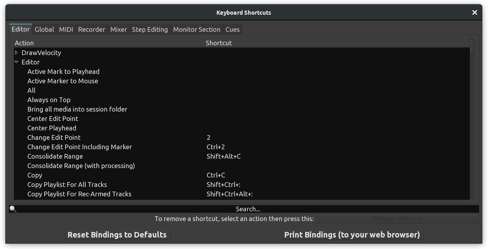
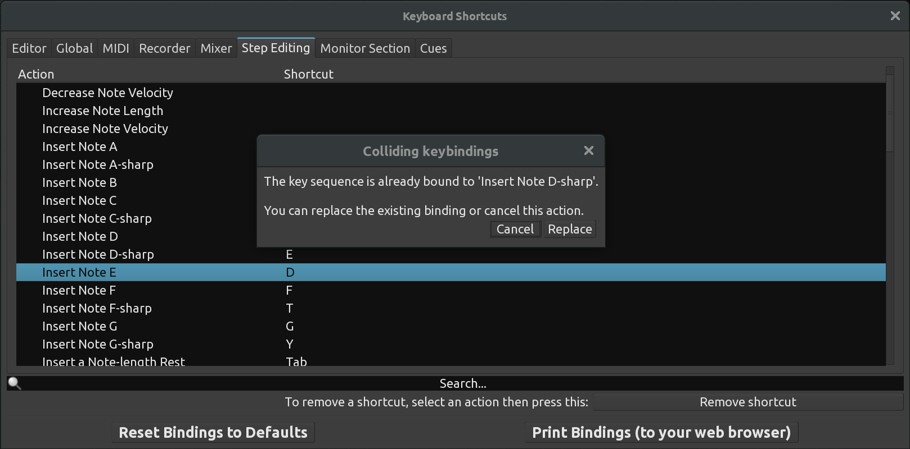

Keyboard shortcuts
==================

The :guilabel:`Keyboard Shortcuts` dialog allows easily redefining existing keyboard shortcuts to operations and creating new ones.

   Keyboard Shortcuts

A thematic list of the default keyboard shortcuts in Ardour can be found in the `Appendix <@@default-shortcuts>`__, but the :guilabel:`Print Bindings` (to your web browser) button show an up-to-date list of the current keyboard bindings, with customization, nicely laid out by theme and alphabetical.

.. _contexts-subcontexts:

Contexts and subcontexts
------------------------

The important concept to understand here is that the same shortcut can be used for different operations in different contexts. E.g. in the **Editor** context, the :kbd:`T` key switches on the **Stretch** mode to time-stretch clips on the canvas. However, in the MIDI Step Entry context, :kbd:`T` inserts an F-sharp note. The contexts are represented by tabs in this dialog, e.g. Editor, MIDI, Recorder, etc.

Inside every tab, features are grouped into **subcontexts** that can be expanded or collapsed by clicking the triangular-shaped button to the left of the name of each subcontext. E.g. the 'Snap' subcontext lists all snapping units, while the 'Region' subcontext lists all actions accessible via the right-click menu.

The **Search** function at the bottom of the dialog works within the currently selected context/tab only. If a search returned zero results, switching to a different context is a viable solution to locating the action of interest.

.. _setting-new:

Setting new shortcuts
---------------------

Once an action of interest is located in the list, all it takes to set a keybinding to it is selecting the action in the list, then pressing the sequence of keys. The newly defined keybinding will immediately show up in the **Shortcut** column.

.. _redefining-existing:

Redefining Existing Shortcuts
-----------------------------

An existing shortcut to an action can easily be replaced with a different one by selecting the action and pressing a new sequence of keys. The newly defined keybinding will immediately show up in the **Shortcut** column.

Handling Collisions
-------------------

Once a keybinding is assigned to an action, that keybinding is considered taken. Attempting to assign that same keybinding to a different action will result in a collision. Ardour will notify the user that the keybinding is already taken (and by what action) and will ask to either reconsider or force-set the keybinding to a new action.

   A keyboard shortcut collision

Force-setting the keybinding of choice to a new action will remove the keybinding from the action it was previously assigned to. A new keybinding then can be assigned to that action.

.. _removing-existing:

Removing Existing Shortcuts
---------------------------

In some cases it is desirable to remove a shortcuts entirely. Selecting an action of interest, then pressing the :guilabel:`Remove shortcut` button at the bottom of the dialog will do just that. The keybinding will immediately disappear from the Shortcut column.

.. _reverting-to-defaults:

Reverting to Factory Settings
-----------------------------

If applied customizations to default keyboard shortcuts didn't work out, it's possible to revert to "factory settings". Clicking :guilabel:`Reset Bindings to Defaults` will remove all customizations and bring back default keybindings. Important: Ardour will not ask for a confirmation!
