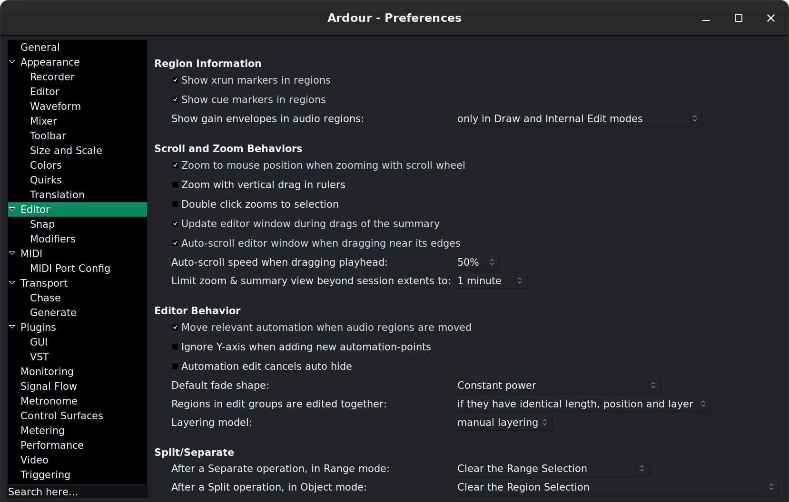

.. _preferences:

Preferences
===========

Global preferences control general workflow and system configuration, and should apply to all sessions. They are located in **Edit > Preferences** and stored in Ardour's user configuration file in the user's home directory.

   The Preferences window

Settings can be searched for using the input box in the lower left corner of the Preferences window. Typing in a keyword and pressing Enter will open the Preferences pages where the first occurrence of the keyword is available, the setting will be highlighted. Pressing Enter again will highlight the next occurrence (where available).

Preferences are conveniently grouped by category:

-  `General <#preferences-general>`__
-  `Appearance <#preferences-appearance>`__

   -  `Recorder <#preferences-appearance-recorder>`__
   -  `Editor <#preferences-appearance-editor>`__
   -  `Waveform <#preferences-appearance-waveform>`__
   -  `Mixer <#preferences-appearance-mixer>`__
   -  `Toolbar <#preferences-appearance-toolbar>`__
   -  `Size and Scale <#preferences-appearance-size-and-scale>`__
   -  `Colors <#preferences-appearance-colors>`__
   -  `Quirks <#preferences-appearance-quirks>`__
   -  `Translation <#preferences-appearance-translation>`__

-  `Editor <#preferences-editor>`__

   -  `Snap <#preferences-editor-snap>`__
   -  `Modifiers <#preferences-editor-modifiers>`__

-  `MIDI <#preferences-midi>`__

   -  `MIDI Port Config <#preferences-midi-port-config>`__

-  `Transport <#preferences-transport>`__

   -  `Chase <#preferences-transport-chase>`__
   -  `Generate <#preferences-transport-generate>`__

-  `Plugins <#preferences-plugins>`__

   -  `GUI <#preferences-plugins-gui>`__
   -  `VST <#preferences-plugins-vst>`__
   -  `Audio Unit <#preferences-plugins-audio_unit>`__

-  `Monitoring <#preferences-monitoring>`__
-  `Signal Flow <#preferences-signal_flow>`__
-  `Metronome <#preferences-metronome>`__
-  `Control Surfaces <#preferences-control_surfaces>`__
-  `Metering <#preferences-metering>`__
-  `Performance <#preferences-performance>`__
-  `Video <#preferences-video>`__
-  `Triggering <#preferences-triggering>`__

.. _preferences_general:

General
-------

-  **Audio/MIDI Setup**

   -  **Show Audio/MIDI Setup** window shows the :ref:`Audio/MIDI Setup <audio_midi_setup>` dialog.
   -  **Try to auto-launch audio/midi engine** allows Ardour to try to automatically launch the audio and MIDI system, driver and device, thus not showing the :ref:`Audio/MIDI Setup <audio_midi_setup>` dialog. This can save a little time if the system is always used the same way.

-  **Editor Undo** defines the behaviour of the Undo operations:

   -  **Limit undo history** sets how many commands can be undone using :kbd:`Ctrl-Z` or **Edit > Undo**. Unchecking will keep an endless memory of operations to undo, at the expense of memory.
   -  **Save undo history** sets how many commands are saved so they are available to be undone after reopening the session. This can also be unchecked to keep all actions undoable, at the cost of bigger session files.
   -  **Verify removal of last capture** when enabled prompts to verify removal the last recording capture when **Edit > Remove Last Capture** is executed.

-  **Session Management**:

   -  **Make periodic backups of the session file** will create a backup session file after changes to the timeline. The backup file is the session name followed by ``.ardour.bak``. The backup can be used to recover from crashes when the session had not been explicitly saved.
   -  **Default folder for new sessions**: defaults the folder where Ardour will create new session folders. This is used in the **Session Setup** dialog displayed by **Session > New**.
   -  **Maximum number of recent sessions**: determines how many of the last opened sessions shows in the **Recent Sessions** dialog displayed by **Session > Recent**.

-  **Import**:

   -  **Drag and drop import always copies files to session** selects, and then disables changes to, the **Copy files to session** option in the :ref:`Add Existing Media <import_dialog>` dialog.
   -  **Cache Folder for downloaded Freesound clips**: when you try sounds form FreeSound.org before inserting them into the project, they need to be saved locally on your computer; this is where you define the folder for those temporary files.

-  **Export**:

   -  **Save loudness analysis as image file after export** allows, when the **Analyze Exported Audio** is checked in the :ref:`Export dialog <export_dialog>`, to save the analysis graph as a file named ``session.png`` alongside the exported audio file(s) (in the same folder).
   -  **Save Mixer screenshot after export** creates and exports a graphical image of the Mixer window as a file named ``session-mixer.png`` alongside the exported audio file(s) (in the same folder).

-  **New Version Check**:

   -  **Check for announcements at application start** sends an anonymous request to Ardour's server to check for a new version.

.. _preferences_appearance:

Appearance
----------

-  **GUI Lock**:

   -  **Lock timeout (seconds)**: locks the GUI after this many idle seconds (zero being 'never lock'). The GUI can also be locked with **Session > Lock**. When locked, a dialog will display a **Click to unlock` button.
   -  **System Screensaver Mode**: can be used to prevent the screensaver to be launched by the system, either while recording (e.g. for long and unattended recording session), when Ardour is simply started, or never (the screensaver is then able to start).

-  **Theme**:

   -  **Color faders with track/bus colors**: when enabled, fills faders for tracks and busses with respective track or bus colors.
   -  **Draw "flat" buttons**: when enabled, button controls in the user interface will be drawn with a flat look. When disabled button controls will have a slight 3D appearance.
   -  **Draw "boxy" buttons**: when enabled, button controls in the user interface will have square corners instead of being slightly rounded.
   -  **LED meter style** if checked, the bar meters in the editor and mixer will be styled to look like if they were made of LEDs, with a dotted bar. Unchecking this option makes the bars flat and continuous.

-  **Graphical User Interface**:

   -  **Highlight widgets on mouseover**, when checked, makes Ardour's widgets (buttons, sliders, …) slightly change color when the mouse hovers them, visually indicating what a mouse action would interact with.
   -  **Show tooltips if mouse hovers over a control**: when checked, displays a little help bubble about the control the mouse hovers. The mouse pointer needs to stay idle for about 1 sec for the tooltip to appear.
   -  **Update clocks at TC Frame rate**: Ardour updates its clocks every 100 ms. Checking this will make the clock refresh at every TimeCode frame which is more responsive, at the cost of a bit more system stress.
   -  **Blink Rec-Arm buttons**: when enabled, the record-armed buttons on tracks will blink when they are armed but not currently recording. When disabled, the record-armed buttons on tracks will be outlined in red instead of blinking. The global record-arm button in the :ref:`Transport bar <transport_bar>` is unaffected.
   -  **Blink Alert indicators**: when enabled, the Alert indicators (like the **Error Log** or the **Feedback** button) will blink when they are active (when an error or feedback has been detected, respectively). When disabled, the indicators will turn red instead of blinking.

-  **Graphics Acceleration**:

   -  **Use intermediate image-surface to render canvas (requires restart)**: Ardour uses hardware accelerated UI rendering by default for speed. Sometimes though, a buggy driver can cause this to make the system slow or unstable. Checking this will make Ardour draw its UI without hardware acceleration, in software, improving stability and responsiveness on those buggy systems at the expense of speed.

.. _preferences_appearance_recorder:

Recorder
~~~~~~~~

-  **Input Meter Layout**:

   -  **Input Meter Layout**: in Recorder mode, determines if audio inputs
      are displayed horizontally or vertically.

.. _preferences_appearance_editor:

Editor
~~~~~~

-  **General**:

   -  **Use name highlight bars in region displays (requires a restart)**:
      when enabled, the region name is displayed, in the editor, in its
      own opaque bar at the bottom of the region. When disabled, the
      region name is overlaid at the top of the region, possibly over
      audio waveforms or MIDI notes.
   -  **Region color follows track color**: when enabled, the background
      color of regions in the editor will be displayed using the color
      assigned to the track. When disabled the default region background
      color will be used.
   -  **Show Region Names**: when enabled, overlays the name of the region
      over its waveform representation, in the top-left.
   -  **Waveforms color gradient depth**: determines how much gradient
      effect is applied to the inner of audio waveforms displayed in the
      editor. Values range from 0.0, no gradient effect, to 1.0, maximum
      effect.
   -  **Timeline item gradient depth**: Determines how much gradient effect
      is applied to the backgrounds of regions displayed in the editor.
      Values range from 0.0, no gradient effect, to 1.0, maximum effect.
   -  **Track name ellipsize mode**: when the track header is not wide
      enough to display the track's name in full, selects how the name
      will be shorten between:

      -  *Ellipsize start of name* will show only the end of the name
      -  *Ellipsize middle of name* will show only the start and end of
         the name
      -  *Ellipsize end of name* will show only the start of the name

   -  **Add a visual gap below Audio Regions**: selects whether or not the
      audio regions fit the height of the track or leave a gap at the
      bottom, either small or large.

-  **Editor Meters**:

   -  **Show meters in track headers**: when enabled, shows a small meter in
      the Editor's :ref:`track headers <audio_track_controls>`. The meter
      is shown on the right side area of the header and provides an
      instant, if imprecise, view of the levels on this track/bus.
   -  **Limit track header meters to stereo**: if a track has more than two
      outputs (e.g. with a drum plugin), limits the number of meters in
      the track header to the first two ones. Only affects audio meters,
      not MIDI.

-  **MIDI Regions**:

   -  **Display first MIDI bank/program as 0**: when patches and bank
      changes are displayed in the editor, if this option is checked,
      the numbering will be zero-based instead of one-based, i.e.
      banks/programs will be numbered ``O, 1, 2…`` instead of ``1, 2, 3…``.
   -  **Don't display periodic (MTC, MMC) SysEx messages in MIDI Regions**:
      if checked, will hide these control messages from the MIDI regions
      for better legibility.
   -  **Show velocity horizontally inside notes**: when on, each note of a
      MIDI region (in **Sustained** mode) displays its velocity (0-127)
      with a darker fill proportional to its value.
   -  **Use colors to show note velocity**: if checked, makes the saturation
      of the notes color proportional to its velocity, hence making a
      more veloce note more intense in color.
   -  **Display note names in track headers**: allows selecting in which
      scenario Ardour will display note names:

      -  *Always* — Ardour will always try to display note names
         regardless of whether they are available through a MIDNAM file.
      -  *When Available* — Ardour will only show note names when they
         are provided in a MIDNAM file.
      -  *Never* — Ardour will never display note names.

.. _preferences_appearance_waveform:

Waveform
~~~~~~~~

-  **Editor Waveforms**:

   -  **Show waveforms in regions**: when enabled, shows a visual
      representation of the region's audio waveform.
   -  **Show waveforms while recording**: when enabled, will draw the audio
      waveform in regions being recorded, in near real time. When
      disabled, only a region block will be drawn while recording,
      reducing CPU requirements.
   -  **Show waveform clipping**: when enabled, the waveform displayed will
      show peaks marked in red if they exceed the clip level.
   -  **Waveform Clip Level (dBFS)**: sets the level at which the waveform
      shown in an audio region will be drawn in red to indicate
      clipping. Setting lower than 0.0 dBFS can be useful if any tool in
      the audio chain has problems near 0.0 dBFS.
   -  **Waveform scale**: when waveforms are shown in audio regions, they
      can be displayed using a *linear* or a *logarithmic* scale. See
      :ref:`Waveform display <waveform_display>`.
   -  **Waveform shape**: when waveforms are shown in audio regions, they
      can be displayed using a *traditional* or a *rectified* shape. See
      :ref:`Waveform display <waveform_display>`.

.. _preferences_appearance_mixer:

Mixer
~~~~~

-  **Mixer Strip**:

   -  This table enables (checked) or disables (unchecked) the display of controls in the :ref:`mixer strip <audiomidi_mixer_strips>`. Controls whose display can be toggled are: **Input**, **Phase Invert**, **Record & Monitor**, **Solo Iso/Lock**, **Output**, **Comments** and VCA Assigns.
   -  **Use narrow strips in the mixer for new strips by default**: when enabled, new mixer strips are created in narrow format. When disabled, they are created in wide format. Existing mixer strips width can be toggled with the width control at the top left of the mixer strip.
   -  **Limit inline-mixer-strip controls per plugin**: Whether or not, and how many, controls each plugin can show in the mixer strip. These mixer-strip controls are added by checking **plugin context-menu > Controls > □ control parameter**.

.. _preferences_appearance_toolbar:

Toolbar
~~~~~~~

-  **Main Transport Toolbar Items**: this section allows to toggle the
   visibility of some elements of the main toolbar:

   -  **Display Record/Punch Options**: toggles the visibility of the :ref:`punch and record <punch_controls>` slice of the main toolbar.
   -  **Display Latency Compensation Info**: toggles the visibility of the **Latency Compensation** slice of the main toolbar.
   -  **Display Secondary Clock**: toggles the visibility of the :ref:`secondary clocks <transport_clocks>` slice of the main toolbar.
   -  **Display Selection Clock**: toggles the visibility of the :ref:`selection clocks <selection_clocks>` slice of the main toolbar.
   -  **Display Monitor Section Info**: toggles the visibility of the **Monitor Info** slice of the main toolbar.
   -  **Display Cue Rec/Play Controls**: toggles the visibility of the buttons that enable creating and playing back cue markers.
   -  **Display Navigation Timeline**: toggles the visibility of the :ref:`navigation/mini timeline <mini_timeline>` slice of the main toolbar.
   -  **Display Master Level Meter**: toggles the visibility of the :ref:`selection clocks <other_toolbar_items_mode_selector>` slice of the main toolbar.

-  **Display Action-Buttons**:

   -  Column *n* enables or disables the visibility of the six possible columns of :ref:`Lua script buttons <other_toolbar_items_mode_selector>`. Each columns contains two user-assignable buttons.

.. _preferences_appearance_size_and_scale:

Size and Scale
~~~~~~~~~~~~~~

-  **User Interface Size and Scale**:

   -  **GUI and Font scaling**: allows the display size of most of the text and buttons in the user interface to be scaled up or down. May require a restart to take effect.

.. _preferences_appearance_colors:

Colors
~~~~~~

-  **Colors**:

   -  **Color Theme** allows to switch between some presets bundled with
      Ardour, changing both the palette and items colors, hence styling
      Ardour all at once.
   -  The table allows to change the color settings in Ardour by acting
      on three parameters:

      -  Items that allow to choose any color from the palette (see
         below) to color a UI element. Clicking on a color sample in the
         **Color** column bring up the Palette, to choose from.
      -  Palette that allows to create a set of colors that will be used
         in the UI. Using a palette allows for better consistency,
         instead of picking "free" colors for each UI element. Clicking
         on a color patch brings up a full color selector, to assign
         this color to this patch of the palette.
      -  Transparency where possible, allows to select, with a slider,
         the transparency of the UI element, with 0 (slider to the left)
         being fully opaque.

   -  **Restore Defaults** turns all the palette, item colors and transparency back to Ardour's default base setting, in case Ardour's appearance has turned into a toddler's toy.
   -  **Use color-palette to assign color for new tracks** enables color-coding of tracks by picking colors from a fixed palette and assigning them to regions' backgrounds and, optionally, to respective faders of tracks and busses (there is a dedicated setting for that). When disabled, all regions (and faders) have a neutral gray background.
   -  **Use color-palette to assign color for new busses** does the same as the setting above, but with regards to busses.
   -  **Use color-palette to assign color for new VCA** does the same as the setting above, but with regards to VCAs.

.. _preferences_appearance_quirks:

Quirks
~~~~~~

-  **Various Workarounds for Windowing Systems**: As Ardour is available on a number of platforms and windowing systems, some specific workarounds are sometimes required to provide a smooth experience to the user.

   -  **Use visibility information provided by your Window Manager/Desktop**: allows the system window manager's rules for the windows visibility to supersede Ardour's.
   -  **Show/Hide splash screen instead of setting z-axis stack order**: hides the splash instead of re-layering it. This setting requires a restart of Ardour to take effect.
   -  **All floating windows are dialogs**: when enabled, Ardour will use type **Dialog** for all floating windows instead of using type "Utility" for some of them. This may help usability with some window managers. This setting requires a restart of Ardour to take effect.
   -  **Transient windows follow front window**: when enabled, transient windows will follow the front window when toggling between the editor and mixer. This setting requires a restart of Ardour to take effect.
   -  **Float detached monitor-section window**: as the :ref:`monitor section <monitor_section>` can be detached from the mixer, this option makes it a floating window, which may be handled differently by the windowing system and easier to access.
   -  **Allow to resize Engine Dialog**: allow to resize the engine dialog window to work around a bug on some XWayland systems that render this dialog as blank.

.. _preferences_appearance_translation:

Translation
~~~~~~~~~~~

-  **Internationalization**:

   -  **Use translations**: sets if Ardour should use a translated version of all the messages. The default (unchecked) is English (US). When checked, and if a language file exists for the system language, this file will be used to translate Ardour.

.. _preferences_appearance_regions:

Regions
~~~~~~~

-  **Region Information**:

   -  **Show xrun markers in regions**: puts a marker on the region(s) while recording, when a buffer over/underflow happens.
   -  **Show cue markers in regions**: determines if cue markers, that are bounded to regions, are displayed or not.
   -  **Show gain envelopes in audio regions**: sets in which :ref:`modes <toolbox>` the gain envelope is displayed in audio regions. The gain envelope is superimposed over the region in the selected modes, and hidden otherwise for a better legibility.

.. _preferences_editor:

Editor
------

-  **Scroll and Zoom Behaviors**:

   -  **Zoom to mouse position when zooming with scroll wheel**: by default, Ardour zooms to the :ref:`edit point <edit_point_control>`. When this option is checked, and the zoom is done with + mousewheel, the zoom will happen at the mouse cursor position regardless of the edit point chosen.
   -  **Zoom with vertical drag in rulers allows**: when checked, to click anywhere in an empty zone of the :ref:`ruler <ruler>` zone and drag up to zoom in or down to zoom out.
   -  **Double click zooms to selection**: allows by double clicking, to zoom on the selection, both on the time and tracks axes. If the selection has been done with or , then this key should still be pressed when double clicking for this to work, otherwise the first click breaks the group selection.
   -  **Update editor window during drags of the summary**: when enabled the       contents of the editor window will redraw the tracks area as the selection rectangle in the :ref:`summary 
` area is moved or resized.
   -  **Auto-scroll editor window when dragging near its edges**: when enabled will scroll the editor window automatically when dragging a region. This can make it easier to see where to position the region.
   -  **Auto-scroll speed when dragging playhead**: chooses how fast the canvas scrolls when dragging the playhead outside of the visible canvas.
   -  **Limit zoom & summary view beyond session extents to**: prevents the zoom out both in the editor and the summary, to show anything past the chosen time after the end marker, restraining the vision to only useful content.

-  **Editor Behaviour**:

   -  **Move relevant automation when audio regions are moved**: when enabled, causes automation data to stay with a region when the region is moved inside the playlist. When disabled, the automation is not affected by movement of regions.
   -  **Ignore Y-axis click position when adding new automation-points**: allows to create new automation points at the x-position of the mouse, without using the Y-position as the value, hence creating a new automation point at its present value.
   -  **Automation edit cancels auto hide**: determines whether automation lanes that have been automatically shown because of the **Edit > Show Automation Lane on Touch** option should be kept visible if the automation has been touched.
   -  **Default fade shape**: sets which :ref:`fade shape <create_region_fades_and_crossfades>` is the default.
   -  **Regions in edit groups are edited together**: sets the criteria to see if editing actions apply to tracks grouped together in an group.
   -  **Layering model**: Ardour allows :ref:`layering <layering_display>` multiple regions in the same track. This selector defines how these layers are managed, either manually or by placing the latest on top.

-  **Split/Separate**:

   -  **After a Separate operation, in Range mode**: determines what should become of the range selection after a **Separate** operation:

      -  **Clear the Range Selection**: nothing is selected anymore
      -  **Preserve the Range Selection**: the range selection is kept
      -  **Force-Select the regions under the range**: the regions that were in the range selection are selected in Grab/Object mode

   -  **After a Split operation, in Object mode**: determines which, if any, regions are selected after a split operation. The options are:

      -  **Clear the Region Selection**: nothing is selected anymore
      -  **Select only the newly-created regions BEFORE the split point**: if regions have been affected by the split, then the regions created by the split before the split point is selected
      -  **Select only the newly-created regions BEFORE the split point**: same as above, for the regions created after the split point
      -  **Select the newly-created regions**: sum of the two above, i.e. all the regions that are created as a result of the split are selected.
      -  **Preserve the existing selection, AND select all newly-created regions**: same as above (all the parts that have been created by the split) plus the unaffected regions that were selected before the split.

.. _preferences_editor_snap:

Snap
~~~~

-  **General Snap options**:

   -  **Snap Threshold (pixels)**: is the maximum distance between a snap
      anchor and an object for Ardour to force the object to be placed
      precisely at that anchor.
   -  **Approximate Grid/Ruler granularity (pixels)**: Ardour tries to show
      a reasonable number of grid lines at the current zoom level and in
      the available screen estate. This value tells Ardour what the
      approximate absolute distance between two closest grid lines
      should be, so that it displays the most relevant grid scale to
      approximately fit this distance.
   -  **Show "snapped cursor"**: if the Edit point is not the playhead, shows
      the currently selected Edit point as a blue line, to indicate
      where the next editing operation will occur.
   -  **Snap rubberband selection to grid** makes the highlighted zone
      created by an area selection also snap to grid, i.e. the beginning
      and end of the resulting selecting box will both be grid anchors.
   -  **Grid switches to alternate selection for Internal Edit Tools**: two
      levels of grid mode can coexist in Ardour, one for global regions
      manipulations, and one for finer, in-region editing (e.g. for
      placing MIDI events in a MIDI region). When this option is
      checked, entering Internal Edit mode makes the grid mode switch
      from one mode to the other.
   -  **Rulers automatically change to follow the Grid mode selection**: if enabled, changing the Grid mode also makes the relevant :ref:`ruler <ruler>` visible, while hiding the other ones.

-  **Snap Target Mode**:

   -  **When "Snap" is enabled, snap to**: lists the different possible
      anchors to which an object should snap to, among:

      -  Markers
      -  Playhead
      -  Region Sync points
      -  Region Starts
      -  Region Ends
      -  Grid

-  **Snap Targets**:

   -  Markers: whether markers are snap targets
   -  Playhead: whether the playhead is a snap targets
   -  Region Sync Points: whether region sync points are snap targets
   -  Regions Starts: whether regions starts are snap targets
   -  Regions Ends: whether regions ends are snap targets

.. _preferences_editor_modifiers:

Modifiers
~~~~~~~~~

This page allows to choose how things are done in the editor. This is a very flexible way for Ardour to match an existing workflow, or speed up the editing process based on the user's most used actions.

The **Reset to recommended defaults** button at the bottom provides a way to revert any user made change to its default value.

.. _preferences_midi:

MIDI
----

-  **Session**

   -  **Allow non quarter-note pulse**: by default, Ardour understands the :ref:`tempo <tempo_and_meter>` as the number of quarter notes in a minute. Checking this option allows to set the tempo based on any division of the note, from whole to 1/128th. This is reflected in the **Edit Tempo` window (accessed by double clicking a tempo marker) that shows a **Pulse` menu when this option is checked.
   -  Initial program change: Ardour will send a MIDI program change message on the ``ardour:MMC out`` MIDI port when a session is loaded and whenever this field is changed. A value of -1 means don't send any program change message.

-  **Audition**

   -  **Sound MIDI notes as they are selected in the editor** will play any selected or added MIDI note when in Draw or Internal Edit modes. The note is sent as MIDI as if Ardour was playing it with the session, so the processors and signal routing will be applied.

-  **Virtual Keyboard**

   -  **Virtual Keyboard Layout**: selects which (if any) computer keyboard layout is used to be mapped on the keys of the musical keyboard of the Virtual Keyboard (**Window > Virtual Keyboard**).

-  **Default Visible Note Range**

   -  **Default lower visible MIDI note**: this note will be the lowest
      visible one on the timeline unless you tweak that by adjusting the
      vertical range. E.g. C4 is C on the fourth octave.
   -  **Default upper visible MIDI note**: this note will be the highest
      visible one on the timeline unless you tweak that by adjusting the
      vertical range. E.g. B4 is B on the fourth octave.
   -  **Maximum note height**: sets the height of MIDI notes in pixels at
      maximum vertical zoom. Attempting to zoom in closer will result in
      scrolling the pianoroll up or down.

-  **MIDI Port Options**

   -  **MIDI input follows MIDI track selection**: allows Ardour to
      automatically connect the MIDI input to the selected track.
      Selecting a different MIDI track results in Ardour disconnecting
      the MIDI device from the former track and connecting it to the
      newly selected one, so that the MIDI device is always connected to
      the selected track. Which MIDI device will follow selection can be
      chosen below.

.. _preferences_midi_port_config:

MIDI Port Config
~~~~~~~~~~~~~~~~

This page allows to set options for input and output MIDI devices, such
as:

-  **Music Data**: whether Ardour should accept/send note events from/to selected MIDI device
-  **Control Data**: whether Ardour should accept/send control events (Control Change, or CC) from/to selected MIDI device
-  **Follow Selection**: whether Ardour should connect this device only to a selected track (only applicable to input devices)

You can also give a more meaningful name to any input and output MIDI
device here. Double-click the name of the device, enter a new name, then
press Enter to confirm.

.. _preferences_transport:

Transport
---------

-  **General**:

   -  **Prompt for new marker names** when enabled, popup a dialog when a new :ref:`marker <working_with_markers>` is created. This allows markers to be named as they are created.
   -  **Stop at the end of the session** causes the transport to stop during playback when it reaches the end marker. Behavior during recording is not changed.
   -  **Keep record-enable engaged on stop** leaves the global record-enable engaged after transport is stopped. Does not affect track level record-enable which is never changed on stop.
   -  **Reset default speed on stop** when the :ref:`Shuttle speed control <transport_bar>` is in *wheel* mode, i.e. the transport speed can be constantly changed, enabling this option makes these changes temporary, and the transport speed reset each time the transport is stopped.
   -  **Disable per-track record** disarm while rolling, when enabled, will not allow the any track's record-enable to be disarmed during record, preventing accidentally stopping the recording of a take.
   -  **12dB gain reduction during fast-forward and fast-rewind** when enabled will reduce the unpleasant increase in perceived volume that occurs when fast-forwarding or rewinding through some kinds of audio.
   -  **Rewind/Fast-forward buttons change direction immediately** sets whether Rewind and Fast-forward transport operations (**Transport > Forward/Rewind**) changes the playback direction and speed abruptly, or gradually.
   -  **Allow auto-return after rewind/ffwd operations** if :ref:`Auto return <other_toolbar_items_playhead_options>` is engaged, sets whether it applies to rewind and fast-forward operations.
   -  **Preroll**: sets the duration of the preroll for playing and recording when using a preroll. Can be a musical duration (in bars) or a duration in seconds.
   -  **Create a marker when a MIDI program change is received (and RECORDING)** allows capturing a MIDI program change when recording from an external MIDI device.
   -  **Locate to the next matching scene marker when a MIDI program change is received (and NOT recording)**: allows moving the playhead to a previously captured MIDI scene event when received a MIDI program change.

-  **Looping**

   -  **Play loop is a transport mode** changes the behavior of the loop
      button, turning it into a toggle. When enabled, the loop button
      does not start playback but forces playback to always play the
      loop. Looping stays engaged when the transport is stopped.
      Playback continues where the transport stopped and continues to
      loop. When disabled, the loop button starts playing the loop but
      stop then cancels loop playback.
   -  **Loop Fades**: when the transport moves from the end of the loop
      range back to the beginning, clicks might be audible. This
      parameter allows for adding fades (in, out or cross-) to prevent
      those clicks.

-  **Dropout (xrun) Handling**

   -  **Stop recording when an xrun occurs** will stop the transport when an
      xrun occurs during recording, ensuring no audible glitches are
      recorded.
   -  **Create markers where xruns occur** will create a new
      :ref:`marker <working_with_markers>` when an xrun occurs during
      recording at the location of the xrun. This marks where possible
      xruns might produce audible glitches.
   -  **Reset x-runs counter when starting to record**, when enabled, sets
      the x-run counter in the :ref:`Status bar <status_bar>` to 0 each
      time a recording is started, hence showing only the relevant
      number of xrun while recording.

-  **Plugins**

   -  **Silence plugins when the transport is stopped**: when stopping
      playback or recording, if this option is checked, the plugins that
      still emit sound (reverbs, etc…) will be stopped. If unchecked,
      the plugins will continue playing after the transport stop.

.. _preferences-transport-chase:

Chase
~~~~~

-  **MIDI Machine Control (MMC)**

   -  **Respond to MMC commands** when enabled Ardour will respond to MIDI Machine Control commands received on the ``ardour:MMC in`` MIDI port.
   -  **Inbound MMC device ID**: is the only device ID Ardour will respond to when an MMC command is received on the ``ardour:MMC in`` MIDI port.
   -  **MMC Fast-wind behavior**: how to respond to the "fast-wind" command that allows quickly navigating through the timeline.

-  **Transport Masters**

   -  **Show Transport Master Window**: opens the **Transport Masters` window, where all the timecode sources are shown to be selected and/or synchronized; same as clicking Window > Transport Masters
   -  **Match session video frame rate to external timecode**: controls the value of the video frame rate *while chasing* an external timecode source. When enabled, the session video frame rate will be changed to match that of the selected external timecode source. When disabled, the session video frame rate will not be changed to match that of the selected external timecode source. Instead, the frame rate indication in the main clock will flash red and Ardour will convert between the external timecode standard and the session standard.

.. _preferences_transport_generate:

Generate
~~~~~~~~

-  **Linear Timecode (LTC) Generator**

   -  **Enable LTC generator** when enabled Ardour will output an LTC timecode signal on its *LTC-out* port. If this option is checked, the two options below are active:
   -  **Send LTC while stopped**, (only available when the previous *Enable LTC generator* is on) when enabled Ardour will continue to send LTC information even while the transport (playhead) is not moving.
   -  **LTC generator level [dBFS]**: specifies the peak volume of the generated LTC signal in dbFS. A good value is 0dBu=−18dbFS in an EBU calibrated system.
   -  **LTC Output Port**: selects to which port (if any) the LTC generator will be connected by default.

-  **MIDI Time Code (MTC) Generator**

   -  **Enable MTC Generator** when enabled Ardour will generate MIDI time code on the ``ardour:MTC out`` MIDI port.
   -  **Max MTC varispeed (%)**: MIDI time code generation will be disabled when the transport speed is greater than normal speed plus this percentage or less than normal minus this percentage.

-  **MIDI Machine Control (MMC)**

   -  **Send MMC commands**: when enabled Ardour will send MIDI Machine Control commands on the ``ardour:MMC out`` MIDI port.
   -  **Outbound MMC device ID**: is the MIDI device ID Ardour will use when it sends MMC commands.

-  **MIDI Beat Clock (Mclk) Generator**

   -  **Enable Mclk generator**: when enabled Ardour will generate a (tempo dependent) beat clock at a rate of 24 pulses per quarter note on the ``ardour:MIDI clock out`` port.

.. _preferences_plugins:

Plugins
-------

The content of this preference page varies heavily between versions or
Ardour: both the platform and the build-time options can make Ardour
support some types of plugins and not others. While this documentation
tries to show all possible options, most systems will only show a subset
of the options hereunder, e.g. AudioUnits are macOS only…

-  **Scan/Discover**

   -  **Scan for Plugins** will initiate an immediate scan of the system for
      available plugins. Useful to get a newly installed plugin
      recognised by Ardour.
   -  **Scan Time Out** sets the time that Ardour will try to find any
      plugins in known paths until it gives up.

-  **General`

   -  **Scan for [new] Plugins on Application Start** When enabled new
      plugins are searched, tested and added to the cache index on
      application start. When disabled new plugins will only be
      available after triggering a 'Scan' manually.
   -  **Always Display Plugin Scan Progress** When enabled a popup window
      showing plugin scan progress is displayed for indexing (cache
      load) and discovery (detect new plugins).
   -  **Verbose Plugin Scan**: adds information about the plugin in the :ref:`Log
      window <status_bar>`.
   -  **Open Plugin manager window when missing plugins are found**: when
      enabled, the Plugin Manager is displayed at session load if the
      session contains any plugins that are missing, or plugins have
      been updated and require a rescan.
   -  **Make new plugins active**: when enabled, any plugin added to a track
      will be in active mode. If unchecked, the plugins will be added in
      inactive mode by default, hence have no processing effect on the
      track/bus.
   -  **Setup Sidechain ports when loading plugin with aux inputs**: when
      enabled, Ardour will automatically create sidechain ports for
      plugins that have sidechain inputs and leave them for the user to
      connect in the Pin Configuration dialog (see the
      `Sidechaining </signal-routing/sidechaining/>`__ chapter).

-  **LV1/LV2**

   -  **Conceal LADSPA (LV1) Plugins if matching LV2 exists**: when enabled,
      gives precedence to the LV2 (more up-to-date) version of a plugin
      over its LV1 version, if both exists.

-  **Instrument**

   -  **Ask to replace existing instrument plugin**: if a MIDI track already
      has an instrument (i.e. MIDI to audio converter of some sort) and
      this option is checked, Ardour will detect it and offer to replace
      the existing instrument with the newly added one, avoiding a
      possible conflict.
   -  **Interactively configure instrument plugins on insert**: when
      inserting a multichannel instrument plugin, if this option is
      checked, prompts the user for the channel configuration for this
      plugin.

-  **Statistics**

   -  **Reset Statistics**: clears the statistics used to determine the most
      used and most recently used plugins.
   -  **Plugin chart (use-count) length**: In the Mixer view's :ref:`favorite
      plugins <favorite_plugins_window>` section, determines how
      many plugins are displayed when in *Top-10 Plugins* mode.
   -  **Plugin recent list length**: Same as above, when in *Recent Plugins*
      mode.

.. _preferences_plugins_gui:

GUI
~~~

-  **Plugin GUI**

   -  **Automatically open the plugin GUI when adding a new plugin** shows
      the plugins GUI as soon as it is added to the processing box. If
      unchecked, the plugin will be added in the processor box but the
      GUI will only be shown when double clicking it.
   -  **Show only one plugin window at a time**: when enabled, only one
      plugin window will be displayed on the screen; when disabled, you
      can open as many plugin windows as you like.
   -  **Closing a Plugin GUI Window**: this allows users deciding how Ardour
      should treat plugin windows aftre closing them. Hiding means a
      complex plugin window can be re-opened fast because it's saved in
      memory, but it uses system resources. Destroying means the window
      isn't saved, which frees up system resources, however some plugins
      will take longer to showup on the screen.

-  **Mixer Strip Inline Display**

   -  **Show Plugin Inline Display on Mixer strip by default** allows Ardour to show, in the :ref:`mixer strips <audiomidi_mixer_strips>`, a visual rendering of the effect. These Inline Display are a special feature of Ardour, so not all plugins are able to show this display. Most of Ardour's :ref:`own plugins <bundled_plugins>` have an Inline Display. At any time, the plugin's inline display can be toggled on or off by double-clicking it.
   -  **Don't automatically open the plugin GUI when the plugin has an inline display mode**: this option, available only if **Automatically open the plugin GUI when adding a new plugin** is checked, supercedes it and hides the plugin GUI at creation if it has an Inline Display, like Ardour's own ``ACE *`` plugins.

.. _preferences_plugins_vst:

VST
~~~

-  **VST**:

   -  **Enable Mac VST2 support (requires restart or re-scan)** makes a
      MacOs system able to run VST-Mac plugins. As stated, a new scan
      for plugins is required, be it manually or by restarting Ardour.
   -  **Enable Linux VST2 support (requires restart or re-scan)** makes a
      Linux system able to run VST2 plugins.
   -  **Enable VST3 support (requires restart or re-scan)** makes any system
      able to run VST3 plugins.

-  **VST 2.x**:

   -  **VST 2 Cache**: Clicking the **Clear` button removes all VST plugins from the list of plugins available to be inserted into the processor box. A new VST plugin scan is then required.
   -  **VST 2 Ignorelist**: Clicking the **Clear` button makes ignored VST plugins available to be added to the processor box.
   -  **Linux VST2 Path**: Clicking the **Edit` button pops up a dialog to manage the directories that will be searched for Linux VST plugins. When modified, Ardour will offer to scan those paths for plugins.
   -  **Path**: are the paths chosen above.
   -  **Windows VST Path**: Clicking the **Edit` button pops up a dialog to manage the directories that will be searched for Windows VST plugins. When modified, Ardour will offer to scan those paths for plugins.
   -  **Path**: are the paths chosen above.

-  **VST 3**

   -  **VST 3 Cache**: Same as above, for VST 3
   -  **VST 3 Ignorelist**: Same as above, for VST 3
   -  **Additional VST3 Path**: The VST 3 specs clearly define where the
      host application should look for plugins. Although Ardour provides
      a way to search other directories for plugin, it is out of spec
      and not recommended.
   -  **Automatically show 'Micro Edit** tagged controls on the
      mixer-strip**: displays the plugin's UI directly inside each mixer
      strip (inline), if the plugin has a 'Micro Edit' tag.

-  **VST2/VST3**

   -  **Conceal VST2 Plugin if matching LV3 exists**: when enabled, gives
      precedence to the VST3 (more up-to-date) version of a plugin over
      its VST2 version, if both exists.

.. _preferences-plugins-audio_unit:

Audio Unit
~~~~~~~~~~

-  **Audio Unit**

   -  **Enable Audio Unit support (requires restart or re-scan)**: when
      enabled, new AU plugins are searched, tested and added to the
      cache index on application start. When disabled, new plugins will
      only be available after triggering a 'Scan' manually.
   -  **AU Cache**: Clicking the Clear button removes all AU plugins from
      the list of plugins available to be inserted into the processor
      box. A new AU plugins scan is then required.
   -  **AU Ignorelist**: Clicking the Clear button makes ignored AU plugins
      available to be added to the processor box.

.. _preferences_monitoring:

Monitoring
----------

-  **Monitoring**

   -  **Record monitoring handled by**: determines whether Ardour provides monitoring of incoming audio or whether monitoring is provided by hardware. See :ref:`Monitoring <monitoring>` for more information.
   -  **Auto Input does 'talkback'**: when enabled, the **Transport > Auto Input** option also sets the tracks to monitor its audio input when transport is not rolling.

-  Solo contains settings that affect the use of :ref:`solo, muting <muting_and_soloing>`, and :ref:`panning <panning>`.

   -  **Solo controls are Listen controls**: when enabled, the soloed track
      is soloed only on the monitor bus, the master fader mix is not
      affected by the solo. This option can also be set by enabling
      pre-fader listen or after-fader listen in the **Mixer** monitor
      section.
   -  **Exclusive solo** when enabled will only solo the last track selected
      for solo. Previously soloed tracks will be un-soloed. This setting
      is also available from the **Mixer** monitor section.
   -  **Show solo muting** when enabled outlines the mute button on tracks
      and busses when another track is soloed.
   -  **Soloing overrides muting` when enabled allows a track to be heard
      when it is soloed while muted. This setting is also available from
      the **Mixer** monitor section.
   -  **Solo-in-place mute cut (dB)**: sets the attenuation of the other
      tracks when another track is soloed in place. This setting is also
      available from the **Mixer** monitor section. The default is
      "−inf" for −∞, meaning the other tracks are totally muted.
   -  **Listen Position**: determines what is listened to when the solo
      controls are used as listen controls. The options are after-fader
      or pre-fader.
   -  **PFL signals come from**: determines whether the pre-fader listen
      position is before or after the pre-fader processors.
   -  **AFL signals come from**: determines whether the after-fader listen
      position is before or after the after-fader processors.

.. _preferences_signal_flow:

Signal Flow
-----------

-  **Master**

   -  **Enable master-bus output gain control** adds a gain-stage to the
      master-bus and a **Loudness Analyzer & Normalizer** button that
      calculates the Loudness (LUFS) of the session (or a range
      selection), and normalizes the loudness according to various
      standards.
   -  **I/O Resampler (vari-speed) quality**: resampling on the fly during
      playback or recording takes time and thus introduces latency. This
      setting accommodates for that and introduces latency predictably
      and consistently. Each preset matches a particular level of
      resampling quality. Restarting audio engine is required after
      changing this setting.

-  **Default Track / Bus Muting Options**: sets the muting options for a
   newly created tracks or bus. The mute options for an existing track
   or bus are changed by the right-click context menu on a mute button.

   -  **Mute affects pre-fader sends**: when enabled pre-fader sends will be
      muted by default.
   -  **Mute affects post-fader sends**: when enabled post-fader sends will
      be muted by default.
   -  **Mute affects control outputs**: when enabled control outputs are
      muted by default.
   -  **Mute affects main outputs**: when enabled main outputs are muted by
      default.

-  **Send Routing** affects :ref:`aux and external sends <aux_sends>`.

   -  **Link panners of Aux and External Sends with main panner by default**: when enabled, sends follow the channel panner. When disabled, sends can panned independently of the channel panner and fader. Double clicking the send in the processor box toggles the main panner and fader between the aux send and the channel.

-  **Audio Regions**

   -  **Replicate missing region channels**: if a track is N-channel, and the region has fewer channels, this option copies the existing channel's data for this non-existent one. If left unchecked, the missing channels will stay silent.

-  **Track and Bus Connections**

   -  **Auto-connect main output (master or monitor) bus to physical ports**:
      auto-connects the outputs to the first N physical ports. In a
      session without a :ref:`monitor section <monitor_section>`, the
      master-bus is connected to the system's playback ports, and if a
      monitor section exists, the monitor-bus' output are connected.
   -  **Connect track inputs**: allows to choose when a new track is created
      whether its inputs will be automatically connected to the physical
      inputs of the system or not (hence the user has to manually
      connect it).
   -  **Connect track and bus outputs**: allows to choose, for any new track
      or bus created, whether its output will automatically be connected
      to the master bus, directly to the physical outputs or to nothing
      (the user has to manually connect it).
   -  **Use 'Strict-I/O' for new tracks or busses**: determines the default choice for the :ref:`signal flow <trackbus_signal_flow>` of a newly created track or bus. This can be overridden in the :ref:`Add Track/Bus/VCA <adding_tracks_busses_and_vcas>` dialog

.. _preferences_metronome:

Metronome
---------

-  Metronome handles the way Ardour's metronome is played when enabled in the :ref:`Transport bar <transport_bar>`.

   -  **Emphasis on first beat**: plays a different sound when the first beat is played (e.g. 1/4 in 4/4, 1/3 in 3/4,…). When unchecked, all the beats are indistinguishable.
   -  **Use built-in default sounds**: when checked, uses Ardour's own sounds for the metronome click. Unchecking this allows to set some custom sounds below.
   -  **Audio file**: selects an audio file for the beats, in any :ref:`format <supported_file_formats>` Ardour supports.
   -  **Emphasis audio file**: in conjunction with emphasis on first beat, selects an audio file for the first beats of each bar.
   -  **Gain level**: allows the metronome's click sounds to be boosted or attenuated.

-  **Options**

   -  **Enable Metronome only while recording**: when enabled, the metronome will remain silent unless Ardour is recording.

.. _preferences_control_surfaces:

Control Surfaces
----------------

This tab contains settings for :ref:`control surfaces <control_surfaces>`.

It lists all the Control Surface protocols Ardour knows. To enable a control surface protocol, the **Enable** checkbox next to its name should be ticked. Editing the settings related to this protocol can be done by double-clicking its name or clicking the **Show protocol settings** (only for Generic MIDI and Open Sound Control).

.. _preferences_metering:

Metering
--------

-  **Metering**

   -  **Peak hold time**: allows the meter to keep displaying the highest
      signal level for a period of time before reverting to showing the
      actual instantaneous value (unless an even higher peak occurs).
      The longer this time is, the easier it is to spot peaks, at the
      expense of instantaneous accuracy.
   -  **DPM fall-off**: describes how fast the Digital Peak Meters can go
      from a high value to a lower one. Faster values are more accurate
      but less readable.
   -  **Meter line-up level; 0 dBu**: chooses a standard for the conversion
      between dBFS (Full Scale) which represent the numeric signal
      level, and dBu which represents the analog signal level. This
      value is used to configure meter-marks and color knee-points, or
      set the reference levels for various meter-types.
   -  **IEC1/DIN Meter line-up level; 0 dBu**: sets the reference level for
      the IEC1/DIN Meter
   -  **VU Meter standard**: selects which standard to use for the zero
      value of the vu-meters, i.e. the analog dBu value that will show
      as 0 on the VU-meter.
   -  **Peak indicator threshold [dBFS]**: at that value and over, the
      signal will make the peak meter to turn red, indicating a level
      too high.

-  **Default Meter Types** sets the default meters when creating a session
   or track. These meters can be changed afterwards by right-clicking a
   meter.

   -  **Default Meter Type for Master Bus**: defines which kind of
      :ref:`meter <metering_in_ardour>` will be used when creating a new
      session (does not apply to the current session).
   -  **Default Meter Type for busses**: defines which kind of meter will be
      used when creating a new bus (applies to the bus created after
      changing the value).
   -  **Default Meter Type for tracks**: same as above, for tracks.

-  **Region Analysis**

   -  **Enable automatic analysis of audio**: generates the transient values
      (used in e.g. the :ref:`Rhythm Ferret <rhythm_ferret>`)
      automatically. When unchecked, the transient values will be
      generated on demand.

.. _preferences_performance:

Performance
-----------

-  **DSP CPU Utilization**

   -  **Signal processing uses**: sets an upper limit on how many CPU cores
      or processors can be used to signal processing. By default Ardour
      uses all but one (leaving one core for the GUI, and other tasks).
   -  **Power Management, CPU DMA latency**: modern processors try to
      aggressively transition to power saving when idle, even for a few
      microseconds, hurting realtime performance by needing to wake to a
      more active state. This setting counters this behaviour by setting
      a maximum response time while low latency operation is desired. 0
      is the fastest response time.

-  **CPU/FPU Denormals** are a specific type of very small numbers that can
   cause issues with CPU consumption when using some plugins in some
   circumstances. Ardour provides two methods of handling the issue.
   Trying different combinations of these settings may minimize CPU
   consumption.

   -  **Use DC bias to protect against denormals** adds a small constant
      value to numbers to move the numbers away from zero.
   -  **Processor handling**: if the computer's hardware supports it,
      offers two methods that can be used individually or combined.
      Flush to zero and denormals are zero.

-  **Disk I/O Buffering settings** determine how many seconds of audio off
   of disk will be buffered in memory. Longer settings reduce the risk
   of buffer under-runs but consume more memory.

   -  **Preset**: will automatically choose the values for the playback and recording buffer based on the chosen size of the session. The **Custom** option allows to manually select the buffers with the two sliders below.
   -  **Playback (seconds of buffering)**: sets how many seconds of audio Ardour will buffer during playback.
   -  **Recording (seconds of buffering)**: sets how many seconds of audio Ardour will buffer during recording.

-  **Memory Usage**

   -  **Waveform image cache (megabytes)**: sets the maximum amount of ram
      that can be used to store the images representing the waveforms in
      the editor. Past this amount, the images will be regenerated when
      needed, which can significantly decrease the system's performance.

-  **Automation**

   -  **Thinning factor** ranges from 0 to 1000 with larger values
      sending fewer automation changes. Thinning is like lossy audio
      compression, removing data that is less likely to be noticed,
      although the more is removed, the more likely the loss will be
      noticed. The advantage to thinning is reduced CPU usage.
   -  **Automation sampling interval** ranges from 1 to 1000 ms.
      Determines how frequently the automation input is sampled. The
      shorter the interval the higher the accuracy but also the higher
      the CPU requirements.

-  **Automatables**

   -  **Limit automatable parameters per plugin**: as some plugins
      (synthesizers, …) have a lot of parameters, and those parameters
      can be automated by Ardour, checking this will limit the number of
      parameters that are listed as automatable, hence making the lists
      shorter and the GUI more responsive.

.. _preferences_video:

Video
-----

-  **Video Server**

   -  **Show Video Server Startup Dialog**: when using video inside Ardour,
      this video is accessed via Xjadeo from a source file through a
      Video Server. This options shows the server's startup dialog
      (useful for debugging a malfunctioning video).
   -  **Advanced Setup** (remote video server) can be used when the setup is
      more complex than opening a local file with Ardour. The tools used
      behind the scene by Ardour allow a lot of flexibility, so for a
      competent user, the options below are provided to access a distant
      file (i.e. on another machine). The default options for the two
      following fields (``http://localhost:1554`` and ``/``) are suitable
      for local files.
   -  **Video Server URL**: Base URL of the video server delivering the
      video through the network (``http://IP-or-address:port``).
   -  **Video folder** is the server's local path to the document-root, i.e.
      the files that can be delivered by the server.

-  **Video Monitor**

   -  **Custom Path to Video Monitor (xjadeo) - leave empty for default**:
      Ardour bundles offer xjadeo bundled, so it should run flawlessly.
      Though, for custom builds or if a newer version of xjadeo is
      available, one can specify a path to the wanted version of xjadeo.

.. _preferences_triggering:

Triggering
----------

-  **Triggering**

   -  **Default trigger input**: this is where you choose a MIDI device that will send notes to trigger boxes in the Cue window. This is typically a grid controller like monome, Novation Launchpad, Ableton Push etc.

-  **Clip Library**

   -  **User writable Clip Library**: this is a folder where your custom reusable clips will be saved to.
   -  **Reset Clip Library Dir**: this will reset the location of your custom reusable clips to a default location.
