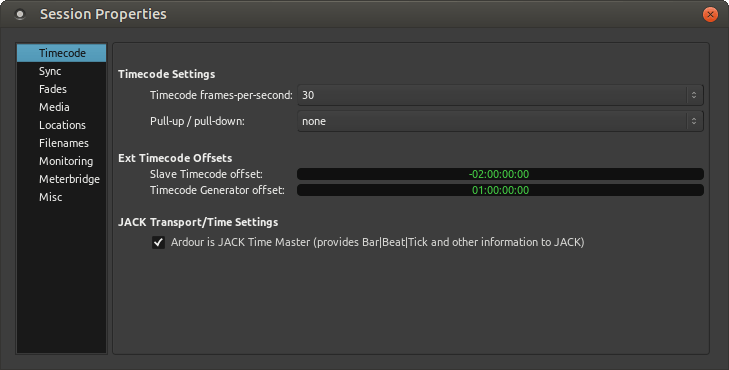

Session properties
==================

Session properties control aspects of the workflow or configuration that pertain to the current session only; these settings are initially set from the template used to create the session. They can be found in **Session > Properties**, and are stored in the session file.

   The Session Properties window

Settings can be searched for using the input box in the lower left corner of the Preferences window. Typing in a keyword and pressing :kbd:`Enter` will open the **Preferences** page where the first occurrence of the keyword is available, the setting will be highlighted. Pressing :kbd:`Enter` again will highlight the next occurrence (where available).

Preferences are grouped by category:

-  `Timecode <#properties-timecode>`__
-  `Sync <#properties-sync>`__
-  `Fades <#properties-fade>`__
-  `Media <#properties-media>`__
-  `Locations <#properties-locations>`__
-  `Filenames <#properties-filenames>`__
-  `Monitoring <#properties-monitoring>`__
-  `Meterbridge <#properties-meterbridge>`__
-  `Misc <#properties-misc>`__

.. _properties_timecode:

Timecode
--------

-  **Timecode Settings**

   -  **Timecode frames-per-second**: defines how many frames of timecode
      are in one second. This can differ from the actual frame rate
      depending on the standard used.
   -  **Pull-up / pull-down**: sets the speed correction to match one actual
      second, e.g. a 4.1667 pull-up matches a 24fps cinema movie to a 25
      fps PAL TV broadcast format.

-  **Ext Timecode Offsets**

   -  **Slave Timecode offset**: when an external timecode source is used,
      adds or substracts the specified offset to the received timecode
      (MTC or LTC).
   -  **Timecode Generator offset**: adds the specified offset to the
      timecode generated by Ardour (so far only LTC) before sending it
      to the external synchronized system.

-  **JACK Transport/Time Settings**

   -  **Ardour is JACK Time Master (provides Bar|Beat|Tick and other
      information to JACK)**: aside from synchronizing any JACK slave,
      Ardour can also provide musical time information (Bar/Beat/Tick)
      for the current absolute position for all the JACK-aware clients
      (N.B. the first jack client that asks for this wins).

.. _properties_sync:

Sync
----

-  **A/V Synchronization**

   -  **Use Video File's FPS Instead of Timecode Value for Timeline and Video Monitor**: when checked, uses the timecode FPS value of the standard used by the video file instead of forcing the FPS set in the `Timecode tab <#properties-timecode>`__.
   -  **Apply Pull-Up/Down to Video Timeline and Video Monitor (Unless using JACK-sync)**: allows to apply the pull-up/down as set in the `Timecode tab <#properties-timecode>`__ to the :ref:`video timeline <video_timeline_and_monitoring>` as displayed in the       editor and to the Video Monitor, resulting in a shorter/longer video in the editor and a speed-up/down in the Video Monitor.

.. _properties_fade:

Fades
-----

-  **Audio Fades**

   -  **Declick when transport starts and stops** creates an artificial
      fade in/out when starting or stopping playback, to avoid the
      'click' sound resulting in starting it at a non zero value.
   -  **Declick when monitor state changes** also creates an artificial
      fade in/out to avoid clicks when a parameter in the monitor
      changes.
   -  **Region fades active** when checked, Ardour applies the region
      :ref:`crossfades <create_region_fades_and_crossfades>` to each
      region's start and end. When unchecked, no fades are applied, and
      clicks may be heard at regions boundaries.
   -  **Region fades visible** when checked, the region fades are visible
      in the the Editor. Unchecking may increase readability for
      sessions made of a lot of tiny regions.

.. _properties_media:

Media
-----

Change how sound is stored on disk. These options do not change how
sound is handled internally.

-  **Audio File Format**

   -  **Sample format** defaults to 32-bit floating point, the same as the
      internal representation. 24-bit and 16-bit integer representation are
      also available, for more lightweight sessions at the cost of a
      reduced audio definition.
   -  **File type** defines what format is used to store the audio files.
      The default is WAVE, and can be changed to Broadcast Wave to store
      metadata and timecodes, CAF to overcome WAVE's limitation to 4Gb
      in size, RF64 to add more channels, etc. The chosen format is
      usually very workflow-specific.

.. _properties_locations:

Locations
---------

These options add file locations that will be searched to find the audio
and midi files used by the session. This is useful when the files have
been imported into the session but not copied into the session.

-  **File Locations**

   -  **Search for audio files in** allows to add a location to look for
      audio files. Adding a location is done by navigating to the
      directory where the files are stored, selecting it and clicking
      Open. The directory will show up in the dialog. The Remove button
      next to the added directory can be used to remove it from the
      search path. Multiple paths can be added this way.
   -  **Search for MIDI files in** is exactly the same, but for MIDI files.

.. _properties_filenames:

Filenames
---------

This tab is used to change how Ardour names recorded regions.

-  **File Naming**

   -  **Prefix Track number** when checked, a unique number will appear on each track in the Editor window and will prefix the region name. If the track number is ``2`` and the region would have been named ``Gtr-1.1``, with track number prefix turned on the region will be named ``2_Gtr-1.1`` instead. See :ref:`Region Naming <region_naming>`.
   -  **Prefix Take Name** when enabled, the first time a track is recorded it will have the specified take name. When recording is stopped, any trailing number on the end of the take name will be incremented by 1. If the specified track name doesn't have a number on the end, the number ``1`` will be suffixed.
   -  **Take name** specifies what name is prefixed if Prefix Take Name is checked.

.. _properties_monitoring:

Monitoring
----------

Provides options affecting monitoring.

-  **Monitoring**

   -  **Track Input Monitoring automatically follows transport state ("auto-input")** affects how input monitoring is handling. See :ref:`Monitor Setup in Ardour <monitor_setup_in_ardour>`.
   -  **Cue containing clips disables implicit (auto) disk monitoring for the track** affects monitor playback.
   -  **Use monitor section in this session** when enabled, displays an extra section in the Mixer window that is modelled on the similarly named section on large analog consoles. More information can be found on the :ref:`Monitor Section <monitor_section>` page.

.. _properties_meterbridge:

Meterbridge
-----------

This tab changes what controls are displayed in the Meterbridge that is available in the **Window > Meterbridge** menu.

-  **Display Options**

   -  **Show Midi Tracks** displays/hides MIDI tracks (even when no synth,
      hence no audio output exists).
   -  **Show Busses** displays/hides :ref:`Busses <track_types>` tracks
   -  **Include Master Bus** displays/hides the :ref:`Master Bus <master_bus_strip>`.

-  **Button Area**

   -  **Rec-enable Button** displays/hides the record arm button (for audio
      and MIDI tracks only)
   -  **Mute Button** displays/hides the mute button (for all tracks/busses
      types)
   -  **Solo Button** same for solo
   -  **Monitor Buttons** displays/hides the two (input and
      playback) :ref:`monitoring <monitoring>` buttons, selecting what
      is played at record and playback time.
   -  **Fader as Gain Knob** displays/hides a rotary button to control the
      gain of the channel.

-  **Name Labels**

   -  **Track Name** adds the tracks' names below the buttons.

.. _properties_midi:

MIDI
----

-  **Draw tool creates opaque MIDI regions** if selected, creates MIDI
   regions that, when placed on top of other regions, don't mix with
   content below during playback.
-  **MIDI region copies are independent** if selected, when a MIDI region
   is copied or duplicated, the new region is not linked to the region
   it was copied from. If it is not selected, the copied regions are
   linked and any editing done on one of the linked regions changes all
   of the linked regions.
-  **Policy for handling overlapping notes on the same MIDI channel**:
   selects how Ardour reacts to possibly conflicting MIDI notes:

   -  never allow them
   -  don't do anything in particular
   -  replace any overlapped existing notes
   -  shorten the overlapped existing note
   -  shorten the overlapping new note
   -  replace both overlapping notes with a single note

.. _properties_misc:

Misc
----

This tab has several things that don't fit on the other tabs.

-  **Miscellaneous Options**

   -  **Default time domain** allows selecting either audio (wallclock) time, or musical (beats) time. In an already opened session, this changes what units various markers operate in.

-  **Metronome**

   -  **Always count-in when recording** when checked, waits for two bars before the actual recording begins. The Metronome will tick (even if disabled) during the count-in. Same as recording with **Transport > Record w/Count-In**.

-  **Defaults**

   -  **Use these settings as defaults** clicking this button makes all the present Session Properties default, by recording them in the default session template.
