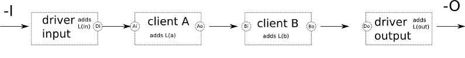

Latency and latency compensation
================================

`Latency <http://en.wikipedia.org/wiki/Latency_%28audio%29>`__ is a system's reaction time to a given stimulus. There are many factors that contribute to the total latency of a system. In order to achieve exact time synchronization all sources of latency need to be taken into account and compensated for.

Sources of Latency
------------------

Sound propagation through the air
~~~~~~~~~~~~~~~~~~~~~~~~~~~~~~~~~

Since sound is a mechanical perturbation in a fluid, it travels at comparatively slow `speed <http://en.wikipedia.org/wiki/Speed_of_sound>`__ of about 340 m/s. As a consequence, an acoustic guitar or piano has a latency of about 1–2 ms, due to the propagation time of the sound between the instrument and the player's ear.

Digital-to-Analog and Analog-to-Digital conversion
~~~~~~~~~~~~~~~~~~~~~~~~~~~~~~~~~~~~~~~~~~~~~~~~~~

Electric signals travel quite fast (on the order of the speed of light), so their propagation time is negligible in this context. But the conversions between the analog and digital domain take a comparatively long time to perform, so their contribution to the total latency may be considerable on otherwise very low-latency systems. Conversion delay is usually below 1 ms.

Digital Signal Processing
~~~~~~~~~~~~~~~~~~~~~~~~~

Digital processors tend to process audio in chunks, and the size of that chunk depends on the needs of the algorithm and performance/cost considerations. This is usually the main cause of latency when using a computer and the one that can be predicted and optimized.

Computer I/O Architecture
~~~~~~~~~~~~~~~~~~~~~~~~~

A computer is a general purpose processor, not a digital audio processor. This means the audio data has to jump a lot of fences in its path from the outside to the CPU and back, contending in the process with some other parts of the system vying for the same resources (CPU time, bus bandwidth, etc.)

The Latency Chain
-----------------

.. note::
   Note! the rest of this document assumes the use of jackd for the audio backend. While many of the concepts are true, the specifics may be different.

.. figure:: images/latency-chain.png
   :alt: Latency chain
   :figclass: invert-in-dark

   Latency chain

The numbers are an example for a typical PC. With professional gear and an optimized system the total round-trip latency is usually lower. The important point is that latency is always additive and a sum of many independent factors.

Processing latency is usually divided into **capture latency** (the time it takes for the digitized audio to be available for digital processing, usually one audio period), and **playback latency** (the time it takes for the audio that has been processed to be available in digital form). In practice, the combination of both matters. It is called **round-trip latency**: the time necessary for a certain audio event to be captured, processed and played back.

.. note::
   It is important to note that processing latency in Ardour is a matter of choice. It can be lowered within the limits imposed by the hardware (audio device, CPU and bus speed) and audio driver. Lower latencies increase the load on the system because it needs to process the audio in smaller chunks which arrive much more frequently. The lower the latency, the more likely the system will fail to meet its processing deadline and the dreaded **xrun** (short for buffer over- or under-run) will make its appearance more often, leaving its merry trail of clicks, pops and crackles.

The digital I/O latency is usually negligible for integrated or PCI audio devices, but for USB or FireWire interfaces the bus clocking and buffering can add some milliseconds.

Low Latency Use Cases
---------------------

Low latency is **not** always a feature one wants to have. It comes with a couple of drawbacks: the most prominent is increased power consumption because the CPU needs to process many small chunks of audio data, it is constantly active and can not enter power-saving mode (think fan noise). Since each application that is part of the signal chain must run in every audio cycle, low-latency systems will undergo **context switches** between applications more often, which incur a significant overhead. This results in a much higher system load and an increased chance of xruns.

For a few applications, low latency is critical:

Playing virtual instruments
~~~~~~~~~~~~~~~~~~~~~~~~~~~

A large delay between the pressing of the keys and the sound the instrument produces will throw off the timing of most instrumentalists (save church organists, whom we believe to be awesome latency-compensation organic systems.)

Software audio monitoring
~~~~~~~~~~~~~~~~~~~~~~~~~

If a singer is hearing her own voice through two different paths, her head bones and headphones, even small latencies can be very disturbing and manifest as a tinny, irritating sound.

Live effects
~~~~~~~~~~~~

Low latency is important when using the computer as an effect rack for inline effects such as compression or EQ. For reverbs, slightly higher latency might be tolerable, if the direct sound is not routed through the computer.

Live mixing
~~~~~~~~~~~

Some sound engineers use a computer for mixing live performances. Basically that is a combination of the above: monitoring on stage, effects processing and EQ.

In many other cases, such as playback, recording, overdubbing, mixing, mastering, etc. latency is not important, since it can easily be compensated for.

To explain that statement: During mixing or mastering, one doesn't care if it takes 10ms or 100ms between the instant the play button is pressed and the sound coming from the speaker. The same is true when recording with a count in.

Latency compensation
--------------------

During tracking it is important that the sound that is currently being played back is internally aligned with the sound that is being recorded.

This is where latency compensation comes into play. There are two ways to compensate for latency in a DAW, **read-ahead** and **write-behind**. The DAW starts playing a bit early (relative to the playhead), so that when the sound arrives at the speakers a short time later, it is exactly aligned with the material that is being recorded. Since we know that playback has latency, the incoming audio can be delayed by the same amount to line things up again.

The second approach is prone to various implementation issues regarding timecode and transport synchronization. Ardour uses read-ahead to compensate for latency. The time displayed in the Ardour clock corresponds to the audio signal that is heard on the speakers (and is not where Ardour reads files from disk).

As a side note, this is also one of the reasons why many projects start at timecode ``01:00:00:00``. When compensating for output latency the DAW will need to read data from before the start of the session, so that the audio arrives in time at the output when the timecode hits ``01:00:00:00``. Ardour does handle the case of ``00:00:00:00`` properly but not all systems/software/hardware that you may inter-operate with may behave the same.

Latency Compensation And Clock Sync
-----------------------------------

To achieve sample accurate timecode synchronization, the latency introduced by the audio setup needs to be known and compensated for.

In order to compensate for latency, JACK or JACK applications need to know exactly how long a certain signal needs to be read-ahead or delayed:

   JACK Latency Compensation

In the figure above, clients A and B need to be able to answer the
following two questions:

-  How long has it been since the data read from port Ai or Bi arrived at the edge of the JACK graph (capture)?
-  How long will it be until the data written to port Ao or Bo arrives at the edge of the JACK graph (playback)?

JACK features an API that allows applications to determine the answers to above questions. However JACK can not know about the additional latency that is introduced by the computer architecture, operating system and soundcard. These values can be specified by the JACK command line parameters :kbd:`-I` and :kbd:`-O` and vary from system to system but are constant on each. On a general purpose computer system the only way to accurately learn about the total (additional) latency is to measure it.

Calibrating JACK Latency
------------------------

Linux DSP guru Fons Adriaensen wrote a tool called ``jack_delay`` to accurately measure the round-trip latency of a closed loop audio chain, with sub-sample accuracy. JACK itself includes a variant of this tool called ``jack_iodelay``.

``jack_iodelay`` allows to measure the total latency of the system, subtracts the known latency of JACK itself and suggests values for jackd's audio-backend parameters.

``jack_[io]delay`` works by emitting some rather annoying tones, capturing them again after a round trip through the whole chain, and measuring the difference in phase so it can estimate with great accuracy the time taken.

The loop can be closed in a number of ways:

-  Putting a speaker close to a microphone. This is rarely done, as air propagation latency is well known so there is no need to measure it.
-  Connecting the output of the audio interface to its input using a patch cable. This can be an analog or a digital loop, depending on the nature of the input/output used. A digital loop will not factor in the AD/DA converter latency.

Once the loop has been closed, one must:

#. Launch jackd with the configuration to test.
#. Launch ``jack_delay`` on the command line.
#. Make the appropriate connections between the jack ports so the loop is closed.
#. Adjust the playback and capture levels in the mixer.

.. important::
   On Linux, the latency of USB audio interfaces is not constant. It may change when the interface is reconnected, on reboot and even when xruns occur. This is due the buffer handling in the Linux USB stack. As a workaround, it is possible to recalibrate the latency at the start of each session and each time an xrun occurs.
