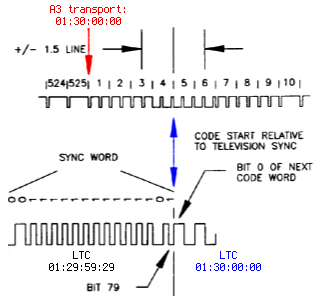

Timecode generators and slaves
==============================

Ardour supports three common timecode formats: **LTC**, **MTC**, and **MIDI Clock**, as well as **JACK-transport**, a JACK-specific timecode implementation.

Ardour can generate timecode and thus act as timecode **master**, providing timecode information to other applications. Ardour can also be **slaved** to some external source in which case the playhead follows the incoming timecode.

Combining the timecode slave and generator modes, Ardour can also **translate** timecode. e.g create LTC timecode from incoming MTC.

Ardour timecode configuration
-----------------------------

Each Ardour session has a specific timecode frames-per-second setting which is configured in :menuselection:`Session > Properties > Timecode`. The selected timecode affects the timecode ruler in the main window as well as the clock itself.

Note that some timecode formats do not support all of Ardour's available fps settings. MTC is limited to 24, 25, 29.97 and 30 fps.

The video pull-up modes change the effective samplerate of Ardour to allow for changing a film soundtrack from one frame rate to another. The concept is beyond the scope of this manual, but Wikipedia's entry on `Telecine <http://en.wikipedia.org/wiki/Telecine>`__ may be a good start.

Ardour timecode generator configuration
---------------------------------------

This is pretty straightforward: simply turn it on. The MTC and MIDI-Clock generator do not have any options. The LTC generator has a configurable output level. JACK-transport cannot be *generated*. Jack itself is always synced to its own cycle and cannot do varispeed—it will always be synced to a hardware clock or another JACK master.

The relevant settings for timecode generator can be found in :menuselection:`Edit > Preferences > MIDI Preferences` (for MTC, MC) and :menuselection:`Edit > Preferences > Transport Preferences` (for LTC).

The timecode is sent to jack-ports ``ardour:MTC out``, ``ardour:MIDI clock out`` and ``ardour:LTC-out``. Multiple generators can be active simultaneously.

.. note::
   Note that, as of Jan 2014, only the LTC generator supports latency compensation. This is due to the fact the Ardour MIDI ports are not yet latency compensated.

In :menuselection:`Session > Properties`, it is possible to define an offset between Ardour's internal time and the timecode sent. Currently only the LTC generator honors this offset.

Both LTC and MTC are limited to 30 fps. Using frame rates larger than that will disable the generator. In both cases also only 24, 25, 29.97df (drop-frame) and 30 fps are well defined by specifications (such as SMPTE-12M, EU and the MIDI standard).

MTC generator
~~~~~~~~~~~~~

The **MTC generator** has no options. Ardour sends full MTC frames whenever the transport is relocated or changes state (start/stop). MTC **quarter frames** are sent when the transport is rolling and the transport speed is within 93% and 107%.

LTC generator
~~~~~~~~~~~~~

The level of the **LTC generator** output signal can be configured in the :menuselection:`Preferences > Transport` dialog. By default it is set to -18 dBFS, which corresponds to 0dBu in an EBU calibrated system.

The LTC generator has an additional option to keep sending timecode even when the transport is stopped. This mode is intended to drive analog tape machines which unspool the tape if no LTC timecode is received.

LTC is sent regardless of Ardour's transport speed. It is accurately generated even for very slow speeds (<5%) and only limited by the soundcard's sampling-rate and filter (see `Gibbs phenomenon <http://en.wikipedia.org/wiki/Gibbs_phenomenon#Signal_processing_explanation>`__) for high speeds.

Ardour slave configuration
--------------------------

The timecode source can be switched with the button just right of Ardour's main clock. By default it is set to :guilabel:`Internal` in which case Ardour will ignore any external timecode. The button allows to toggle between Internal and the configured timecode source which is chosen in :menuselection:`Edit > Preferences > Transport`.

When Ardour is **chasing** (synchronizing to) an external timecode source, the following cases need to be distinguished:

#. the timecode source shares the clock
#. the timecode source is independent (no wordclock sync)

and

#. the timecode source uses the same FPS setting as Ardour
#. the timecode source runs at different frames-per-second

In both cases the first option is preferred: clock sync + same FPS setting.

Frames-per-second

If the frames-per-second do not match, Ardour can either re-calculate and map the frames, or the configured FPS (:menuselection:`Session > Properties`) can be changed automatically while the slave is active. The behavior is configured with the checkbox :menuselection:`Edit > Preferences > Transport > Match session video frame rate to external timecode`.

When enabled, the session video frame rate will be changed to match that of the selected external timecode source. When disabled, the session video frame rate will not be changed to match that of the selected external timecode source. Instead the frame rate indication in the main clock will flash red, and Ardour will convert between the external timecode standard and the session standard.

.. note::
   29.97 drop-frame timecode is another corner case. While the SMPTE 12M-1999 specifies 29.97df as 30000/1001 frames per second, not all hardware devices follow that standard. The checkbox :guilabel:`Lock to 29.9700 fps instead of 30000/1001` allows to use a compatibility mode for those devices.

   When enabled, the external timecode source is assumed to use 29.970000 fps instead of 30000/1001. SMPTE 12M-1999 specifies 29.97df as 30000/1001. The spec further mentions that drop-frame timecode has an accumulated error of -86 ms over a 24-hour period. Drop-frame timecode would compensate exactly for a NTSC color frame rate of 30 * 0.9990 (ie 29.970000). That is *not* the actual rate. However, some vendors use that rate—despite it being against the specs—because the variant   of using exactly 29.97 fps yields zero timecode drift.

Clock sync lock
~~~~~~~~~~~~~~~

As described in the `On Clock and Time <@@on-clock-and-time>`__ chapter, timecode and clock are independent. If the external timecode source is not in sample-sync with the audio hardware (and JACK), Ardour needs to run at varispeed to adjust for the discrepancy.

The checkbox External timecode is sync locked allows to select the behavior according to the setup. When enabled, it indicates that the selected external timecode source shares sync (Black & Burst, Wordclock, etc) with the audio interface.

In other words: if enabled, Ardour will only perform initial synchronization and keep playing at speed 1.0 instead of vari-speed adjusting to compensate for drift.

MIDI clock
~~~~~~~~~~

MIDI Clock is not a timecode format but tempo-based time. The absolute reference point is expressed as beats-per-minute and Bar, Beat and Tick. There is no concept of sample-locking for MIDI clock signals. Ardour will vari-speed if necessary to chase the incoming signal.

Note that the MIDI Clock source must be connected to the ``ardour:MIDI clock in`` port.

LTC—linear timecode
~~~~~~~~~~~~~~~~~~~

The LTC slave decodes an incoming LTC signal on a JACK audio port. It will auto-detect the frame rate and start locking to the signal once two consecutive LTC frames have been received.

The incoming timecode signal needs to arrive at the ``ardour:LTC-in`` port. Port-connections are restored for each session and the preference dialog offers an option to select it for all sessions.

Ardour's transport is aligned to LTC-frame start/end positions according to the SMPTE 12M-1999 specification, which means that the first bit of an LTC-Frame is aligned to different Lines of a Video-Frame, depending on the TV standard used. Only for Film (24fps) does the LTC-Frame directly match the video Frame boundaries.

   LTC frame alignment for the 525/60 TV standard

Ardour supports vari-speed and backwards playback but will only follow speed changes if the sync locked option is disabled.

While Ardour is chasing LTC, the main transport clock will display the received Timecode as well as the delta between the incoming signal and Ardour's transport position.

A global offset between incoming timecode and Ardour's transport can be configured in :menuselection:`Session > Properties`.

The user-bits in the received LTC frame are ignored.

MTC—MIDI timecode
~~~~~~~~~~~~~~~~~

Ardour's MTC slave parses full timecode messages as well as MTC quarter-frame messages arriving on the ``ardour:MTC in`` port. The transport will only start rolling once a complete sequence of 8 quarter frames has been received.

Ardour supports vari-speed and backwards playback but will only follow MTC speed changes if the sync locked option is disabled.

When Ardour is chasing MTC, the main transport clock will display the received timecode as well as the delta between the incoming signal and Ardour's transport position.

JACK transport
~~~~~~~~~~~~~~

When slaved to jack, Ardour's transport will be identical to JACK Transport. As opposed to other slaves, Ardour can be used to control the JACK transport states (stopped/rolling). No port connections need to be made for JACK Transport to work.

JACK Transport does not support vari-speed, nor offsets. Ardour does not chase the timecode but is always in perfect sample-sync with it.

JACK Transport also includes temp-based time information in Bar:Beats:Ticks and beats-per-minute. However, only one JACK application can provide this information at a given time. The checkbox :menuselection:`Session > Properties > JACK Time Master` configures Ardour to act as translator from timecode to BBT information.
