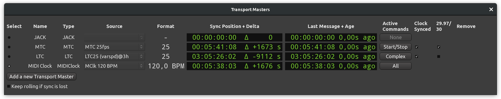
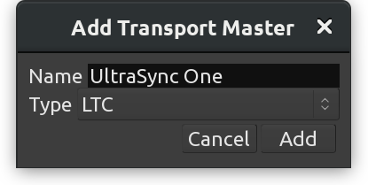

Transport masters
=================

The :guilabel:`Transport Masters` dialog allows selecting a transport master (a timecode source) for Ardour to sync to, as well as tweaking additional settings.

   Transport Masters

Supported protocols are:

-  JACK Transport
-  MIDI Time Code (MTC)
-  Linear (or Longitudinal) Timecode (LTC)
-  MIDI Beat Clock, or MIDI Clock

For each type of supported protocol it's possible to select the port to read timecode signal from, view sync position and drift (delta), see when any message was received the last time, and toggle additional options.

Selecting a transport master
----------------------------

The dialog collects all transport masters information and settings in one place, however Ardour can sync only to one timecode source at a time. Clicking the radio button to the left of the master's name selects that transport master.

It is necessary to also select an audio or MIDI port (depending on the protocol) to read timecode data from. Relevant ports are listed for each transport master in the dropdown list in the :guilabel:`Source` section.

Keeping track of sync
---------------------

:guilabel:`Format` displays the timecode format for each transport master depending on the specifics of that master's protocol. E.g. while MTC and LTC will display a frame rate such as 25 fps, MIDI Clock will be transmitting tempo such as 120 beats per minute.

:guilabel:`Sync Position + Delta` displays current location as per timecode as well as the difference between current location in Ardour and the location per timecode source. This difference (delta) accumulates as long as Ardour's transport isn't rolling.

:guilabel:`Last Message + Age` displays the latest location transmitted by the timecode source, as well as the time since the last transmission was received.

Additional options
------------------

It's possible to set several additional options.

:guilabel:`Active Commands` makes it possible to perform certain types of actions in Ardour at the cost of decoupling from the transport master. Supported options are:

-  Accept start/stop commands (displays 'Start/Stop' on the button)
-  Accept speed-changing commands (displays 'Speed' on the button)
-  Accept locate commands (displays 'Locate' on the button)

When only one command is enabled, its short name will displayed at the button's caption (see above). When two out of three are enabled, the button's caption will be 'Complex'. When all three options are enabled, the caption will be 'All'.

The easiest way to select two or three options at a time is to open the drop-down menu, use arrow up/down keys to navigate to the option of interest, the press :kbd:`Spacebar` to toggle that option without subsequently closing the drop-down menu.

:guilabel:`Clock Synced` — when this option is enabled, the external timecode source is assumed to be sample-clock synced to the audio interface that is being used by Ardour

:guilabel:`29.97/30` — when this option is enabled, the external timecode source is assumed to use 29.97 fps exactly rather than 30000/1001 (which is 29.97002997).

Both :guilabel:`Clock Synced` and :guilabel:`29.97/30` options are not applicable to **MIDI Beat Clock** that operates in the musical time domain and transmits beats per minute rather that seconds and frames.

Adding and removing custom transport masters
--------------------------------------------

It is possible to **add** additional masters of the same type, e.g. two difference sources of LTC.

Clicking :guilabel:`Add a New Transport Master` opens a new dialog.

   Add a new transport master

It's usually a good idea to give the custom transport master a descriptive name, especially if there are multiple ones available using the same protocol.

The next step is selecting the audio or MIDI port where the timecode signal will be coming from.

Additional transport masters can be **removed** with a single click. Every custom transport master has a button with a crosshair icon :kbd:`X` to the right of the window. No confirmation will be asked upon clicking this button.
