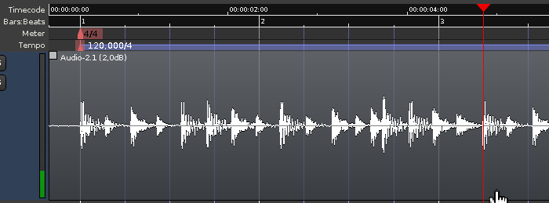
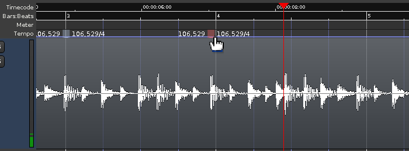
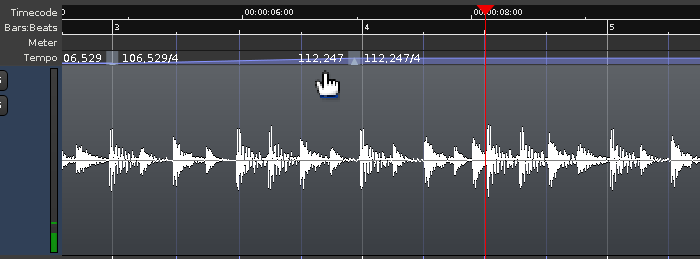

.. _techniques_tempo_time_signature:

Techniques for working with tempo and time signature
====================================================

Matching a recorded tempo with a tempo ramp
-------------------------------------------

As a general approach, the best way to control tempo ramps is to use
them in pairs.

One typical use of tempo ramps is to match the click to a drum
performance recorded in 'free time', like in the (admittedly bad) 4/4
example on the left.

   
   Initial state

Step 1: First time signature
~~~~~~~~~~~~~~~~~~~~~~~~~~~~

The first thing needed is determining where the first beat is in the
recording and left-dragging the first time signature to that position.

.. figure:: images/tempo-ramp_2.png
   :alt: Step 1/5
   
   Placing the first time signature

Step 2: Locating the n-th bar
~~~~~~~~~~~~~~~~~~~~~~~~~~~~~~~~

Now the first click will be in time with the first beat. By listening to
the recorded drums, the position of bar *n* (here, 9th beat, 3rd bar) is
visually located (the playhead may be moved to this location to "pin"
it).

   
   Locating a known beat

Step 3: Aligning the ruler with the tempo
~~~~~~~~~~~~~~~~~~~~~~~~~~~~~~~~~~~~~~~~~

Holding the constraint modifier (:kbd:`Shift` by default, may be changed in
**Preferences > Editor > Modifiers**), the third bar marker in the BBT ruler
is dragged at the position of the third bar in the recording (where the
playhead is located). This drag can be done either in the Time Signature
or in the Tempo rulers. The tempo (on the first and only tempo marker)
reflects the new value based on this change.

The click now matches the first 8 beats, but after that it can wander
off, which will be reflected in the tempo lines thet won't quite match
the drum hits.

   Matching the tempi

Step 4: Placing a new tempo marker
~~~~~~~~~~~~~~~~~~~~~~~~~~~~~~~~~~

A new tempo marker is placed on the last position where the click
matches the recorded audio, by :kbd:`Ctrl`-clicking the **Tempo** ruler.
This will "anchor" the value of the tempo at that position.

.. figure:: images/tempo-ramp_5.png
   :alt: Step 4/5
   
   Creating a tempo marker

Step 5: Placing another tempo marker at the n-th beat
~~~~~~~~~~~~~~~~~~~~~~~~~~~~~~~~~~~~~~~~~~~~~~~~~~~~~~~~

Another tempo marker is placed *n* beats after the previous marker
(here, 4 beats, 1 bar).

   
   Placing another marker

Step 6: Changing the tempo to a new value
~~~~~~~~~~~~~~~~~~~~~~~~~~~~~~~~~~~~~~~~~

Now, :kbd:`Shift`-dragging any beat **after** the second new tempo
marker will allow to align the drum audio and tempo after the second
marker.

.. figure:: images/tempo-ramp_7.png
   :alt: Step 5/5

   Adjusting the tempo

Step 7: Ramping the tempo change
~~~~~~~~~~~~~~~~~~~~~~~~~~~~~~~~

Although it may be unnecessary in some cases where the tempo changes
abruptly, most of the time, the tempo change is progressive in time,
like an instrumentist drifting in tempo. In those cases, the tempo
change should be progressive too, and Ardour allows that by ramping the
tempo change.

Right-clicking the first tempo marker, a menu appears, allowing to
**Ramp to Next**. This will make the tempo between the two markers
linearly change from the first marker's value to the second's.

   
   Ramping the change

Again, some time later the click will probably drift again, so the same
technique has to be repeated: adding two new tempos and dragging the BBT
ruler **after** the newest tempo so that the beats align with the audio
again.

In a general sense, adding tempo markers in pairs allows to 'pin' the
tempo at the marker's location while moving further to the right.

Other use cases
---------------

Audio-locked time signatures can be useful when composing, as they allow
a continuous piece of music to be worked on in isolated segments,
preventing the listening fatigue of a fixed form. Reassembly is left as
an exercise for the reader.

Tempo ramps can also be used in a video context, e.g. for an
accelerando, by snapping to TC frames and dragging the ruler so that a
bar ends up on a significant video frame.
