.. _bundled_plugins_filters:

Filters
=======

ACE Compressor
--------------

The job of this filter is to make an audio recording perceivably louder
by reducing the dynamic range, that is, the difference between the
loudest and the quietest parts. ACE compressor lowers the volume of loud
sounds above a user-defined threshold measured in dB, then the gain of
all the sound gets increased to make up for lost loudness.

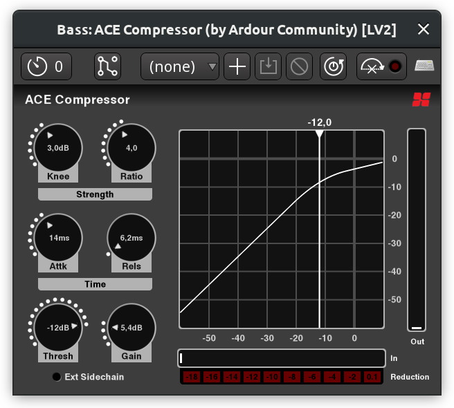

   ACE Compressor

Available settings are:

-  **Threshold**. This setting defines the loudness at which the
   compressor will start working.
-  **Knee**. Whether the transition from uncompressed to compressed is
   soft or hard. The effect is more noticeable with larger ratios.
-  **Ratio**. How much the gain is reduced above a certain threshold. If
   the ratio is e.g. 5:1, 5dB will become 1dB.
-  **Attack**. How long (in ms) it takes to apply maximum compression.
-  **Release**. How long it takes to return to zero compression.
-  **Makeup Gain**. How much the overall level should be increased after
   reducing loud sections.
-  **Sidechain**. Whether the effect should be activate by the loadness
   of audio signal in another track passing a certain threshold.

The plugin also provides an opt-out inline display that shows input
signal, threshold, and resulting gain reduction:

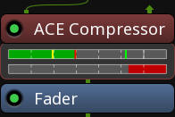

   Inline display

ACE Expander
------------

Contrary to compressors, expanders increase the dynamic range either by
making quite sounds quieter (downward expanders) or by making loud
sounds louder (upward expanders). *ACE Expander* is a downward expander.
It reduces the level of a signal below a user-defined threshold by
user-defined ratio, then optionally increases the overall gain to make
up for lost loudness.

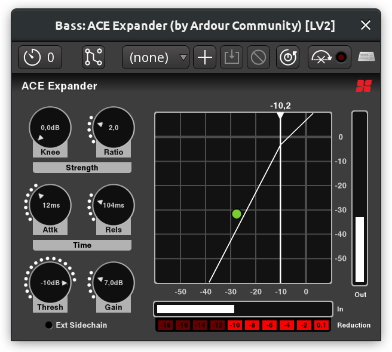

   ACE Expander

Available settings are:

-  **Attack**. How long (in ms) it takes to apply maximum reduction of
   the quiet sections.
-  **Release**. How long it takes to stop reducing the quiet signal at
   all.
-  **Knee**. Whether the transition from non-reduced to reduced signal
   level is soft or hard. The effect is more noticeable with larger
   ratios.
-  **Ratio**. How much the gain is reduced below a certain threshold. If
   the ratio is e.g. 3:1, -10dB will become -30dB.
-  **Threshold**. The loudness at which the expander will start working.
-  **Makeup Gain**. How much the overall level should be increased after
   reducing quiet sections.
-  **Sidechain**. Whether the effect should be activated by the loudness
   of audio signal in another track passing a certain threshold.

*ACE Expander* also comes with an inline widget for mixer channels that
displays the input signal level, the threshold, and the amount of
reduced signal.

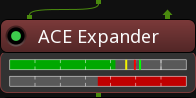

   Inline display

ACE Delay
---------

Delay effects repeat original signal after a user-defined interval. In
*ACE Delay*, the interval is calculated from the tempo and the divisor —
a musical time unit like a 1/4th note or a dotted 1/16th note. When
using a delay in music production, it's usually best to sync to
project's tempo, especially if there are tempo ramps in a song.

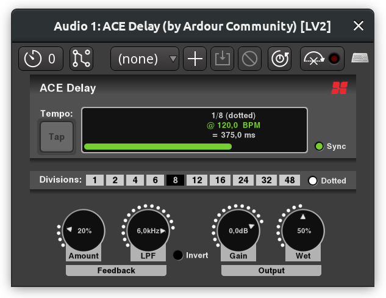

   ACE Delay

Available settings are:

-  **Tempo**. Amount of beats per minute.
-  **Sync**. This toggles the syncing to project's tempo.
-  **Divisor**. The interval between the original sound and its delayed
   copy, expressed in whole or fractional notes (1/4th, 1/8th etc.)
-  **Dotted**. When enabled, adds half the divisor unit to the delay
   interval, e.g. a 1/8th note becomes a dotted 1/8th note.
-  **Time**. The final delay time expressed in milliseconds.
-  **Feedback**. How much of the processed signal goes back into the
   delay effect's input.
-  **Low-Pass Filter (LPF)**. This helps simulating analog delay effects
   where the repeated signal gets dull.
-  **Invert**. This option inverts the polarity of the output signal.
-  **Output Gain**. Reduces or increases the level of the output signal.

ACE Reverb
----------

A reverb effect emulates sound waves reflecting off the walls in a
closed space which could be a a small room or a cathedral. The effect is
usually applied to a "dry" audio recording, that is, one typically made
in a very small room with acoustic absorption treatment so that there
are little-to-no reflections. That way, a reverb effect makes the most
sense as it gives you a clean slate and more freedom to shape your
sound.

The *ACE Reverb* effect is a very simple one, based on early research to
artificial reverberation by Manfred Schroeder and Ben Logan (`see
here <https://ccrma.stanford.edu/~jos/pasp/Schroeder_Reverberators.html>`__
for technical details). There are just two controls:

-  **Blend**. This control changes the mix in favour of either "dry"
   unprocessed signal that is being fed into the effect or the "wet"
   processed by the effect. 0 means you only hear the unprocessed
   signal, 1 mean you only hear the processed signal.
-  **Room Size**. This control changes the size of the virtual room and
   therefore the amount of decay.

.. _ace-high-low-pass-filter:

ACE High/Low Pass Filter
------------------------

High-pass and low-pass filters reduce the signal below and above a
certain frequency respectively. The *ACE High/Low Pass* filter combines
the two filters in one.

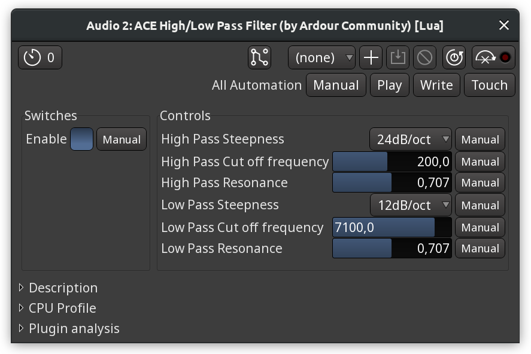

   ACE High/Low Pass Filter

Each of the two bandpass filters has three controls:

-  **Steepness**. How much the filter reduces the signal per each step
   (12dB/oct to 48dB/oct). Setting steepness to *Off* disables the
   filter entirely.
-  **Cutoff frequency**. The base frequency where the filter begins
   cutting off the data.
-  **Resonance**. How much the signal around the cutoff frequency is
   suppressed (lower values) or emphasized (higher values). The plugins
   defaults to 0.707 which roughly translates to "do nothing".

The plugin also comes with an inline display visualizing the effect that
the filters have.

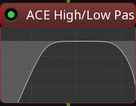

   Inline display

ACE EQ
------

Equalizers are commonly used to shape the sound, change timbre of an
instrument and generally help it sit better in a mix.

ACE EQ is a simple 4-band equalizer with a low and a high shelves. All
bands and shelves are optional and can be disabled by clicking on the
outer border of respective parameters boxes.

For each band it's possible to set the base frequency, the gain level,
and the bandwidth. The latter defines how much frequencies around the
base frequency are affected by the gain adjustment. In an example below,
the first band has the narrowest bandwidth of 0.1, and the third band
has the default banwidth of 1.0. While both bands have a gain of +10dB,
the first one is very narrow, but the third one is wide enough so that
changes begin affecting frequencies that belong to neighboring frequency
bands.

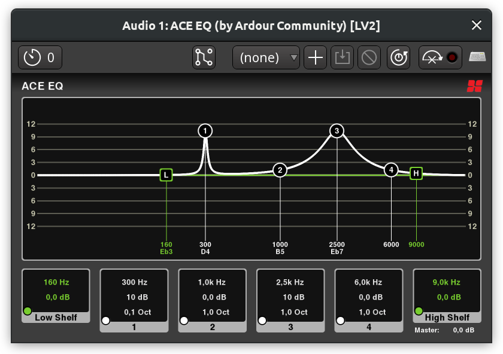

   ACE EQ bandwidths

There are three ways to adjust both frequency, gain, and bandwidth:

#. **Directly on the diagram**. Dragging the band mark (1 through 4)
   left and right changes the frequency, dragging it up and down changes
   the gain. Scrolling the mouse wheel over the band mark changes the
   bandwidth.

#. **In the bottom parameters boxes**. Scrolling the mouse wheel over a
   setting changes its value. This is also where and how the master
   output can be adjusted.

#. **Numerically via the generic plugin UI**. This user interface can be
   displayed by right-clicking on the plugin in the mixer channel and
   choosing the *Edit with generic controls…* option.

ACE EQ also provides an inline display for mixer channels:

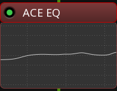

   Inline display

ACE Notch Bank
--------------

This is a very basic harmonic filter that suppresses a user-defined
number of harmonics (stages) starting at a user-defined base frequency.
The filter is mostly useful as a demonstration for Ardour's built-in
biquadratic filter that can be used in Lua scripts.

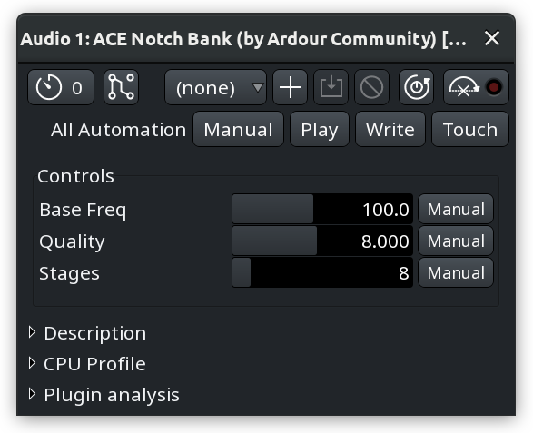

   ACE Notch Bank

An example below is a sine wave at 120Hz with added harmonics, each at a
lower magnitude than the previous one. Applying the ACE Notch Bank
filter starting at 120Hz with 8 stages completeles silences the signal
(the purple line for processed signal is not even visible):

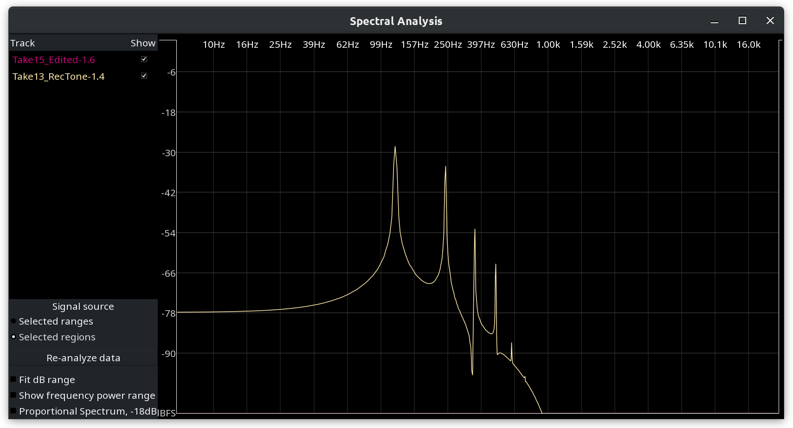

   Results of applying ACE Notch Bank
