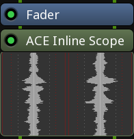
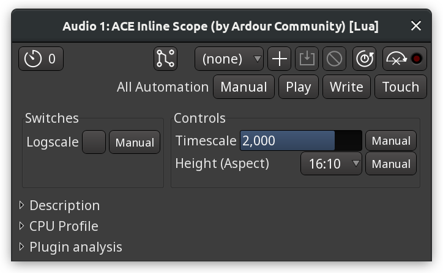
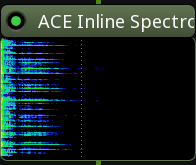
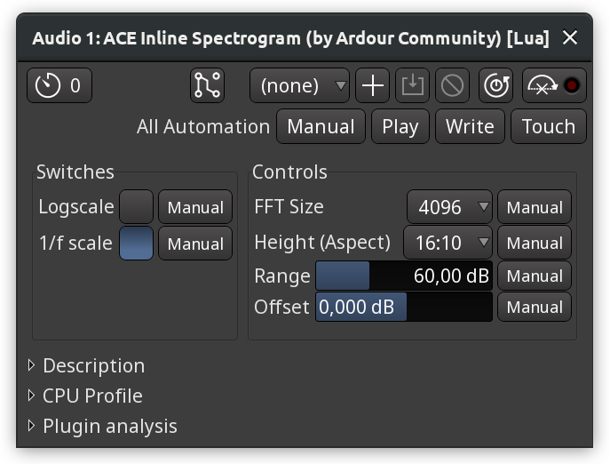
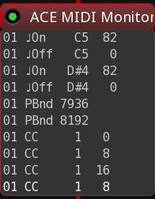
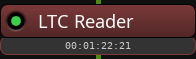

.. _bundled_plugins_inline_scopes:

Inline scopes
=============

ACE Inline Scope
----------------

This inline scope displays the waveform of audio being played in the
track or streamed into track's input. The waveform moves downwards.

   Inline Scope

The scope has a few settings:

-  **Timescale**. How many seconds of audio fit into the display at any
   time.
-  **Height (Aspect)**. The aspect ratio of the inline display.

   Inline Scope Options

ACE Inline Spectrogram
----------------------

This plugin displays a spectrogram of audio signal being played in the
track or streamed into track's input.

   ACE Inline Spectrogram

The plugin has a number of options:

-  **Logscale**. Whether the plugin should use a logarithmic rather than
   a linear scale.
-  **1/f scale**. Whether the spectrum analyzer should adjust for 1/f
   aka "pink noise" to provide a more useful representation of the
   signal.
-  **FFT size**. This is the frequency resolution. The more bins in
   analysis window, the better resolution.
-  **Height (Aspect)**. The aspect ratio of the inline display.
-  **Range**. The dynamic range of the spectrum analyzer in dB.
-  **Offset**. Optional gain correction of the original signal if it's
   too quiet or too loud.

   Inline Spectrogram options

ACE MIDI Monitor
----------------

This inline tool displays all incoming or outgoing MIDI events in a
track or a bus.

   ACE MIDI Monitor

There are several options:

-  **Hexadecimal**. Whether values should be displayed in hexadecimal
   notation, e.g. 1E00 instead of 7680.
-  **System messages**. Whether the Monitor should display system
   control and real-time messages
-  **Numeric notes**. Whether the Monitor should display notes in the
   numeric notation, e.g. 48 instead of C3.
-  **Font size**. The font size used to display events.
-  **Line count**. How many lines the MIDI MOnitor should display in the
   mixer strip.

LTC Reader
----------

This is a Linear Timecode (LTC) decoder with an inline display in the
mixer strip. It can display either the LTC data from regions in a track
or any LTC data streamed into track's input.

   LTC Reader
