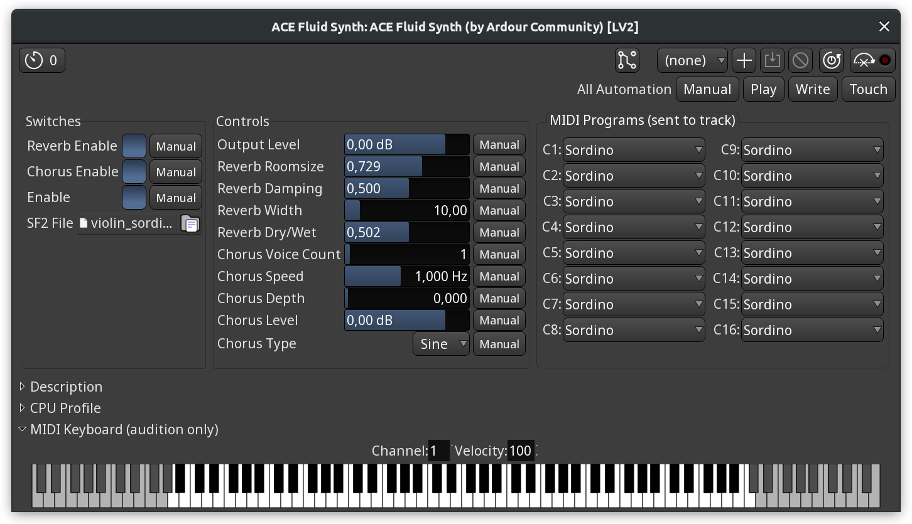
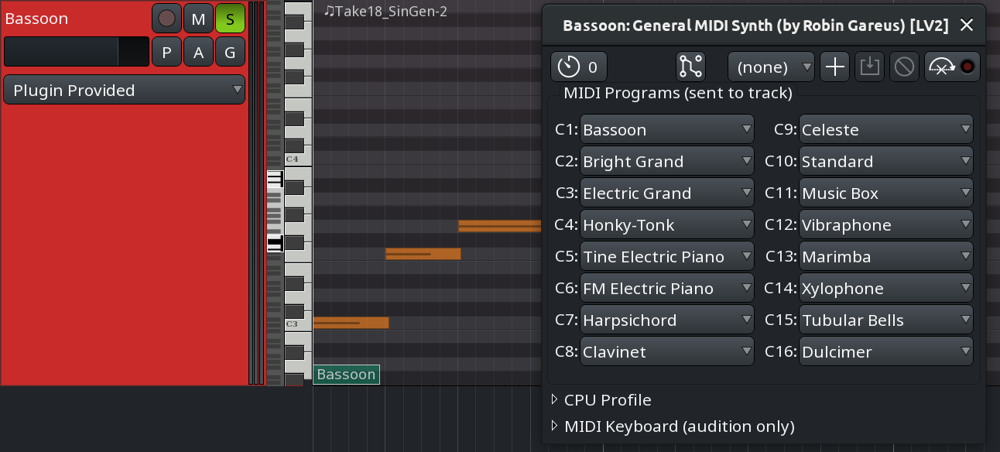

.. _bundled_plugins_instruments:

Instruments
===========

ACE Fluid Synth
---------------

This is a simple FluidSynth-based synthesizer that uses SF2 samples and
comes with two built-in effects that are part of FluidSynth: reverb and
chorus.

   ACE Fluid Synth

Available settings are:

-  **Reverb enable**. Toggles the reverb effect.
-  **Chorus enable**. Toggles the chorus effect.
-  **Output level**. Adjusts the output gain.
-  **Reverb Room Size**. Controls the room size of the reverb effect.
-  **Reverb Damping**. Controls the absorption of high frequencies in
   the reverb.
-  **Reverb Width**. Adjusts the stereo spread of the reverb signal.
-  **Reverb Dry/Wet**. Changes the mix in favor of either "dry"
   unprocessed signal that is being fed into the effect or the "wet"
   signal processed by the effect.
-  **Chorus Voice Count**. The voice count of the chorus.
-  **Chorus Speed**. The modulation speed in Hz.
-  **Chorus Depth**. The modulation depth of the chorus.
-  **Chorus Level**. The output level of the chorus signal.
-  **Chorus Type**. The type of the modulation wave, sine or triangle.

This instrument plugin doesn't work without 3rd party SF2 files,
otherwise it will be silent. `This
thread <https://discourse.ardour.org/t/where-to-find-nice-soundfonts/107686>`__
on the Ardour forum has a number of links to royalty-free samples in the
SF2 file format.

General MIDI Synth
------------------

This is a convenience plugin for playing standard MIDI files. It uses
the FluidSynth engine and the GeneralUser GS soundfont by S. Christian
Collins. The plugin comes with a MIDI map for simple patch selection in
the user interface. General MIDI Synth was developed outside Ardour and
comes bundled with it as 3rd party software in the official builds
available from Ardour's website.

   General MIDI Synth

ACE Reasonable Synth
--------------------

This is a very minimal synth with a piano-like sound, developed
primarily for auditioning MIDI files. It comes with no controls, however
it can be used creatively with a number of effects running on top of it.
