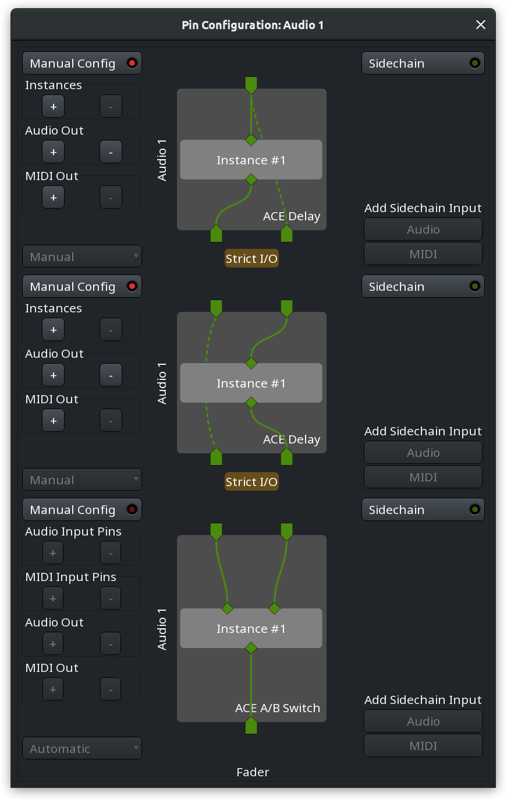
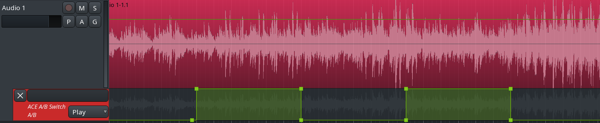
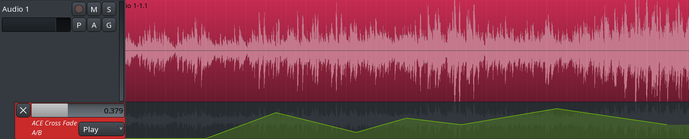
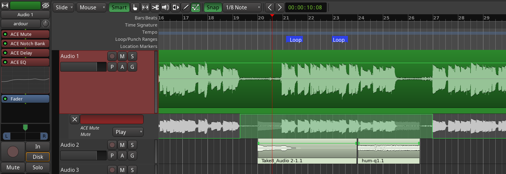
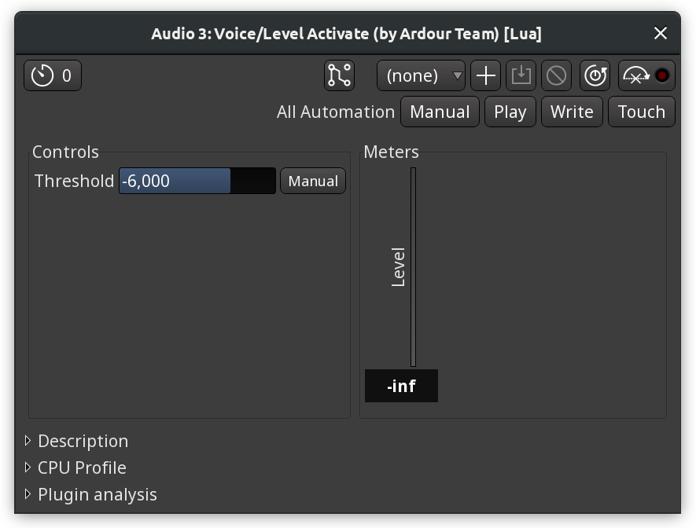
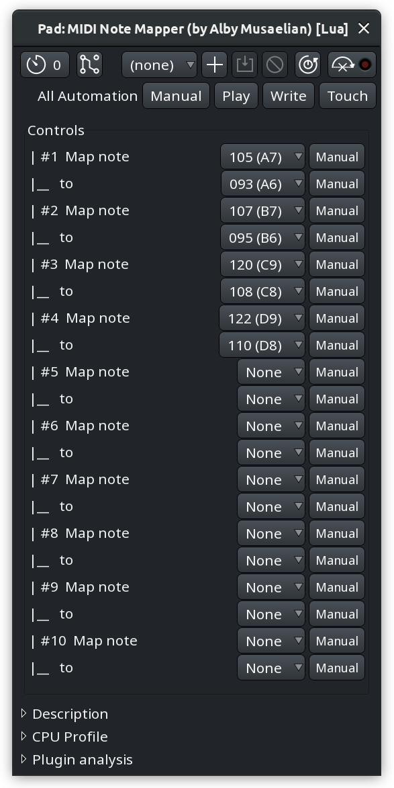
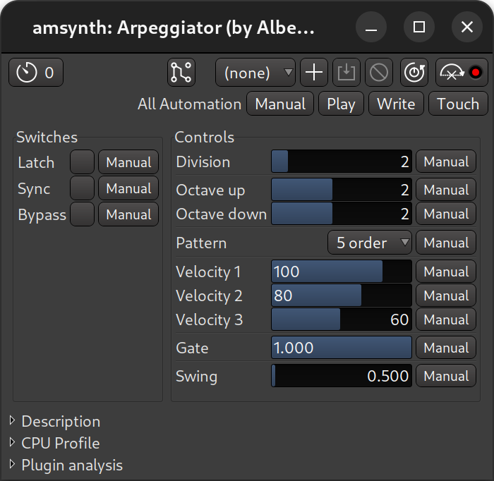
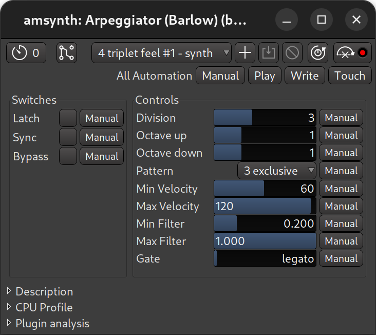
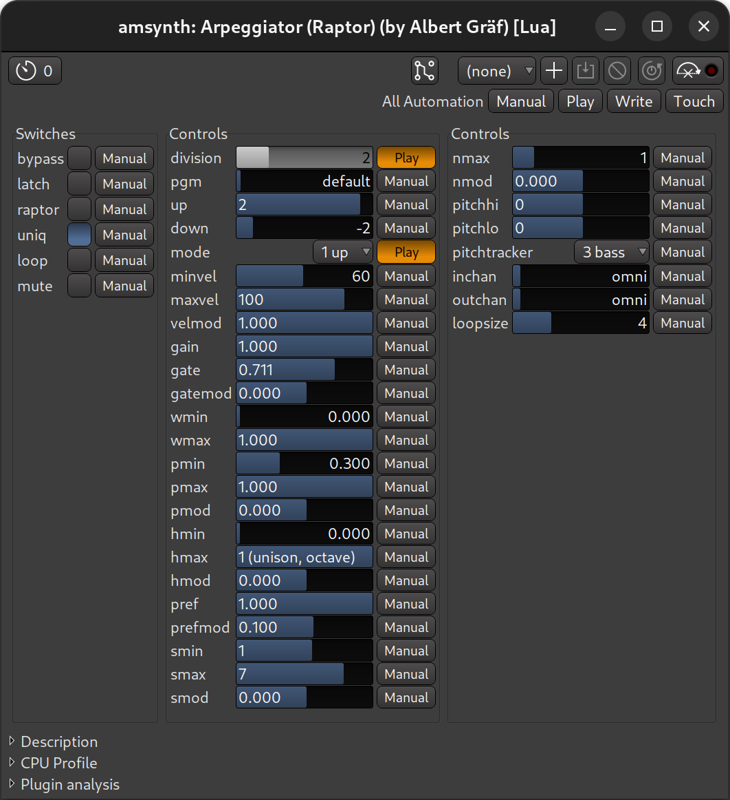

.. _bundled_plugins_utilities:

Utilities
=========

ACE Amplifier
-------------

This plugin can adjust gain by ``+/- 20dB`` anywhere in the processor
box. It's typically useful in scenarios where a plugin's output needs to
be adjusted, but the plugin does not provide its output level control.

**Gain** is the only available setting. It can be set in the generic
plugin editor dialog or adjusted on the respective automation lane.

.. _ace-a-b-switch-cross-fade:

ACE A/B Switch and ACE Cross Fade
---------------------------------

These two plugins are very similar and allow switching between two
plugins earlier in the processing chain using an automation lane and
custom pin connections.

In the example below, the processor box for a 1-channel track has two
ACE Delay plugins processing the input differently. Each plugin has
one manually added output so that the original signal would flow into
one instance of a plugin while bypassing the other one. All two
resulting outputs then flow into the ACE A/B Switch plugin. Input 1 is
considered the A version, input 2 is the B version.

   Pin Connections for ACE A/B Switch

Both ACE A/B Switch and ACE Cross Fade will default to the A version.
Using an automation lane, it's switch to the B version and back. This is
where the difference between the two plugins comes into play.

With ACE A/B Switch, the switch is instant, it's either A or B:

   Pin Connections for ACE A/B Switch

With ACE Cross Fade, however, it's possible to gradually transition to
the B version and then back, mixing A and B signal in different ratios.

   Pin Connections for ACE Cross Fade

The plugins support 1-, 2-, and 4-channel configurations:

-  Mono out: In 1/2 -> Out 1
-  Stereo out: In 1/3 -> Out 1, In 2/4 -> Out 2
-  Quad out: In 1/5 -> Out 1, In 2/6 -> Out 2, In 3/7 -> Out 3, In 4/8
   -> Out 4

ACE Mute
--------

This plugin can mute the signal anywhere in the processing chain as
opposed to automating the mute state of the track that works on all
processed audio only. Using *ACE Mute* in the very beginning of the
signal chain means that in the muted state no signal is processed by
plugins further in the processing chain.

*ACE Mute* has no settings. All user interaction happens in the
dedicated automation lane:

   Using ACE Mute

Ardour also ships with a variation of *ACE Mute* called *ACE Slow Mute*
that applies a 1 second long fade out/in before/after the muting.

.. _voice-level-activate:

Voice/Level Activate
--------------------

This plugin rolls the transport when the signal level on the plugin's
input exceeds a user-defined level. A common scenario where this is
helpful is recording in a home studio where an instrument or a vocal mic
is at a distance from the computer. Arming a track for recording,
toggling recording mode, then clapping in front of a mic or plucking a
string will roll the transport and start recording to a track of choice.

   Voice/Level Activate

The only configurable setting is the input level threshold.

MIDI Note Mapper
----------------

Maps arbitrary MIDI notes to others. This affects both note-on and
note-off events, as well as polyphonic key pressure. A single note can
be mapped twice, but only the last mapping is used.

   MIDI Note Mapper

Arpeggiators
------------

Arpeggiators commonly take a chord and play it note by note in a certain
pattern: up (from the lowest note to the highest note), down (from the
highest note to the lowest one), up and down, down and up, or in a
random fashion.

They also have a number of additional settings like division that
defines the rate at which an arpeggiator will repeat the pattern. Or the
number of octaves the arpeggiator will jump between while transposing a
repeating note.

All three arpeggiators shipped with Ardour — simple arpeggiator, Barlow
arpeggiator, and Raptor arpeggiator — share these basic settings.
However, some of their design specifics vary.

The simple arpeggiator allows setting different velocities for notes at
the bar line, beat line, and subdivisions. It also has a swing setting.

   Simple arpeggiator

The Barlow arpeggiator has sample-accurate triggering and automatically
adjusts to the current time signature. It also allows setting min and
max velocity.

   Barlow arpeggiator

The Raptor arpeggiator has harmonic controls, input pitch and velocity
tracking, and a few other features.

   Raptor arpeggiator
