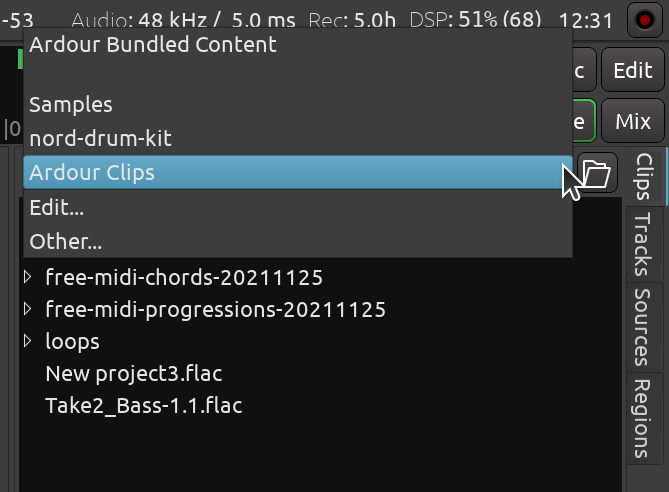

.. _adding_local_clip_libraries:

Adding local clip libraries
===========================

You can add as many sample library locations as you like and easily
switch between them using the drop-down list at the top of the **Clips**
browser.

There are two ways to add new library location. The first one is by
using the **Edit Sample Library Path** window directly:

#. In the **Clips** tab of the sidebar, click the top drop-down list and
   choose **Edit**.
#. In the newly opened dialog called **Edit Sample Library Path** click
   **Add** and locate the folder that contains samples. If there are
   subfolders, choose the parent folder that contains all of them.
#. Repeat for all other sample libraries.
#. Click **OK** to apply changes.

Alternatively, you can drop a folder from a file manager into the list
of clips in the **Clips** browser. This will add a new clip library location
stored across sessions.

Now when you click the drop-down list at the top of **Clips**, you will see
all the paths you added.

Should you need to delete any path you previously added, open the **Edit
Sample Library Path** dialog again, select the path and click **Delete**.
