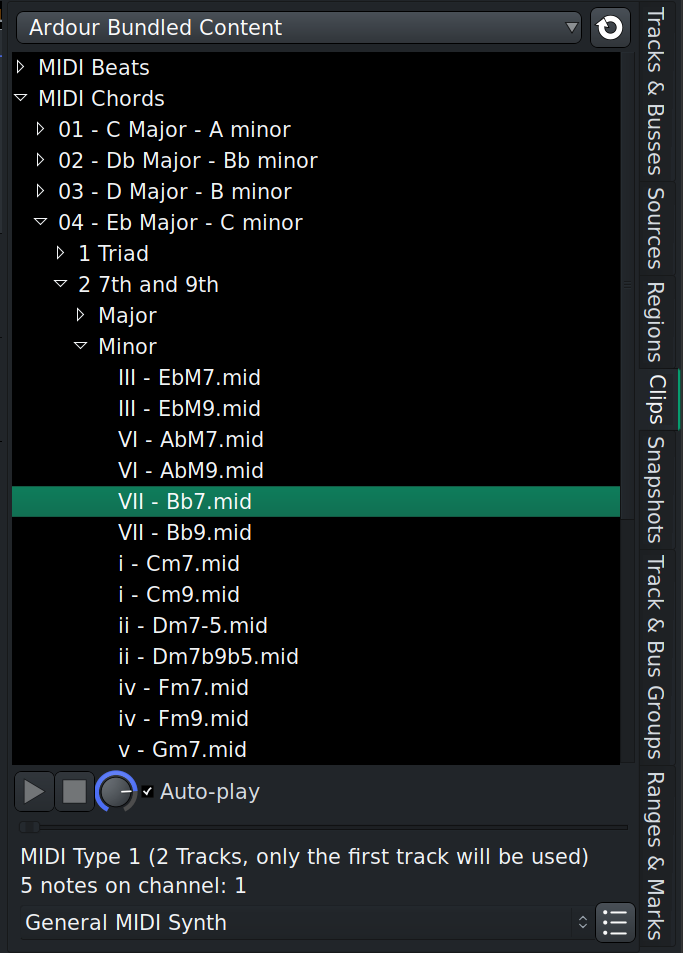

.. _clips_overview:

Clips overview
==============

The Clips browser provides a way to easily reuse little pieces of music
across sessions. You can also drop audio and MIDI clips on a timeline in
the :ref:`Editor window <clips_in_the_editor>` or use them in trigger
slots in the :ref:`Cue window <clips_in_the_cue_window>`.

Clips Browser Interface
-----------------------

In the Editor window, the **Clips** browser is part of the Editor sidebar
and thus can be hidden from the main window. In the Cue window, the
Clips browser is an essential part of the workflow and is always
visible.

The Clips browser has three main parts:

#. Selector of clip library locations
#. List of clips, with a treeview where necessary
#. Preview options

Library Locations
-----------------

The Clips browser is capable of handling multiple locations of clips and
loops. There are several types of locations supported by the browser:

#. Ardour Bundled Content: these are all the audio and MIDI files
   shipped along with an official Ardour build.
#. FreeSound: all clips previously downloaded from FreeSound.org.
#. Custom folder: it's a single user-defined location on a local or
   remote disk that you can write to. The folder is defined on the
   Triggering page of the Preferences dialog and is preserved across
   sessions.
#. Additional locations: typically those are locations where you store
   existing clips/loops libraries acquired elsewhere. You can have as
   many as you like, please see :ref:`Adding 3rd Party Clip
   Libraries <adding_3rd_party_clip_libraries>` chapter for more
   info. These locations are also preserved across sessions.
#. Other locations: this is a one-off access to a location where clips
   and loops are stored. This location is not preserved across sessions.

List of Clips
-------------

The Clips browser will provide access to all supported media file types
available in a selected location. Typically those would be, WAV, FLAC,
and MID files.

If there are subfolders in the clip library's folder, the Clips browser
will display them using as a tree view. The browser will also lazy-load
subfolders: instead of loading the entire list of all supported files in
the library location, it will only display top-level folders and load
their content when you start expanding subfolders you are interested in.

Preview Options
---------------

The preview section has simple playback controls, a volume control, as
well as an option to automatically play back a clip when you click it in
the list. For MIDI clips, you can also select a virtual instrument
(Ardour defaults to ACE Reasonable Synth).

When playing a clip, Ardour will automatically pause the transport and
resume playback when the clip playback is done. Ardour will also use the
audition channel for playback, so you can control the preview volume
using the monitor level control in the :ref:`Monitor <monitor_section>`
section of the Mixer.
