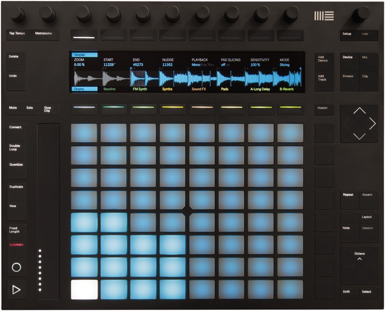
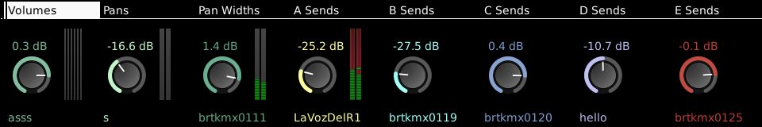
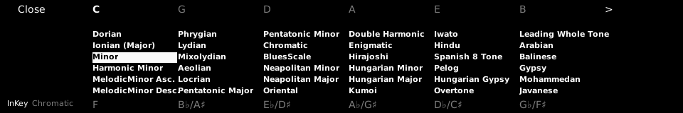

.. _ableton_push2:

Ableton Push 2
==============

   The Ableton Push 2 surface

Since version 5.4, Ardour has had extensive support for the Ableton
Push 2. This is an expensive but beautifully engineered control surface
primarily targeting the workflow found in Ableton's Live software and
other similar tools such as Bitwig.

We have designed our support for the Push 2 around mixing and editing
and musical performance, without the clip/scene oriented approach in
Live. This may change in future versions of Ardour.

Connecting the Push 2
---------------------

Plug the USB cable from the Push 2 into a USB2 or USB3 port on your
computer. For brighter backlighting, also plug in the power supply (this
is not necessary for use).

The Push 2 will be automatically recognized by your operating system,
and will appear in any of the lists of possible MIDI ports in both
Ardour and other similar software.

.. note::

   Linux does not provide normal users access to arbitrary USB devices
   by default (this is a security measure). To give yourself access to
   the Push 2, you need to create a file in the ``/etc/udev/rules.d``
   folder (directory). The name of the should be something like
   ``50-Ableton-Push2.rules`` (the only critical parts are that it ends
   in ``.rules`` and is unique). The file should contain the following
   single line:

   ``SUBSYSTEM=="usb", ATTR{idVendor}=="2982", ATTR{idProduct}=="1967",
   MODE="0666", GROUP="audio"``

   Note that you will need to be member of the group named in the
   "GROUP" property ("audio" in the example above).

Normally, Ardour should be able to automatically detect a connected Push
2 device. If it fails, open the Preferences dialog, and then click on
**Control Surfaces**. Click on the **Enable** button in the line that
says "Ableton Push 2" in order to activate Ardour's Push 2 support.

Once you select the input and output port, Ardour will initialize the
Push 2 and it will be ready to use. You only need do this once: once
these ports are connected and your session has been saved, the
connections will be made automatically in this and other future
sessions.

Push 2 Configuration
--------------------

The only configuration option at this time is whether the pads send
aftertouch or polyphonic pressure messages. You can alter this setting
via the Push 2 GUI, accessed by double-clicking on the **Push 2** entry
in the control surfaces list.

.. figure:: images/push2-gui.png
   :alt: The Push 2 configuration dialog

   The Push 2 configuration dialog

Basic Concepts
--------------

With the Push 2 support in Ardour 5.4, you can do the following things:

Perform using the 8 x 8 pad "grid"
   The Push 2 has really lovely pressure-sensitive pads that can also
   generate either aftertouch or note (polyphonic) pressure.

Global Mixing
   See many tracks at once, and control numerous parameters for each.

Track/Bus Mixing
   View a single track/bus, with even more parameters for the track.

Choose the mode/scale, root note and more for the pads
   37 scales are available. Like Live, Ardour offers both "in-key" and
   "chromatic" pad layouts.

… plus a variety of tasks related to transport control, selection,
import, click track control and more.

Musical performance
-------------------

Messages sent from the 8x8 pad grid and the "pitch bend bar" are routed
to a special MIDI port within Ardour called "Push 2 Pads" (no extra
latency is incurred from this routing). Although you can manually
connect this port to whatever you wish, the normal behaviour of Ardour's
Push 2 support is to connect the pads to the most recently selected MIDI
track.

This means that to play a soft-synth/instrument plugin in a given MIDI
track with the Push 2, you just need to select that track.

If multiple MIDI tracks are selected at once, the first selected track
will be used. Note that messages originating from all other controls on
the Push 2 will *not* not be delivered to the "Push 2 Pads" port. This
makes no difference in practice, because the other controls do not send
messages that are useful for musical performance.

Global Mix
----------

This is the default mode that Ardour will start the Push 2 in. In this
mode, the 8 knobs at the top of the device, the 8 buttons below them,
the video display and the 8 buttons below that are combined to provide a
global view of the session mix.

   Global mix mode on Push 2 screen

The upper buttons are labelled by text in the video display just below
them. Pressing one of the buttons changes the function of the knobs, and
the parameters that will shown for each track/bus in the display.

As of Ardour 5.4, the possible parameters are:

Volumes
   The display shows a knob and text displaying the current gain
   setting for the track, and a meter that corresponds precisely
   to the meter shown in the Ardour GUI for that track. Changing the
   meter type (e.g. from Peak to K12) in the GUI will also change
   it in the Push 2 display. The physical knob will alter
   track/bus gain.

Pans
   The display shows a knob indicating the pan
   direction/azimuth for the corresponding track/bus. Turning
   the physical knob will pan the track left and right. If the
   track/bus has no panner (i.e. it has only a single output), no
   knob is shown and the physical knob will do nothing.

Pan Widths
   For tracks with 2 outputs, the display will show a knob
   indicating the pan width setting for the corresponding track/bus.
   The physical knob can be turned to adjust the width.

   Unlike many DAWs, Ardour's stereo panners have "width" parameter
   that defaults to 100%. You cannot change the pan direction/azimuth
   of a track with 100% width, but must first reduce the width in
   order to pan it. Similarly, a track panned anywhere other than
   dead center has limits on the maximum width setting. If these
   concepts are not familiar to you, please be aware than many DAWs
   use a "panner" that actually implement "balance" and not
   "panning", hence the difference.

A Sends
   The display shows a knob indicating the gain level for the
   first send in that track. If the track has no send, no knob will
   be shown, and the physical knob for that track will do nothing.

B Sends, C Sends, D Sends
   Like "A Sends", but for the 2nd, 3rd and 4th sends of a track/bus
   respectively.

To change which tracks are shown while in global mix mode, use the left
and right arrow/cursor keys just below and to the right of the display.
Tracks and busses that are hidden in Ardour's GUI will also be hidden
from display on the Push 2.

To select a track/bus directly from the Push 2, press the corresponding
button below the display. The track name will be highlighted, and the
selection will change in Ardour's GUI as well (and also any other
control surfaces).

Soloing and muting in Global Mix mode
~~~~~~~~~~~~~~~~~~~~~~~~~~~~~~~~~~~~~

The **Solo** and **Mute** buttons to the left of the video display can
be used to solo and mute tracks while in Global Mix mode. The operation
will be applied to the *first* currently selected track(s).

There are two indications that one or more tracks are soloed:

#. The solo button will blink red
#. Track names will be prefixed by "\*" if they are soloed, and "-" if
   they are muted due to soloing.

To cancel solo, either:

-  Select the soloed track(s) and press the solo button again
-  Press and hold the solo button for more than 1 second

Track mix
---------

Track Mix mode allows you to focus on a single track in more detail than
is possible in Global Mix mode. To enter (or leave) Track Mix mode,
press the **Mix** button.

In Track Mix mode, various aspects of the state of the first selected
track/bus will be displayed on the Push 2. Above the display, the first
4 knobs control track volume (gain), pan directiom/azimuth, pan width,
and where appropriate, track input trim.

Below the display, 7 buttons provide immediate control of mute, solo,
rec-enable, monitoring (input or disk or automatic), solo isolate and
solo safe state. When a a track is muted due to other track(s) soloing,
the mute button will flash (to differentiate from its state when it is
explicitly muted).

The video display also shows meters for the track, which as in Global
Mix mode, precisely match the meter type shown in Ardour's GUI. There
are also two time displays showing the current playhead position in both
musical ``beats|bars|ticks`` format, and as ``hours:minutes:seconds``.

To change which track is visible in Track Mix mode, use the left/right
arrow/cursor keys just below and to the right of the video display.

Scale selection
---------------

Press the **Scale** button to enter **Scale** mode. The display will
look like this:

   Track mix mode on Push 2 screen

In the center, 37 scales are presented. Scroll through them by either
using the cursor/arrow keys to the lower right of the display, or the
knobs above the display. The scale will change dynamically as you
scroll. You can also scroll in whole pages using the upper right and
upper left buttons above the display (they will display "<" and ">" if
scrolling is possible).

To change the root note of the scale, press the corresponding button
above or below the video display.The button will be lit to indicate your
selection (and the text will be highlighted).

By default, Ardour configures the Push 2 pads to use "in-key" mode,
where all pads correspond to notes "in" the chosen scale. Notes
corresponding to the root note, or the equivalent note in higher
octaves, are highlighted with the color of the current target MIDI
track.

In "chromatic" mode, the pads correspond to a continuous sequence of
notes starting with your selected root note. Pads corresponding to notes
in the scale are illuminated; those corresponding to the root note are
lit with the color the current target MIDI track. Other pads are left
dark, but you can still play them.

To switch between them, press button on the lower left of the video
display; the text above it will display the current mode (though it is
usually visually self-evident from the pad lighting pattern).

To leave **Scale** mode, press the **Scale** button again. You may also
use the upper left button above the display, though if you have scrolled
left, it may require more than one press.

Specific button/knob functions
------------------------------

In addition to the layouts described above, many (but not all) of the
buttons and knobs around the edges of the Push 2 will carry out various
functions related to their (illuminated) label. As of Ardour 5.4, this
includes:

Metronome (button and adjacent knob)  
   Enables/disables the click (metronome). The knob directly  
   above it will control the volume (gain) of the click.  

Undo/Redo  
   Undo or redo the previous editing operation.  

Delete  
   Deletes the currently selected region, or range, or note.  
   Equivalent to using Ctrl/Cmd-x on the keyboard.  

Quantize  
   If a MIDI region is selected in Ardour, this will open the  
   quantize dialog.  

Duplicate  
   Duplicates the current region or range selection.  

Rec-Enable  
   Enables and disables Ardour's global record enable state.  

Play  
   Starts and stops the transport.  
   Press Shift-Play to return to the session start.  

Add Track  
   Opens Ardour's Add Track/Bus dialog.  

Browse  
   Open's Ardour's import dialog to select and audition existing  
   audio and MIDI files.  

Master  
   Pressing this button jumps directly to Track Mix mode, with  
   the master out bus displayed.  

Cursor arrows  
   These are used by some modes to navigate within the display (e.g  
   Scale mode). In other modes, the up/down cursor arrows will  
   scroll the GUI display up and down, while the left/right  
   cursor arrows will generally scroll within the Push 2 display  
   itself.  

Repeat  
   Enables/disables loop playback.  
   This will follow Ardour's "loop is mode" preference, just like  
   the loop button in the Ardour GUI.  

Octave buttons  
   These shift the root note of the current pad scale up or down by  
   1 octave.  

Page buttons  
   These scroll Ardour's editor display left and right along the  
   timeline.  

Master (top right) knob  
   This knob controls the gain/volume of Ardour's main output.  
   If the session has a monitor section.
