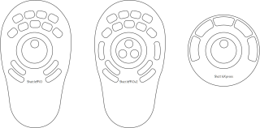

.. _contour_design:

Contour Design
==============

ShuttlePRO and ShuttleXpress are simple shuttle-centric control devices
by Contour Design, designed for user of digital audio workstations and
non-linear video editors.

   Contour Design ShuttlePRO v1 (left), ShuttlePRO v2 (middle), and
   ShuttleXpress (right)

Connecting the Contour Design Shuttle
-------------------------------------

Plug the USB cable from the shuttle into a USB2 or USB3 port on your
computer. The device will be automatically recognized by your operating
system and will appear in any of the lists of possible MIDI ports in
Ardour.

Normally, Ardour should be able to automatically detect a connected
Contour Design Shuttle device and enable it. If it fails, connect the
shuttle to Ardour, open the **Preferences** dialog, then click **Control
Surfaces**. Tick the **Enable** checkbox opposite to "Contour Design" to
activate Ardour's Contour Design shuttles support.

Once the device is activated, click **Show Protocol Settings** and in
the newly opened window configure the device.

Contour Design Configuration
----------------------------

The configuration dialog allows setting up various settings for
supported models of Contour Design shuttles:

-  Transport speeds for shuttle positions
-  Jump distance for jog wheel (in seconds, beats, or bars)
-  Actions in Ardour for available on-device buttons

Ardour ships with some sensible defaults for shuttle buttons.
