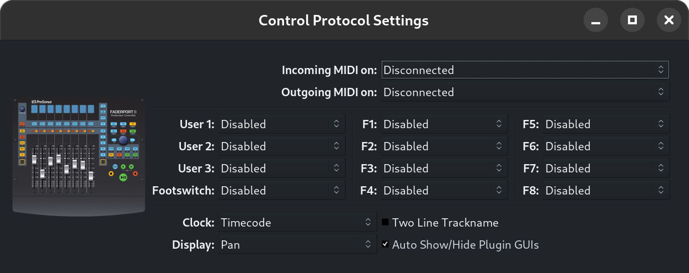
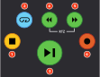
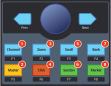
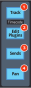
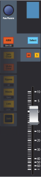
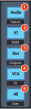
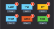
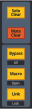

.. _faderport8:

PreSonus FaderPort 2/8/16
=========================

Ardour supports a variety of controllers in the `Presonus FaderPort
<https://www.presonus.com/products/Controllers>`__ product line. The
documentation below is written with FaderPort™ 8 in mind. However, it
equally applies to FaderPort 2 and FaderPort 16 as the main difference
between these units is the amount of motorized faders. For the
documentation on using 1st generation FaderPort devices please refer to
:ref:`this chapter <faderport>` instead.

Connecting the FaderPort 8
--------------------------

The FaderPort 8 (FP8) comes with a USB socket on the back. Connect a
suitable USB cable from there to a USB port on your computer. The FP8
will be automatically recognized by your operating system, and will
appear in any of the lists of possible MIDI ports in both Ardour and
other similar software.

.. important::
   
   Ardour uses the FaderPort 8 in what PreSonus calls "Studio One" or
   "native" mode. To use the FaderPort8 with Ardour's FP8 Control
   Surface, make sure that the device is in "Studio One" mode. (If you
   would like to change the mode at any point, power on the unit while
   holding down the two leftmost Select buttons, see the FaderPort 8
   manual for further details. Also note that at least firmware version
   1.01 is required. NB. "factory default" resets the firmware, see the
   PreSonus FaderPort8 Owner's manual chapter 9.4.)

   While the FaderPort provides a Mackie Control Universal (MCU) mode,
   which works with Ardour's Mackie Control Surface, MCU does not
   support various elements available on the FP8 (e.g. colored buttons,
   and the custom mode scribble strips).

Normally, Ardour should be able to automatically detect a connected
Faderport 8 device and enable it. If it fails, open the Preferences
dialog, select "Control Surfaces" and enable "PreSonus FaderPort 8".
Then open the "Protocol Settings" dialog for the FP8. Which (among other
things) allows to select the the MIDI ports corresponding to the FP8.

Once you select the input and output port, Ardour will initialize the
FP8 and it will be ready to use. You only need do this once: Once these
ports are connected and your session has been saved, the connections
will be made automatically in this and other future sessions.

   FaderPort8 Control Surface Settings Dialog

Using the FaderPort 8
---------------------

The FaderPort's controls can be divided into five groups:

-  Transport buttons
-  Session Navigation controls
-  Fader modes
-  Mix management
-  Channel strip

In general the control mapping described in the FaderPort 8 Owner's
Manual for Studio One (chapter 2) applies to Ardour as well. There are
however subtle differences where the DAWs differ.

Buttons generally act on release (not press), with exception of
transport-control (since 6.0pre) and individual exceptions mentioned
below.

Transport buttons
~~~~~~~~~~~~~~~~~

   FaderPort8 Transport Buttons

#. Stop: Stops the transport. Press twice to return to session start.
#. Loop: Toggles loop playback. A loop-range needs to be defined in the
   session for looping to be engaged.
#. Play/Pause: Roll/Stop the transport (note that Ardour has no "pause"
   mode: Pause is equivalent to stop). During vari-speed playback,
   pressing "play" resets to 100% forward speed.
#. Rewind: Rewind, roll backwards. Successive presses or holding the
   button incrementally changes the speed.
#. Fast Forward: Roll forward. Successive presses or holding the button
   accumulate speed. Pressing (Rewind and Fast Forward) simultaneously
   stops playback and returns the playhead to zero.
#. Record: Toggles the global record enable setting.

Session navigation
~~~~~~~~~~~~~~~~~~

Session Navigation allows quick navigation and provides access to
session-wide controls. Each of the eight buttons alters the function of
the push-button encoder and the Prev, Next buttons. With exception of
Click the seven modes are exclusive (radio buttons).

   FaderPort8 Navigation Buttons

#. Channel: The Prev / Next buttons select the previous/next
   mixer-strip. If no strip is selected, Next selects the first, Prev
   the last mixer-strip in the session. Pressing the encoder knob moves
   the most recently selected mixer-strip into view on the FP8. The
   encoder scrolls the editor-canvas up/down.
#. Master: The encoder controls the master-bus level. If a session
   includes a monitor-section, the encoder controls monitor-out by
   default. Hold the button to control the master-bus level. Press the
   encoder knob to reset the gain to 0dB. The Prev / Next navigation
   buttons bank the visible strips on the FP8 by one track left/right.
#. Zoom: The encoder controls horizontal zoom of the editor. Press the
   encoder to *zoom to fit* the session. Prev / Next navigation buttons
   zoom selected track(s) vertically (or all tracks if none are
   selected).
#. Click: Toggle the metronome on/off. While holding the Click button,
   the encoder modifies the volume of the metronome click (press the
   encoder while holding Click to reset the metronome level to 0dBFS).
#. Scroll: The encoder scrolls the timeline (hold Shift for finer
   steps). Pressing the encoder *zooms to fit* the session. The Prev /
   Next navigation buttons bank the visible strips on the FP8 by one
   track left/right.
#. Section: The Prev / Next navigation buttons nudge the selected region
   by the time configured in the nudge-clock. If no region is selected
   the playhead position is nudged. The encoder always nudges the
   playhead position.
#. Bank: Encoder and navigation buttons scroll through mixer-strips in
   banks of eight. Pressing the encoder moves the most recently selected
   mixer-strip into view on the FP8.
#. Marker: The encoder scrolls the timeline (hold Shift for finer
   steps). The Prev / Next navigation buttons jump to prev/next markers.
   Press the encoder to drop a new marker.

When combined with Shift, the eight buttons will access custom
functions, which can be configured in the Preference Dialog. The buttons
will light up if an action has been assigned to a button.

The following tables shows a condensed overview of the
session-navigation modes:

+----------------+----------------+----------------+----------------+
|                | Prev / Next    | Encoder knob   | Encoder Press  |
+================+================+================+================+
| Channel        | Select         | Scroll Editor  | Bank to show   |
|                | prev/next      | up/down        | selected strip |
|                | mixer-strip    |                | on FP8         |
+----------------+----------------+----------------+----------------+
| Master         | Bank visible   | Adjust         | Reset          |
|                | strips on FP8  | master/monitor | master/monitor |
|                | by 1           | level          | to 0dB         |
+----------------+----------------+----------------+----------------+
| Zoom           | Vertical zoom  | Horizontal     | Horizontal     |
|                | (editor        | timeline zoom  | zoom to        |
|                | track-height)  | (time)         | session        |
+----------------+----------------+----------------+----------------+
| Scroll         | Bank visible   | Scroll the     | Horizontal     |
|                | strips on FP8  | timeline (move | zoom to        |
|                | by 1           | playhead)      | session        |
+----------------+----------------+----------------+----------------+
| Section        | Nudge the      | Nudge the      | -              |
|                | selected       | playhead       |                |
|                | region         |                |                |
+----------------+----------------+----------------+----------------+
| Bank           | Bank visible   | Bank visible   | Bank to show   |
|                | strips on FP8  | strips on FP8  | selected strip |
|                | by 8           | by 1           | on FP8         |
+----------------+----------------+----------------+----------------+
| Marker         | Move to        | Scroll the     | Drop a new     |
|                | prev/next      | timeline (move | marker         |
|                | marker         | playhead)      |                |
+----------------+----------------+----------------+----------------+
| Press and hold | (mode          | Adjust         | Reset          |
| Click          | dependent)     | metronome      | metronome      |
|                |                | Level          | level to 0dBFS |
+----------------+----------------+----------------+----------------+

Shift button
~~~~~~~~~~~~

   The FaderPort8 Shift Button

| The two Shift buttons are identical, they're copied to provide
  convenient access to the modifiers. Pressing and holding the Shift
  button updates the lights (and colors on RGB buttons) to indicate the
  modified control.
| Pressing and holding the Shift button for one second without pressing
  any other button enters shift-lock mode. Press Shift again to reset.
  The Shift button engages directly on press. Activating an action while
  the button is held will void the shift-lock mode.

Fader modes
~~~~~~~~~~~

The eight faders on the FP8 can be assigned to various automatable
controls present in the current session. The four fader-mode buttons
change the behavior of the mixer-strip and scribble strip displays.
(Note: with the 1.01 firmware these buttons always act on press.)

   FaderPort8 Fader Mode Buttons

#. Track: In Track-mode, the motorized faders display and control a
   mixer-strip's signal level. The Pan/Param encoder modifies the
   azimuth of the panner (hold Shift to control the width, if the
   track's panner supports it). Mute and Solo affect the respective
   mixer-strip.
#. Edit Plugins: When Edit Plug-ins mode is active, the motorized faders
   will control the parameter settings of a given plugin-insert.
   Press the Edit Plugins button to view all available plugin-inserts on
   a strip. If no plugins are available, Edit Plugins will not engage
   and the FP8 automatically switches back to Track-mode.
   **Select Plugin Mode**: Use the Select buttons under the scribble
   strip to pick a plugin to edit.
   The Select button color indicates the bypass/enable state of the
   plugin (red: bypassed, green: enabled). Use Shift + Select to toggle
   the bypass state.
   Selecting a plugin enters **Parameter Edit Mode**: The faders and the
   Select buttons will respectively control the parameters and toggle
   controls of the selected plugin (once a plugin has been selected, it
   stays in edit mode regardless of track selection). If there are more
   than eight parameters, the Pan/Param encoder allows to scroll through
   available control-parameters (hold Shift to bank by 8).
   If the plugin has any presets, pressing the Pan/Param encoder
   switches to the **plugin-preset display**: Plugin preset names are
   displayed on the scribble-displays, the Select button below each
   loads the preset. The "Pan/Param" encoder can be used to scroll
   through presets if there are more than seven (right-most, 8th, slot
   is reserved to unload/clear a loaded preset, hold Shift to bank by
   7). The Select button color is used to indicate the currently loaded
   preset (if any) and blinks if a parameter has been modified since
   loading the preset. Loading a preset or pressing the Pan/Param
   encoder again switches back to the Plugin Parameter Edit Mode.
   In Parameter Edit Mode, the "Open" (Shift + Macro) allows to toggle
   the Plugin GUI visibility.
   Press the Edit Plugins button again to return to the Select Plugin
   Mode.
#. Sends: In Sends mode, each of the faders is mapped to the send-level
   of aux-sends of the selected track. If there are more than eight
   sends on a given track, the Pan/Param encoder can scroll through
   them. Send-mode follow the selection. If there are no sends on a
   given track, the FP8 automatically switches back to Track-mode.
#. Pan: When Pan mode is active, the motorized faders will display and
   control the panner's azimuth. The Pan/Param controls the pan-width of
   the selected mixer-strip.

Shift + Track toggles timecode display on/off (middle row of the
scribble-strip). The timecode format can be configured in the Control
Surface Preference Dialog (Timecode, musical-time: bar/beat/tick).

Channel strip
~~~~~~~~~~~~~

   The FaderPort8 Channel Strip

-  **Touch-Sensitive Fader**: The fader can be used to control volume
   levels, aux send levels, panning, or plugin parameters, depending on
   the fader-mode (see above).
-  **Pan/Param**: The encoder controls panning in Track and Pan mode. In
   Plugin and Send fader-modes, the encoder banks parameters. See Fader
   modes above for details. When "Link" is engaged, the encoder can
   control any automatable parameter (see Miscellaneous below).
-  Mute: Toggle the mute-control of the corresponding mixer-strip. Mute
   engages on press, and disengages on release. Press and hold the
   button for at least 0.5sec for momentary.
-  Solo: Toggle the solo or listen (AFL,PFL) control of the
   corresponding mixer-strip. Solo engages on press, and disengages on
   release. Press and hold the button for at least 500ms for momentary.
-  Select: In Track and Sends and Pan mode the Select button
   select/de-select a given mixer-strip.
   Since selection is not limited to a single mixer-strip, the button
   acts in tri-state. A mixer-strip light indicates selection:

   -  **Any Selected Track**: The select button is lit with the track's
      color.
   -  **Any Not Selected Track**: The select button is off (dimly
      showing the track's color).
   -  **Most Recently Selected Track**: Only one track at a time. The
      select button blinks with the track's color.

   Operations such as Edit Plugins or Sends use the
   most-recently-selected (focused) track. To modify the selection, the
   button's action depends on the current selection:

   #. **Select**: The track is exclusively selected and also becomes the
      most-recently selected.
   #. **Shift + Select any selected track**: Deselect the track.
   #. **Shift + Select any unselected track**: Adds the given track to
      the selection and make it most-recently selected).

While holding the ARM button the Select button lights change to red and
the Select buttons controls the record-arm of the given track.
Mixer-strips that cannot be record-armed have a dim white light.

Shift + ARM record-arms all tracks in the session.

Mix management
~~~~~~~~~~~~~~

These buttons allows to select which mixer-strips are spilled on the FP8
channel-strips.

   FaderPort8 Mix Management Buttons

#. Audio: View Audio Tracks only.
#. VI: Show tracks with virtual instrument plugins.
#. Bus: Display only Busses.
#. VCA: Show VCAs.
#. All: Display all Tracks, Busses (incl master-bus) and VCAs.

In combination with the Shift modifier ten total filters are available:

-  Shift + Audio **Inputs**: shows all record-armed tracks (Audio and
   MIDI).
-  Shift + VI **MIDI**: View all MIDI tracks.
-  Shift + Bus **Outputs**: Show the Master and Monitor Bus.
-  Shift + VCA **FX**: Shows Aux-Busess.
-  Shift + All **User**: Display all currently selected mixer-strips
   only.

Automation controls
~~~~~~~~~~~~~~~~~~~

The Automation Controls provide access to the currently selected
mixer-strips. The automation enable lights indicates the mode of the
most recently selected mixer-strip (blinking selection button). The
action affects all selected mixer-strips. The automation controls are
currently only available in Track and Pan fader modes where they affect
the fader and pan automation modes respectively.

   FaderPort8 Automation Buttons

#. Latch: Currently not available in Ardour.
#. Trim: Currently not available in Ardour.
#. Off: Select "Manual" automation mode.
#. Read: Select "Play" automation mode.
#. Write: Select "Write" automation mode (note at the end of a write
   pass, Ardour automatically puts the track into "Touch" mode.
#. Touch Select "Touch" automation mode.

The Automation Controls also double as session state controls when
combined with Shift.

#. Shift + Latch **Save**: Save the session. The button lights up red if
   the session is modified.
#. Shift + Trim **Redo**: Redo a previously undone operation. The button
   lights up green if redo is possible.
#. Shift + Off **Undo**: Undo the most recent operation. The button
   lights up green if undo is possible.

With Shift, the bottom row allows to bind three custom user actions.

Miscellaneous
~~~~~~~~~~~~~

   FaderPort8 Misc Buttons

-  Solo Clear: Reset all solo controls in the session. If the FP8 was
   used to clear solo-state, pressing the button again will restore the
   previous state (unless solo state was modified manually since).
-  Mute Clear: Unmute all mixer-strips in the session. If the FP8 was
   used to clear mute-state, pressing the button again will restore the
   previous mute state (unless mute-state was changed manually since).
-  Bypass: The behavior depends on the edit-mode:

   -  **Track + Pan Mode**: A/B bypass toggle any plugins on all
      selected mixer-strips.
   -  **Edit Plugin Parameter**: Toggle bypass of of the plugin that is
      currently being edited. Bypass state is indicated by color: red
      for bypassed, green for enabled (not bypassed).

-  Shift + Bypass **Bypass All**: A/B bypass toggle any plugins on all
   selected mixer-strips.

-  Macro: Toggle Editor and Mixer Windows/Tabs.
-  Shift + Macro **Open**: The behavior depends on the edit-mode:

   -  **Edit Plugin Parameter**: Toggle Plugin GUI visibility (if it has
      a GUI) of the plugin that is currently being edited.
   -  **all other modes**: Show the Import Audio Dialog.

-  Link: Activate Control-Link Mode (only available in Track and Pan
   modes).
   The Pan/Param encoder controls the element over which the
   mouse-cursor hovers in the GUI. One can access any parameter which
   can be automated.
   Pressing the Pan/Param encoder resets the control-parameter to the
   default value.
   The buttons color is used to indicate the link-state:

   -  **orange**: Link is enabled, but the mouse-cursor is not over an
      element which can be controlled.
   -  **yellow**: Link is enabled, and the cursor is hovering over a
      controllable element.
   -  **green**: Link is locked to a given element (see below).
   -  **turquoise**: Link lock is possible (when pressing Shift while
      link-mode is enabled).
   -  **red**: Link-lock is not possible (only when pressing Shift while
      link-mode is enabled without a valid element to control.

-  Shift + Link **Lock**: When in Link-mode (see above), this allows to
   lock the current control to the Pan/Param encoder. Link will no
   longer follow the GUI mouse-cursor.
   If Link-mode is not enabled, Lock, locks the GUI (alike Session >
   Lock) to prevent accidental changes.

Link and Link-Lock mode will automatically disengage when entering Sends
or Edit Plugins mode.

Harrison Mixbus
~~~~~~~~~~~~~~~

The above also applies to Ardour-derivatives Harrison-Mixbus and Mixbus
32C with a few subtle differences:

-  Mix Management **Bus** shows Mixbusses only, while **FX** spills
   Aux-busses.
-  The Mixbus built-in EQ and Compressor are present on every track and
   bus and always available. They are displayed as special plugins on
   right-side in **Select Plugin Mode**. When editing those processors,
   the parameters follows track selection (for other plugins this is not
   possible since they may not be present).
-  Fader mode **Sends** shows mixbus-assigns first (before any optional
   aux-sends). The master-bus-assign is available on the "S"olo button
   of the right-most strip.
