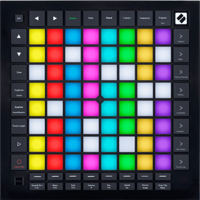

.. _launchpad_pro_mk3:

Novation Launchpad Pro Mk3
==========================

Since version 8.0, Ardour has had extensive support for the Novation
Launchpad Pro Mk3, a relatively inexpensive grid/pad controller that
unlike some similar has its own internal capabilities in addition to
those provided by DAW interactions.

   The Novation Launchpad Pro

Connecting the Launchpad Pro
----------------------------

Plug the USB cable from the Launchpad Pro into a USB2 or USB3 port on
your computer.

The Launchpad Pro will be automatically recognized by your operating
system, and will appear in any of the lists of possible MIDI ports in
both Ardour and other similar software.

Normally, Ardour should be able to automatically detect a connected
Launchpad Pro device. If it fails, open the **Preferences** dialog, and
then click on **Control Surfaces**. Click on the **Enable** button in
the line that says **Launchpad Pro** in order to activate Ardour's
Launchpad Pro support.

Once you select the input and output port, Ardour will initialize the
Launchpad Pro and it will be ready to use. You only need do this once:
once these ports are connected and your session has been saved, the
connections will be made automatically in this and other future
sessions.
