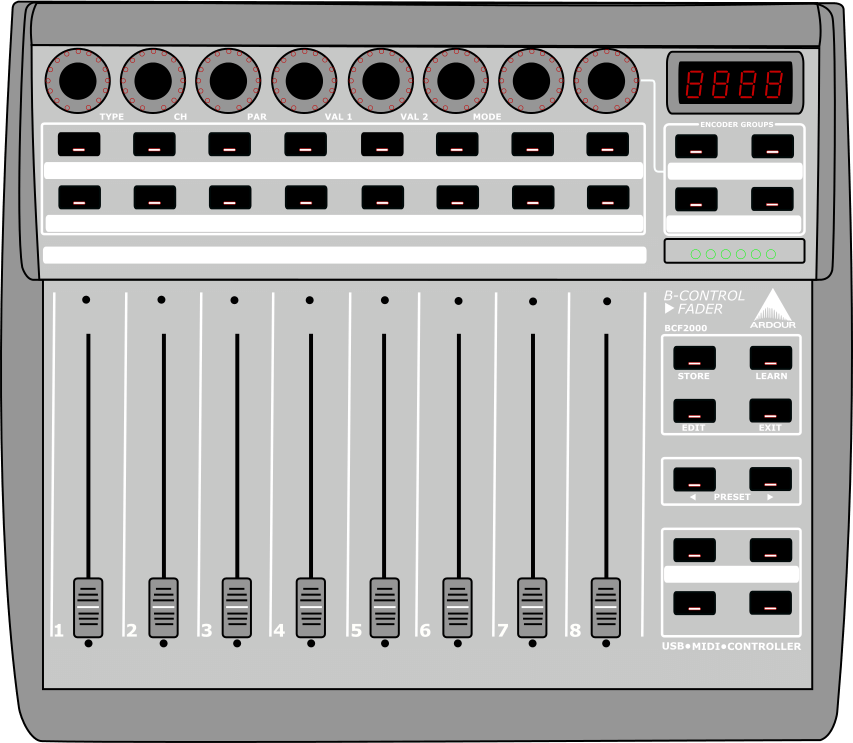

.. _behringer_devices:

Behringer Devices in Mackie/Logic control mode
==============================================

.. _bcf2000:

Behringer BCF-2000 faders controller
------------------------------------

The Behringer BCF-2000 Fader Controller is a control surface with 8
motorized faders, 8 rotary encoders and 30 push buttons. The device is a
class compliant USB Midi Interface and also has standard Midi DIN
IN/OUT/THRU ports.

   Digramatic Image of the BCF2000

The device has included a Mackie/Logic Control Emulation Mode since
firmware v1.06. Any devices with a firmware older than v1.06 will
require an update before Mackie Control Emulation works as described
here.

   Digramatic Image of the BCF2000 in Edit Global Mode

In order to put the controller into Mackie/Logic control mode, the unit
must be turned on while holding the third button from the left in the
top most row of buttons (under the rotary encoder row). The button must
be held down until EG or edit global mode is displayed on the LCD screen
of the unit. The global parameters can then be edited using the 8 rotary
encoders in the top row.

-  Encoder #1 sets the operating mode and should be set to U-1 or USB
   mode 1 if using with a USB cable connection.
-  Encoder #3 sets the foot switch mode and should most likely be set to
   Auto to detect how the foot switch is wired.
-  Encoder #5 sets the device id, if you are using only 1 device the id
   should be set to ID 1. If you are using multiple BCF/BCR2000 each
   device is required to be set up sequentially and one at a time.
-  Encoder #7 controls the MIDI Dead Time or the amount of milliseconds
   after a move has been made that the device ignores further changes,
   this should be set to 100.
-  Encoder #8 controls the MIDI message Send Interval in milliseconds
   and should be set to 10

To exit the EG mode press the Exit button. The device is now ready to
use with Ardour.

Modes of operation
~~~~~~~~~~~~~~~~~~

   Digramatic Image of the BCF2000 Control Modes

The four buttons arranged in a rectangle and located under the Behringer
logo are the mode selection buttons in Logic Control Emulation Mode,
currently Ardour has implemented support for two of these modes.

The surface can be broken into 8 groups of controls:

#. The rotary encoders at the top of the device
#. The first row of buttons under the encoders
#. The second row of buttons under the encoders
#. The row of motorized faders
#. The group of 4 buttons at the top right that will be referred to here
   as the Shift Group
#. The group of 4 buttons under the Shift Group referred to here as the
   Mode Group
#. The group of 2 buttons under the Mode Group referred to here as the
   Select Group
#. The group of 4 buttons under the Select Group referred to here as the
   Transport Group

Mixer pan mode
~~~~~~~~~~~~~~

   Diagrammatic Image of the BCF2000 Control Modes 

This is the standard work mode that organizes the control surface to
emulate a standard mixer layout where controls for each track/bus are
arranged vertically. The order of the faders is either controlled by the
order of the tracks in the mixer or can be set manually by the user.

Encoders  
   Mixer Pans. The red LEDs show the amount of pan left or right  

First Row of Buttons  
   Mixer Mutes. The button led lights up if the track is currently muted  

Second Row of Buttons  
   Select Active Track/Bus.  
   Currently selected track/bus is indicated by the button led  

Faders  
   Mixer Gains  

Shift Group  
   -  The top and bottom left buttons are simply shifts to  
      change the function of other buttons.  
   -  The top right is the Fine Control button that allows the  
      increment values sent by rotary encoders and faders to  
      be a small value for more precise editing. This button  
      can also act as a shift button.  
   -  The bottom right is the Global Shift button that allows you  
      to change back to the standard Mixer Pan view from other  
      views and modes. This button can also act as a shift button.  

Mode Group  
   -  The top two buttons functions are not currently implemented  
      in Ardour.  
   -  The bottom left button sets the device to Pan mode and  
      should currently be lit  
   -  The bottom right button sets the device to Send mode but  
      will only allow the switch if the currently selected  
      track/bus has a send or sends to control.  

Select Group  
   In this mode they function as bank select left and right. If  
   the current session has more than 8 tracks the next set of 8 tracks  
   is selected with the right button and the faders will move to match  
   the current gain settings of that bank of 8 tracks/busses. If the  
   last bank contains less than 8 tracks/busses the unused faders  
   will move to the bottom and the pan lights will all turn off. An  
   unlimited amount of tracks can be controlled with the device.  

Transport Group  
   -  The upper left button controls Rewind
   -  The upper right button controls Fast Forward
   -  The lower left button controls Stop
   -  The lower right button controls Play

Send Mode
~~~~~~~~~

   Digramatic Image of the Send Mode

Send mode allows for the top row of encoders to control the sends for a
selected channel. One interesting option is to flip the controls from
the encoders to the faders by pressing the shift 1 button and the global
view button at the same time.

Encoders
   In send mode, the encoders control sends from left to right instead of mixer pans. If there are less than 8 sends the behavior of the encoder will be to continue controlling the mixer pan. Visually it is indicated by the change in the LED from originating at the 12 o'clock position to originating at the 7 o'clock position. If FLIP is pressed the encoder will control the mixer gain for the selected track/bus.

First row of buttons
   No change.

Second row of buttons
   No change

Faders
   No change unless :kbd:`FLIP` is pressed then it controls the send for the selected track/bus.

Shift Group
   No change

Select Group
   No change

Transport Group
   No change

Mixer pan while holding :kbd:`Shift 1`
~~~~~~~~~~~~~~~~~~~~~~~~~~~~~~~~~~~~~~

.. figure:: images/BCF2000-Shift1.png
   :alt: Digramatic Image of the Mixer Mode while holding down Shift-1
   :width: 75%

   Digramatic Image of the Mixer Mode while holding down Shift-1

The operations of various buttons change while holding down the Shift 1
button:

Encoders
   No Change

First row of buttons
   These now control the Soloing of each track/bus in the current bank

Second row of buttons
   These now control the Enable Record for each track

Faders
   No Change

Shift Group
   No change

Mode Group
   No Change

Select Group
   These now change the current bank of tracks being controlled over by one.
   So if tracks 1–8 were controlled, pushing the right button will change the
   controlled tracks to 2–9, and pressing the left would then shift back to
   controlling tracks 1–8.

Transport Group
   - The upper left now controls turning on and off Loop mode.  
   - The upper right now toggles Click.  
   - The lower left toggles Replace.  
   - The lower right toggles Global Record.

Mixer pan while holding :kbd:`Shift 2`
~~~~~~~~~~~~~~~~~~~~~~~~~~~~~~~~~~~~~~

.. figure:: images/BCF2000-Shift2.png
   :alt: Digramatic Image of the Mixer Mode while holding down Shift 2
   :width: 75%

   Digramatic Image of the Mixer Mode while holding down Shift 2

The operations of various buttons change while holding down the Shift 2
button::kbd:``

Encoders
   No Change

First row of buttons
   FIX ME

Second row of buttons
   These now control setting up different Views. See below for more info

Faders
   No Change

Shift Group
   No change

Mode Group
   No Change

Select Group
   Left button controls Undo (FIXME: NEEDS VERIFICATION)

Transport Group
   FIX ME

Views
~~~~~

   Digramatic Image of the LED display for different Views

.. _xtouch:

Behringer X-Touch
-----------------

The Behringer X-Touch is a direct emulation of the Mackie Control and
has all the buttons the Mackie device does. There is a "Behringer
X-Touch" map included with Ardour. The X-Touch can be connected to the
computer with USB or through a MIDI port. Using USB keeps MIDI ports
free for other uses. The Ethernet port uses RTP MIDI which should show
up as MIDI devices on MacOS computers.

.. _compact:

Behringer X-Touch Compact
-------------------------

The Behringer X-Touch Compact has a Mackie Control mode. From the device
manual:

"To switch between standard operating mode and MC (Mackie Control) mode,
press and hold down the MC button in the bottom left corner, and then
turn on the unit’s power switch. Keep holding down the MC button until
the MC MODE LED lights continuously to show that the unit is in MC
mode."

There is a "Behringer X-Touch Compact" map included with Ardour. The
X-Touch can be connected to the computer with USB or through a MIDI
port. Using USB keeps MIDI ports free for other uses.

The Behringer X-Touch Compact has fewer controls than the Mackie control
and therefore less function as well. See pages 19-21 of the Behringer
X-Touch Compact Quick Start Guide For an explanation of what controls on
the Compact map to which Mackie Control buttons.

.. _mini:

Behringer X-Touch Mini
----------------------

The Behringer X-Touch Mini says it can emulate Mackie control as well.
There is a "Behringer X-Touch Mini" map included with Ardour. The
control layout in Mackie Control mode is shown below.

.. figure:: images/xtouch-mini-mcp.png
   :alt: X-Touch Mini MC mode layout
   :figclass: invert-in-dark

   X-Touch Mini MC mode layout
