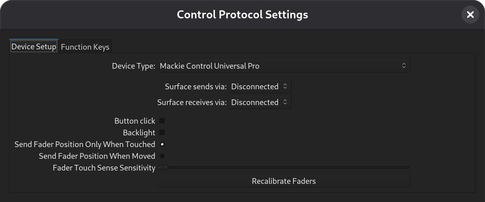

.. _mackie_devices:

Devices using Mackie/Logic control protocol
===========================================

This will walk you through the process of configuring and using a MIDI
control surface with Ardour that uses the **Mackie Control protocol** (MCP)
or **Logic Control protocol**. Devices that have been tested and are known
to work include the SSL Nucleus, Mackie Control Pro (plus extenders),
Behringer devices in Mackie/Logic mode, and Steinberg CMC devices.

Enabling Mackie Control in Ardour
---------------------------------

Navigate to **Edit > Preferences > Control Surfaces**. Tick the **Mackie**
option and click on the **Show Protocol Settings** button to see the setup
dialog:

   The Mackie Control Setup Dialog

From the selector at the top, choose the type of device you are using.
(:ref:`What to do if your device is not listed
<what_to_do_if_your_device_is_not_listed>`).

Update the controls description

Once your setup is complete, click **OK** to close the dialog. Now click
on the enable checkbox for **Mackie Control**.

Devices using ipMIDI
--------------------

If you are using a device that uses ipMIDI, such as the SSL Nucleus, no
MIDI port connections are required—Ardour and your control surface will
be able to talk to each other automatically so long as your control
surface and computer are both connected to the same network.

Connecting control surface and Ardour MIDI ports
------------------------------------------------

Before attempting to use a Mackie Control device that communicates via a
standard MIDI cable or a USB cable, you should ensure that `your MIDI
environment is setup <configuring_midi>`. If you are using a device that
uses normal MIDI (via a standard MIDI or USB cable), you need to connect
Ardour's Mackie Control ``in`` and ``out`` ports to the MIDI ports
leading to and coming from the control surface.

When you have made these connections once, Ardour will recreate them for
you in the future, as long as you leave Mackie Control enabled.

Customizing your control surface
--------------------------------

Every possible global Mackie Control button can be bound to any
`action <list_of_menu_actions>` present in Ardour's GUI. Please
check your control surface page for suggestions.

Preparing your device for use with Ardour
-----------------------------------------

Most interfaces will require some configuration to send and respond to
MCP.

.. note::
   When setting up the control surface, do *not* use "Pro Tools" mode.
   Pro Tools is the only DAW that still requires HUI. The rest of world
   uses Mackie Control Protocol. Ardour does not support HUI at this
   time.
