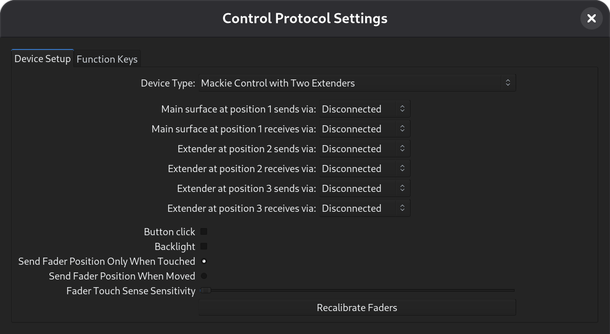

.. working_with_extenders:

Working with extenders
======================

There are currently five devices pre-configured to work with extenders. Two
of them are for one master and one extender with the master on the right
side or master on the left side.

There are three presets for a master and two extenders with the master
on the left, in the center and on the right. While these files will work
for many uses there may be cases where a custom device profile makes
more sense.

The best way is to start with the \*.device file in the `Source Tree
<https://github.com/Ardour/ardour/tree/master/mcp>`__ that matches your
master device and copy it to a new name such as ``xt+mc.device`` in the
:ref:`user config <files_and_directories_ardour_knows_about>` sub
directory ``mcp`` and then edit that file. It is best to name the file
with the order the devices are expected to be used in as the position of
the master device is specified in this file.

The three lines of interest are:

.. code-block:: xml

    <Name value="Device name"/>
    <Extenders value="0"/>
    <MasterPosition value="0"/>

Add any lines that are not present.

The ``Name`` value should be a unique name so it is obvious in the list
of devices (so change it).

The ``Extenders`` value is the number of extenders used and should not
include the master in that number.

When an ``Extenders`` value of greater than 0 is used, extra midi ports
will appear for the extenders to be connected to. The MIDI ports for the
controllers will be named ``mackie control in/out`` for the master,
``mackie control in/out ext #*`` where \* is the position of the
extender from left to right. So for a master in the middle with an
extender on either side, the ports from left to right will be mackie
control in/out ext #1, mackie control in/out and mackie control in/out
ext #3.

If using the MCP GUI to connect surfaces the top surface is the leftmost
and the bottom is the rightmost. The GUI shows explicitly the position
of the main or master surface within the group of surfaces.

   The Mackie Control Device Dialog

The ``MasterPosition`` value is the position the master unit (with the
master fader) is located at within the group of surfaces. The surfaces
are numbered from 1 at the left side and up. So if there are three
surfaces, ``<MasterPosition value="1"/>`` will expect the master on the
left, ``<MasterPosition value="2"/>`` would be master in the middle and
``<MasterPosition value="3"/>`` would be master on the right.

The default value of ``<MasterPosition value="0"/>`` has the same effect
as ``<MasterPosition value="1"/>``.

If the ``MasterPosition`` value does not properly match the physical
position and MIDI port, the master fader and global controls will not
work. The master unit will act like an extender.
