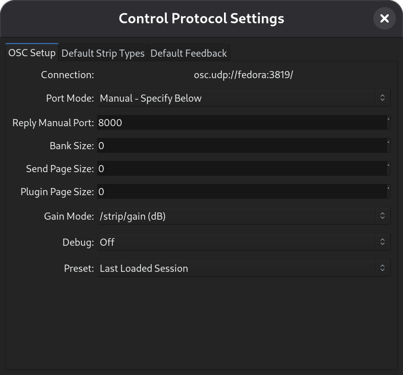
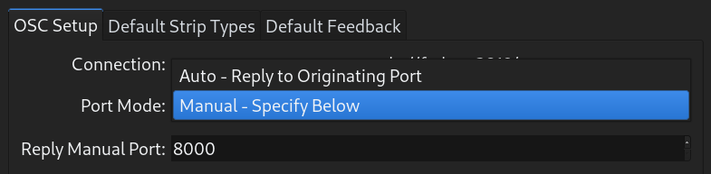
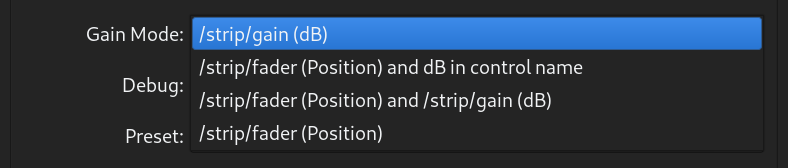
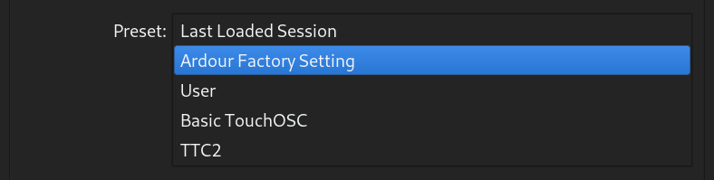
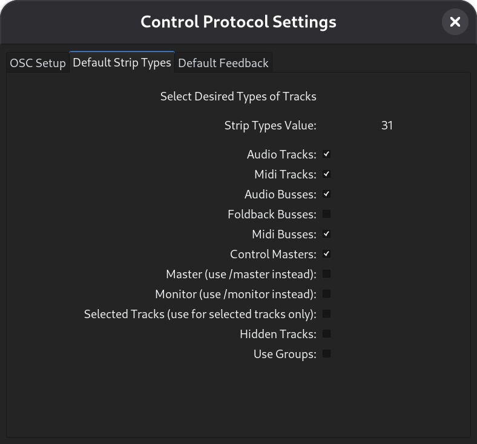
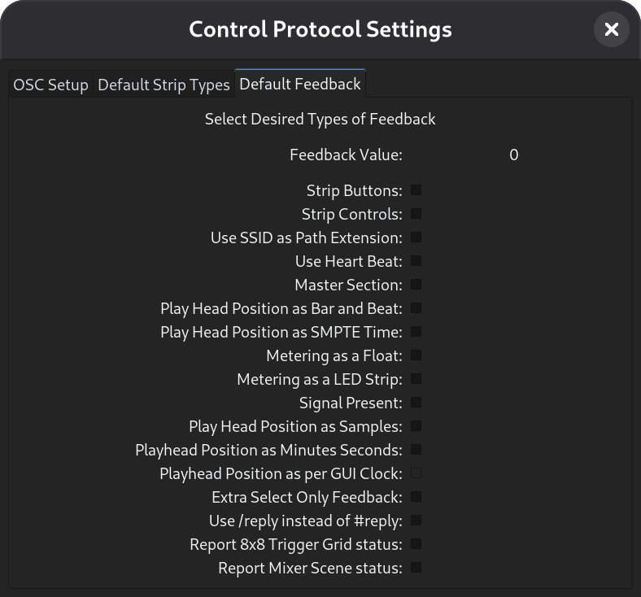

.. osc_setup:

Using the setup dialog
======================

Starting with Ardour 5.1 OSC has a graphic setup dialog. This dialog can
be accessed from **Preferences > Control Surfaces**. Select OSC and click on
the **Show Protocol Settings**.

The Ardour OSC dialog has three tabs. The main **OSC Setup** tab, the
**Default Strip Types** tab and the **Default Feedback** tab.

Many OSC devices get their IP from a DHCP making it difficult to set an
IP in Ardour's OSC settings. Therefore, most of the settings are
*default* settings. Values are set and the next OSC surface to send an
OSC message to Ardour will use those settings. Any change to a setting
will reset all device settings. The use of ``/set_surface`` will
override all settings except **Port Mode**. **Port Mode** affects all
connected surfaces and so all surfaces must use either the set manual
port or send OSC messages from the same port they expect to receive
feedback on.

Dialog settings
---------------

OSC setup tab
~~~~~~~~~~~~~

   The OSC configuration dialog

Connection:
^^^^^^^^^^^

This field is informational only. It shows where Ardour will receive OSC
messages. The system Name and the Port are the most important parts.
Normally, Ardour will use ``3819`` as its server port. However, if some
other server is already using this port, Ardour will try to use the next
port up and will keep trying up to 10 ports up.

Port Mode:
^^^^^^^^^^

This drop down allows the choice of Auto or Manual outbound port
setting.

   Port Mode Dropdown

The **Auto** port mode, will send OSC messages back to the port
messages from that surface are received from. This setting allows two
surfaces on the same IP to operate independently. However, there are a
number of OSC control surfaces that do not monitor the same port they
send from and in fact may change ports they send from as well. Manual
allows the outgoing port, the port the surface will receive on, to be
manually set.

In **Manual** port mode only one control surface per IP can work. Most
phone or tablet OSC controllers like touchOSC or Control need **Manual**
port mode. More than one controller can be used so long as each has it's
own IP.

Manual Port:
^^^^^^^^^^^^

This is an entry box for setting the outgoing port when in **Manual**
port mode.

Bank Size:
^^^^^^^^^^

This sets the default bank size for the next surface to send a
``/set_surface/*`` OSC message. Bank size ``0`` (the default) sets no
banking and allows controlling all strips included in strip_types at
once. The entry area will be bright blue for a port that is not valid
(ports below ``1024`` or ``3819``).

Send Page Size:
^^^^^^^^^^^^^^^

This allows setting the size of pages for sends. In the case there are
more sends than controls. A size of ``0`` is the same as no paging and
all sends are directly controllable.

Plugin Page Size:
^^^^^^^^^^^^^^^^^

This allows setting the size of pages for plugin controls. Some plugins
have hundreds of controls and so it may be necessary to page the plugin
controls to a limited number of physical controls. A size of ``0`` is
the same as no paging and all plugin controls are directly controllable.

Gain Mode:
^^^^^^^^^^

   Gain Mode Dropdown

Sets the faders (and sends faders) feedback math to position where a
value between ``0`` and ``1`` represents the fader position of the same
fader in the mixer GUI or dB where the feedback from fader movement will
be returned as a dB value. When the **Gain Mode** is set to
**position**, there are also options to send the gain in dB either to
the channel name, ``/*/name`` feedback for the channel will show dB
values in text while the fader is being adjusted and then return the
name text. It can also be set to send both position and gain or just
position.

Debug:
^^^^^^

   Debug Mode Dropdown

For debugging purposes this allows logging either all OSC messages
Ardour receives or invalid messages received or none. The last option:
Print surface information to Log window prints the internal information
that Ardour uses to create feedback for all surfaces Ardour knows about.

Preset:
^^^^^^^

   Preset Loader

Ardour now allows the use of preset settings. The default settings used
are the settings from the last session or the factory defaults the first
time OSC is enabled. As soon as any of these settings are changed, the
Preset will change to "User" and the new settings will be save to the
osc directory in the :ref:`Ardour configuration directory
<files_and_directories_ardour_knows_about>` as ``user.preset``. This
preset file can be renamed for future use. It is suggested to also
change the name value inside to avoid confusion in the preset listing.
Ardour will ship with some of it's own presets that go with some popular
OSC control and map combinations.

Default Strip Types tab
~~~~~~~~~~~~~~~~~~~~~~~

   The Default Strip Types tab

This allows selecting which of Ardour's mixer strips will be available
for control. The Factory default is all strips except master, monitor
and hidden strips. If it is desired to only see input tracks the others
can be deselected. It is also possible to change these settings from the
control surface. A set of buttons could select showing only inputs or
only busses. If a group is selected in the GUI then showing only
selected strips will show only that group. Showing hidden tracks is
handy for cases where a groups of tracks that grouped to a bus or
controlled by a VCA are hidden, but one of those tracks needs a tweak.

Default Feedback tab
~~~~~~~~~~~~~~~~~~~~

   The Default Feedback tab

This allows setting up which controls provide feedback. The Factory
default is none. If the controller is unable to receive feedback, this
should be left blank. In the case of metering, **Metering as a LED
strip** only works if **Metering as a Float** is disabled.
