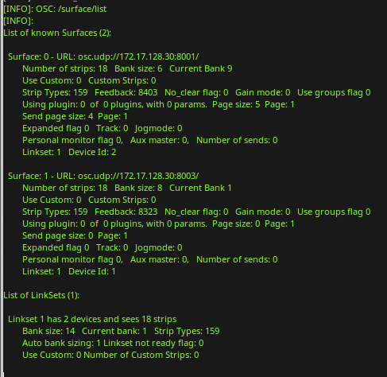

.. _querying_ardour:

Querying Ardour
===============

In order to make a custom controller that knows what strips Ardour has,
the controller needs to be able to query Ardour for that information.
These set of commands are for smarter control surfaces that have the
logic to figure out what to do with the information. These are not of
value for mapped controllers like touchOSC and friends. The controller
will need to send these queries to Ardour as often as it needs this
information.

It may well make sense to use regular feedback for things
that need to be updated often such as position or metering. Here are the
commands used to query Ardour:

``/strip/list``
   Ask for a list of strips.

``/strip/sends *ssid*``
   Asks for a list of sends on the strip *ssid*.

``/strip/receives *ssid*``
   Asks for a list of tracks that have sends to the strip *ssid* points to.

``/strip/plugin/list *ssid*``
   Asks for a list of plug-ins for strip *ssid*.

``/strip/plugin/descriptor *ssid* *piid*``
   Asks for a list of descriptors for plug-in *piid* on strip *ssid*.

``/set_surface``
   Ask for the current surface setting. Reply is in the same form as setting the surface would be.

``/surface/list``
   Print a list of known surfaces and Link Sets to the log window.

A list of strips
~~~~~~~~~~~~~~~~

``/strip/list`` asks Ardour for a list of strips that the current
session has. Ardour replies with a message for each strip with the
following information:

-  Strip type - One of:

   -  AT - Audio Track
   -  MT - MIDI Track
   -  B - Audio Bus
   -  MB - MIDI bus
   -  FB - Foldback bus
   -  V - VCA

-  Strip name
-  Number of inputs
-  Number of outputs
-  Muted
-  Soloed
-  Ssid (strip number)
-  Record enabled

After all the strip messages have been sent, one final message is sent
with:

-  The text ``end_route_list``
-  The session frame rate
-  The last frame number of the session
-  Monitor section present

.. note::

   The ``/set_surface`` should be set before this is called. That way
   the right set of strips will be sent in return (though the default is
   good for most uses) and feedback will start correctly.

If the surface is using ``/strip/list``, the surface needs to know if
the strips have changed. This would be true if a strip gets moved,
created or deleted. When this happens Ardour sends ``/strip/list`` to
the surfaces that have previously requested a ``/strip/list``. This lets
the surface know that its list of strips is no longer valid.

.. note::
   
   A bus will not have a record enable and so a bus message will have
   one less parameter than a track. It is the controllers responsibility
   to deal with this.

A list of sends
~~~~~~~~~~~~~~~

``/strip/sends``\ *``ssid``* asks Ardour for a list of sends for strip
number ssid. The reply is sent back to the controller as one message
with the following information:

-  Ssid that information is for
-  Each send's information:

   -  The send's target bus ssid
   -  The send's target bus name
   -  The send id for this strip
   -  The send gain as a fader position
   -  The Send's enable state

The controller can tell how many sends there are from the number of
parameters as each send has 5 parameters and there is one extra for
ssid.

A list if tracks that send audio to a bus
~~~~~~~~~~~~~~~~~~~~~~~~~~~~~~~~~~~~~~~~~

``/strip/receives``\ *``ssid``* will return a list of tracks that have
sends to the bus at the ssid. The reply will contain the following
information for each track connected to this bus:

-  The ssid of the track sending
-  The name of the sending track
-  The id of the send at that track
-  It's gain in fader position
-  The send's enable state

A list of plug-ins for strip
~~~~~~~~~~~~~~~~~~~~~~~~~~~~

``/strip/plugin/list ssid`` will return a list of plug-ins that strip
ssid has. The reply will contain the following information:

-  Ssid that information is for
-  Each plugin's information:

   -  The plug-in's id
   -  The plug-in's name

A list of a plug-in's parameters
~~~~~~~~~~~~~~~~~~~~~~~~~~~~~~~~

``/strip/plugin/descriptor ssid piid`` will return the plug-in
parameters for ppid plug-in on the ssid strip. The reply will be sent as
a number of messages, one for each parameter. Each message will contain
the following information:

-  Ssid of the strip the plug-in is in
-  The plug-in id for the plug-in
-  The plug-in parameter id for the plug-in
-  The plug-in parameter's name
-  Information about that parameter:

   -  A bitset of flags (see below)
   -  Data type
   -  Minimum value
   -  Maximum value
   -  The number of scale points
   -  zero or more scale points of one value and one string each
   -  The current parameter value

.. note::

   The plug-in parameter id is the position in the full list of plugin
   paramaters, but messages for controlling parameter values and their
   feedback use the position in the list of *controllable* parameters only
   (as specified by the controllable flag, see below).

After all the parameters have been sent this way, one final message
``/strip/plugin/descriptor_end`` is sent with these parameters:

-  ssid of the strip the plugin is in
-  The plug-in id for the plug-in

The flag bitset above has been defined as (from lsb):

-  0—enumeration
-  1—integer step
-  2—logarithmic
-  5—sample rate dependent
-  6—toggled
-  7—controllable
-  8—hidden

Bits 3 and 4 are not used, they were max unbound and min unbound in
previous versions and always zero.

While this seems complex, it is really not that bad. Minimum, maximum
and value will in most cases give you all you need. For simpler access
to plug-ins, the /select/plugin/ set of commands will handle most needs.

Obtaining a list of surfaces Ardour knows about
~~~~~~~~~~~~~~~~~~~~~~~~~~~~~~~~~~~~~~~~~~~~~~~

Ardour can work with more than one OSC control surface at a time.
Sometimes it is useful to know the information stored about all
surfaces. Sending ``/surface/list`` from any surface or selecting:
**Print surface information to Log window** from the **Debug** dropdown
in the OSC setup dialog, will list all the information Ardour uses to
calculate the feedback it sends. The Log window can be opened from the
menu with **Window > Log**. This would be useful information to include
with any OSC related bug report. The output is printed in this format:

   OSC surface log
