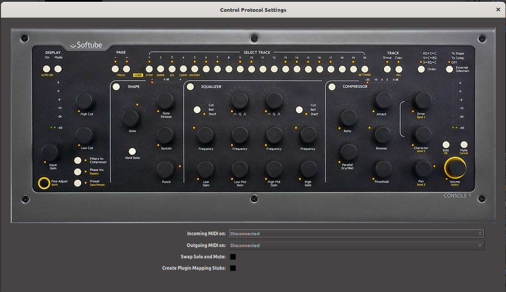

.. _softube_console:

Softube Console1
================

Ardour has a good support for the Softube Console1 controller.

Connecting the Console1
-----------------------

Console1 comes with a single USB Socket on the back. Connect a suitable
USB cable from there to a USB port on your computer.

.. note::

   Ardour uses the Console1 as a generic MIDI controller. You do not
   need to do anything to enable this—The Console1 sends and receives
   ordinary MIDI controller messages to/from the host, and the host
   understands the intended meaning of these messages. We note this
   detail to avoid speculation about whether Ardour supports the native
   mode, which sends MIDI Sysex Messages—it does not.

The Console1 will be automatically recognized by your operating system,
and will appear in any of the lists of possible MIDI ports in both
Ardour and other similar software.

To connect the Console1 to Ardour, open the Preferences dialog, and then
click on **Control Surfaces**. Click on the **Enable** button in the
line that says "Console1" in order to activate Ardour's Console1
support. Then double click on the line that says "Console1". A new
dialog will open, containing two dropdown selectors that will allow you
to identify the MIDI ports where your Console1 is connected.

   The Console1 configuration dialog

Once you select the input and output port, Ardour will initialize the
Console1 and it will be ready to use. You only need do this once: once
these ports are connected and your session has been saved, the
connections will be made automatically in this and other future
sessions.

Checkboxes
~~~~~~~~~~

The checkbox **Swap Solo and Mute** does exactly that. In Ardour and
Mixbus, these buttons are arranged exactly the other way round than in
Console1. Since this can be irritating, the assignment can be reversed
here.

**Work in Progress**:

The checkbox "Create Plugin Mapping Stubs" automatically creates mapping
files for external plugins—if they does not already exists. See the
last section "External Plugins" for further information.

Harrison Mixbus & Mixbus 32c
----------------------------

.. note::
   
   A lot of functionality is developed to be used with Harrison Mixbus
   and Harrison Mixbus32c, therefore the assignment of the controls
   might sometimes feels a little arbitrary. However, in the future it
   might be possible, to control plugins with this surface.

   **Controls only used by Harrison Mixbus (32c) are marked with
   [Mixbus]**

   **Controls inside a Mixbus only section which are working in Ardour
   as well marked with [Ardour]**

Using the Console1
------------------

The **Fine Adjust** / **Shift** button unfortunately does not work in
the generic MIDI mode. Therefore the **Preset** / **Save Preset** button
is used as a shift button. In the following this will be simply referred
to as the **Shift** button.

The controls
~~~~~~~~~~~~

General
^^^^^^^

On
   Is lit when a mixer strip is in solo mode and can disables all solo
   modes.

Mode
   Zooms to selection

Page Up / Page Down
   Switches 20 mixer strips up or down. Only lit if there is another
   page/bank

1...20
   Select the n-th mixer strip of the current bank. *The Master channel
   is always the last mixer strip*

Track Group/Track Copy
   Unused

Order
   [Mixbus]Switches between the compressor modes:
   [Leveler/Compressor/Limiter — see Compressor section

External Sidechain
   Switches between Edit, Cue and Mixer Screen

Input
   Trim

Input Meter
   Unused

High Cut
   [Mixbus]High Cut

Low Cut
   [Mixbus]Low Cut

Filter to Compressor
   [Mixbus]Filters on/off

Phase
   Switches the phase of all channels. If only one of more channels is
   switched in the GUI, the LED blinks

Preset
   The Global 'Shift' button

Pan
   Pan

Solo
   Solo button for the mixer strip

Mute
   Mute button for the mixer strip, blinks, when the mixer strip is
   muted due to another mixer strips Solo-Mode

Volume Meter
   Shows the mixer strip volume

Volume
   Sets the mixer strip volume

Shape-Section [Mixbus]
^^^^^^^^^^^^^^^^^^^^^^

Shape
   Switches the Gate section on or off

Shape Meter
   Shows the Gain reduction of the gate

Gate
   Threshold for the gate

Gate Release
   Release time for the gate

Shift+Gate Release
   Hysteresis for the gate

Sustain
   Attack time for the gate

Shift+Sustain
   Hold time for the gate

Punch
   Depth for the gate

Shift+Punch
   Sidechain filter frequency

Hard Gate
   Sidechain filter on / off

Shift+Hard Gate
   Sidechain filter listen

Equalizer Section [Mixbus]
^^^^^^^^^^^^^^^^^^^^^^^^^^

All encoders in the EQ section are working as sends if the shift button
is activated. See the bus send section.

Equalizer
   Switches the Equalizer section on or off

Low Gain
   The Gain (reduction or boost) of the semiparametric bass eq

(Low) Frequency
   The frequency of the semiparametric bass eq

(Low) Cut / Bell / Shelf
   Switches between Cut/Boost or Shelf (this uses only two of the three
   states

Low Mid Gain
   The Gain (reduction or boost) of the semiparametric low mid eq

(Low Mid) Frequency
   The frequency of the semiparametric low mid eq

(Low Mid) Shape
   [Ardour]The eleventh send of a mixer strip / Send to the eleventh mixbus

High Mid Gain
   The Gain (reduction or boost) of the semiparametric high mid eq

(High Mid) Frequency
   The frequency of the semiparametric high mid eq

(High Mid) Shape
   [Ardour]The twelfth send of a mixer strip / Send to the twelfth mixbus
   (see section Mixbusses)

High Gain
   The Gain (reduction or boost) of the semiparametric treble eq

(High) Frequency
   The frequency of the semiparametric treble eq

Compressor Section [Mixbus]
^^^^^^^^^^^^^^^^^^^^^^^^^^^

Compressor
   Switches the Compressor on or off

Compressor Meter
   Shows the gain reduction of the leveler/compressor/limiter

Order
   *Above this section* Switches between the compressor modes:
   Leveler/Compressor/Limiter

Ratio
   Ratio of the compressor

Parallel Dry/Wet
   Makeup gain of the compressor

Attack
   Attack time of the compressor

Release
   Release time of the compressor

Threshold
   Threshold of the compressor

Sends
^^^^^

All Encoders in the equalizer-section are working as sends when
'shift' is selected.

Additionally the Low-Mid and High-Mid shape encoders are sends to the
mixbusses eleven and twelfe. The Idea behind this is to have some
common effects on this two mixbusses which are accessible without
'shift'. Currently, this is focused on Mixbus.

The functionality will be extended to fit better with Ardour in a
second development phase. However, if a mixer strip in Ardour has
sends to busses, these are accessible with the send encoders as well.

These are numbered from top to bottom. The topmost send can be
changed by the send 1 encoder Shift+(Low) Frequency, the next send
below by the send 2 encoder Shift+(Low Mid) Frequency and so on.

========================== =======
Shift+(Low) Frequency      Send 1
Shift+(Low Mid) Frequency  Send 2
Shift+(High Mid) Frequency Send 3
Shift+(High) Frequency     Send 4
Shift+Low Gain             Send 5
Shift+Low Mid Gain         Send 6
Shift+High Mid Gain        Send 7
Shift+High Gain            Send 8
Shift+(Low Mid) Shape      Send 9
Shift+(High Mid) Shape     Send 10
(Low Mid) Shape            Send 11
(High Mid) Shape           Send 12
========================== =======

External Plugins
^^^^^^^^^^^^^^^^

.. note::

   *This is work in progress. But things described here are already
   working but might be unstable!*

   Pressing **Group** will set Console1 into external plugin mode.
   External plugins are all plugins in case of Ardour and in case of
   Mixbus all plugins which are not a fixed part of the mixer strips.

Group
   Set or unset the Console 1 into "External Plugin Mode"

1-20
   Select the plugin at position [selected number]. Pressing repeatedly
   then shows or hides the plugin.The LED of the selected channel stay
   on permanently, the channel LED of the plugin number stays in
   'blinking mode'.

Mute
   Disables the plugin

All other assignements needs to be done with the mapping files. A stub
of such a mapping file can be automatically created when the **Create
Plugin Mapping Stubs** checkbox in the **Control Protocol Settings**
dialog is enabled.

The mapping files are created in a subdirectory "c1mappings" of the
Ardour/Mixbus settings directory

This is the example of a mapping file for the a-compressor. The file
name is created from the unique URL of the plugin. In this case its
**urn:ardour:a-comp.xml**.

.. code-block:: xml

   <?xml version="1.0" encoding="UTF-8"?>
   <c1plugin-mapping 
           ID="urn:ardour:a-comp" 
           NAME="ACE Compressor">
           <param-mapping id="0">
                   <name>Attack</name>
                   <mapping shift="false">COMP_ATTACK</mapping>
           </param-mapping>

           <param-mapping id="1">
                   <name>Release</name>
                   <mapping shift="false">COMP_RELEASE</mapping>
           </param-mapping>

           <param-mapping id="2">
                   <name>Knee</name>
                   <mapping shift="false"></mapping>
           </param-mapping>

           <param-mapping id="3">
                   <name>Ratio</name>
                   <mapping shift="false">COMP_RATIO</mapping>
           </param-mapping>

           <param-mapping id="4">
                   <name>Threshold</name>
                   <mapping shift="false">COMP_THRESH</mapping>
           </param-mapping>

           <param-mapping id="5">
                   <name>Makeup</name>
                   <mapping shift="false">COMP_PAR</mapping>
           </param-mapping>

           <param-mapping id="6">
                   <name>Sidechain</name>
                   <mapping shift="false"></mapping>
           </param-mapping>
   </c1plugin-mapping>

It is planned to allow creating the mapping file for the plugins inside
the setup dialog. This, however, might take some time.
