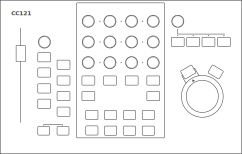
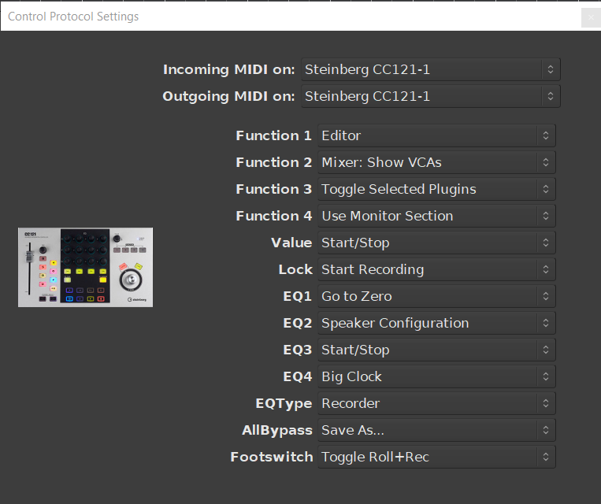

.. _steinberg_cc121:

Steinberg CC121
===============

Steinberg CC121 is a compact control surface originally designed for use
with the Cubase™ digital audio workstation.

   Steinberg CC121

Connecting the CC121
--------------------

Plug the USB cable from the CC121 into a USB2 or USB3 port on your
computer. The device will be automatically recognized by your operating
system and will appear in any of the lists of possible MIDI ports in
Ardour.

To connect the CC121 to Ardour, open the Preferences dialog, and then
click Control Surfaces. Tick the Enable checkbox opposite to "Steinberg
CC121" to activate Ardour's CC121 support.

Once the device is activated, click Show Protocol Settings and in the
newly opened window select the device in the drop-down lists for
incoming and outgoing MIDI events.

Once you select the input and output port, the CC121 will be ready to
use. You only need do this once: once these ports are connected and your
session has been saved, the connections will be made automatically in
this and other future sessions.

CC121 Configuration
-------------------

Ardour supports a subset of features available in the CC121. Various
actions in the program can be mapped to the following buttons and
encoders on the device:

-  Function 1 through Function 4 buttons
-  Value encoder
-  Lock button
-  EQ type button
-  All Bypass button
-  EQ1 through EQ4 toggles

Here is an example of a customized setup:

   Steinberg CC121 settings

Some additional behavior cannot be configured:

Fader
  Controls the fader of the selected track or bus

Pan encoder
  Controls the panner of the selected track or bus

M button
  Mutes the selected track or bus

S button
  Soloes the selected track or bus

R button
  Read automation, sets the fader to the play mode, can only be disabled by pressing E, Edit instrument or Write automation

W button
  Write automation, sets the fader to the write mode, can only be disabled by pressing E, Edit instrument or Read automation

Speaker button
  Alternate between *In*, *Disk*, *In/Disk*, and *In* and *Disk* both disabled

O button
  Arms a track for recording

E (edit) button
  Sets the fader to touch mode, can only be disabled by pressing Edit instrument, Read automation, or Write automation

Edit instrument button
  Sets the fader to the manual mode, can only be disabled by pressing E, Read automation or Write automation

Channel Select
  Left-pointing button selects the previous track, right-pointing button selects the next track

Jog Wheel
  Jogs through audio with Jog button enabled, zooms in/out with Jog button disabled

Previous button
  Moves the playhead to the previous marker

Rewind
  Moves the playhead back in time

Forward
  Moves the playhead forward in time

Next button
  Moves the playhead to the next marker

Loop/Cycle button
  Enables/disables region looping

Stop
  Stops the transport

Play
  Rolls the transport

Record
  Starts to blink when pressed, when a track has record enable set and play is pressed, recording to the track will start and it will be lit during recording.
   
  When pressed again during recording, track will keep playing but is no longer recording and the button will no longer be lit.  

  When a track does not have record enable set, the record button will keep blinking when play is pressed, the track will play but not record. Once the record enable button is pressed, recording has started and the button will be lit.

