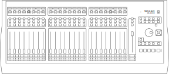
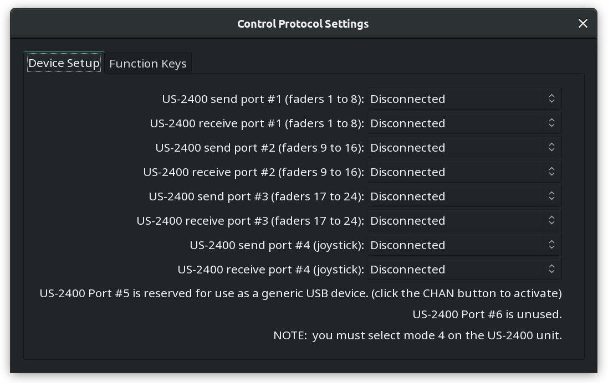
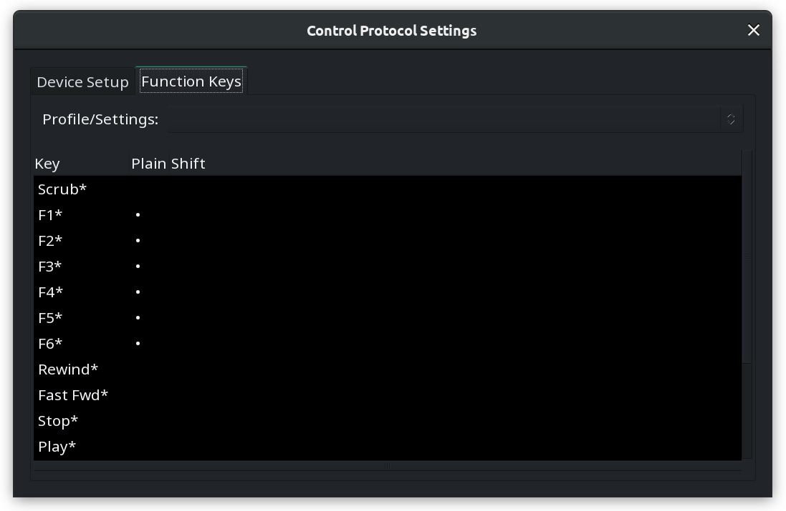

.. _tascam_us2400:

Tascam US-2400
==============

Tascam US-2400 is a control surface that features 3 by 8 channels
strips, each with a continuous rotary encoder, a motorized fader, MUTE,
SOLO and SEL. It also has a master section with a motorized fader for
the master bus, transport controls, a joystick, a jog dial, and several
function keys.

   Tascam US-2400

Connecting the US-2400
----------------------

Plug the USB cable from the US-2400 into a USB2 or USB3 port on your
computer. The device will be automatically recognized by your operating
system and will appear in any of the lists of possible MIDI ports in
Ardour.

To connect the US-2400 to Ardour, open the Preferences dialog, and then
click Control Surfaces. Tick the Enable checkbox opposite to "Tascam
US-2400" to activate Ardour's US-2400 support.

Once the device is activated, click Show Protocol Settings and in the
newly opened window configure the device.

US-2400 Configuration
---------------------

The configuration dialog allows setting up send and receive ports, as
well as map functions keys to various actions in Ardour. To make it
work, you need to select mode 4 on the US-2400 unit.

It's possible to define MIDI send/receive ports for the three groups of
faders (1..8, 9..16, 17..24) and the joystick.

   Tascam US-2400 port settings

It's also possible to map device keys to various actions in Ardour:

   Tascam US-2400 function keys mapping
