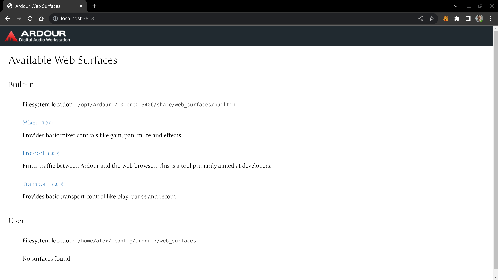
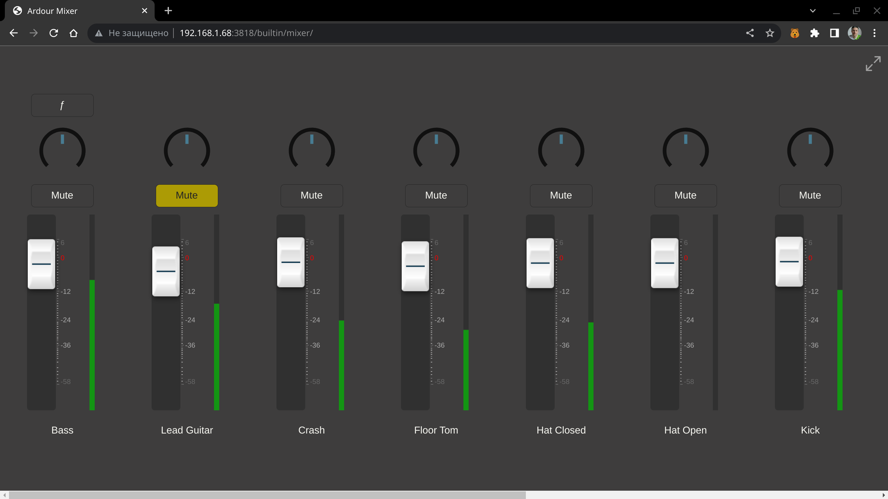
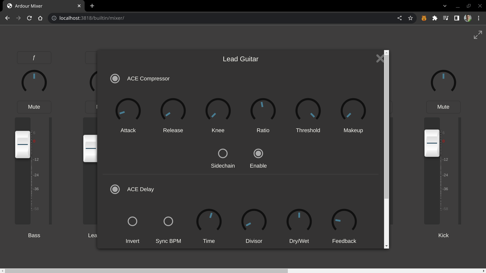
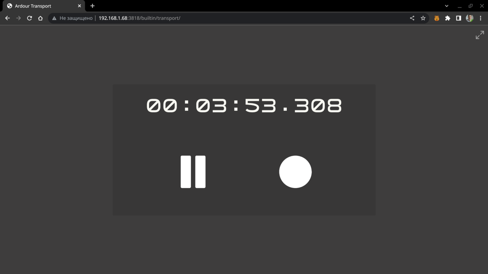
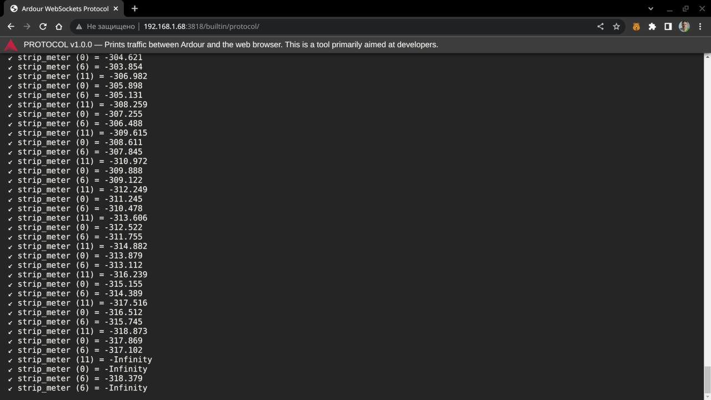

.. _websockets_server:

WebSockets Server
=================

The WebSockets Server is an experimental control surface that allows
controlling a running Ardour session via a web browser on any computer
in the same local network.

The connection between the WebSockets server and a running instance of
Ardour is two-way: any changes made in the web-based surface are
immediately available in Ardour, and vice versa.

The experimental status means that this control surface is not
feature-complete and might have bugs.

Supported features are currently limited to:

-  Adjusting positions of channel faders and panners in tracks and the
   master bus, as well as muting and unmuting tracks.
-  Changing settings of LV2 plugins that have already been loaded into
   tracks or the master bus.
-  Rolling or pausing transport.

Enabling and Accessing the WebSockets Server
--------------------------------------------

To enable the WebSockets Server surface, open the *Preferences* dialog
and go to the *Control Surfaces* page. Click on the *Web Sockets Server
(Experimental)* to enable it. This will immediately run the server and
make it available on port 3818. You can verify that it's running by
opening a web browser on the same computer and visiting
http://localhost:3818/. You should see the home page that looks like
this:

   WebSockets Server main page

To access the server from any device in the same network you need to
know the broadcast IP address or the hostname of the computer running
Ardour. To do that, open Window > Log right after enabling the control
surface and look at the message that says something like this:

``2025-02-28T21:42:14 [INFO]: ArdourWebsockets: listening on: http://fedora:3818/``

Alternatively, you can use system's specific tools to discover the IP
address. Once you know the address or the hostname, you can open the
control surface web app in a browser by visiting the IP address with
appended port number. E.g. if the IP address of the computer running
Ardour is ``192.168.1.68``, the entire URL will be
``http://192.168.1.68:3818/``.

Using the WebSockets Server control surface
-------------------------------------------

Various features available in the control surface are spread across
three pages: *Mixer*, *Transport*, and *Protocol*.

Mixer
~~~~~

This is where you can view VU meters for each track and the master bus,
as well as make a number of adjustments:

-  Change positions of faders and panners.
-  Enable and disable the *Mute* status.
-  Adjust settings of LV2 plugins loaded into mixer channels.

   Mixer view in WebSockets Server

The control surface only supports changing settings for LV2 plugins
presently. LADSPA, VST2/VST3, and AU plugins will not be listed. When an
LV2 plugin has been loaded into a mixer channel, a button with "f"
caption appears on top of the mixer channel. Clicking it opens this kind
of an overlay:

   Plugins view in WebSockets Server

Transport
~~~~~~~~~

The *Transport* view displays the timecode of the current playhead
position and allows toggling playback.

   Transport view in WebSockets Server

The *Record* toggle is currently non-functional.

Protocol
~~~~~~~~

This page is targeted at developers willing to enhance the WebSockets
Server control surface. It displays the data passed between Ardour and
the web browser.

   Protocol view in WebSockets Server
