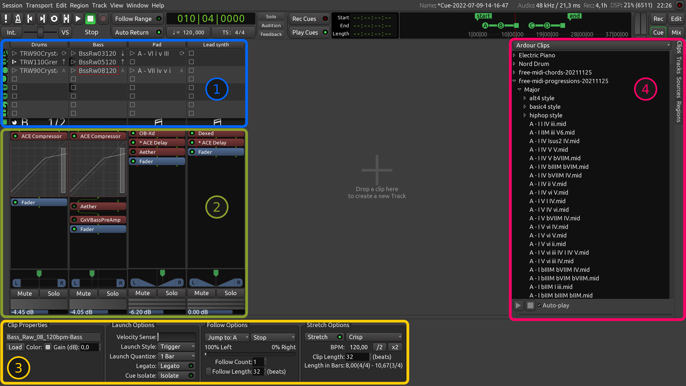

.. _cue_window_elements:

Cue window elements
===================

For cues, Ardour generally follows the design pattern of other
applications that support a grid-based non-linear workflow.

   The Cue window elements

The main elements of the Cue window are:

#. Grid of tracks and cues, playback indicators
#. Mixer channel section
#. Clip and trigger slot options
#. Sidebar: Clips, Tracks, Sources, and Regions

.. _cue_window_grid:

Grid
----

The trigger slots grid is comprised of tracks (stacked horizontally) and
cues (stacked vertically). Tracks group clips played by roughly the same
instrument (or set of instruments, in case of drums and percussion).
Cues group clips that will be played simultaneously.

Every trigger slot with a clip inside contains three elements: launch
button/indicator, clip title, and follow action selector/indicator.

Cue buttons (**A** to **H**) to the left of the grid initiate the
playback of an entire cue. Right-clicking on them opens a menu where
it's possible to set the same options for all clips and trigger slots in
that cue:

-  Follow action
-  Launch style
-  Quantization
-  Color

The playback indication area displays four pieces of data for each
track:

-  Clip playback progress
-  Which cue the playing clip belongs to
-  MIDI clip indication
-  Follow count

Similarly to cue playback buttons, the playback indication area has a
right-click menu where it's possible to set the same options for all
clips and trigger slots in a track of choice.

:ref:`This chapter <playing_back_the_cues>` provides more information on
playback in the Cue window.

.. _cue_window_mixer_channels:

Mixer channel section
---------------------

The mixer channel section is very similar to what's available in the
Mixer window: there's the :ref:`processor box <processor_box>`, the same
:ref:`panner <panning>`, as well as the :ref:`mute and the
solo <muting_and_soloing>` buttons. Both the fader and the meter are
horizontal, there is no choice for a type of meter.

.. _cue_window_clip_options:

Clip and trigger slot options
-----------------------------

The bottom section contains several groups of controls:

-  :ref:`Clip Properties <clip_properties>`: full name of a clip in the
   selected trigger slot, loading a different clip, gain control
-  :ref:`Launch Options <clip_launch_options>`: how the clips' playback
   is triggered and within what musical time unit it is quantized
-  :ref:`Follow Actions <clip_follow_actions>`: how many times one clip
   is played and what other clip's playback is triggered next
-  :ref:`Stretch Options <clip_stretch_options>` (audio-only): stretching
   the original audio data to match current session tempo, adjusting
   assumed original tempo for creative purposes

.. _cue_window_sidebar:

Sidebar
-------

Ardour defaults to displaying the :ref:`Clips <clips_overview>` tab as
the clips browser is commonly used for pulling reusable clips into the
project.

In the Cue context, the Tracks tab is mostly useful for marking a track
as visible or not visible in the Cue window.

Both the Sources and the Regions tabs can work as drag-and-drop sources
for:

-  Placing audio and MIDI data to trigger slots
-  Creating new tracks
-  Creating new reusable clips available from the Clips browser
