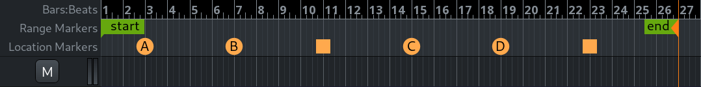

.. _mixing_linear_nonlinear_workflows:

Mixing linear and non-linear workflows
======================================

It's possible to combine the linear workflow, i.e. working with regions
on the timeline, and the non-linear workflow, i.e. launching clips from
trigger slots.

The general steps to do so are:

#. Setting up the trigger slots grid: loading clips into slots and
   grouping them into cues.
#. Setting up follow actions to make transitions from one cue to
   another, although in some cases this would be fairly optional as it
   is possible to trigger specific cues from the timeline.
#. Adding cue markers on the ruler where repeatable clips should start
   playing. This will launch an entire cue sans the isolated slots.
#. Adding the "Stop all cues" marker where all cues should stop playing.

In the example below, cue A starts at bar 3, followed by cue B at bar 7,
then all cues are stopped at bar 11. After that, cue C is triggered on
bar 15, then cue D on bar 19, then all cues are stopped at bar 23.

   Using Cue markers

Just like any other markers, cue markers can be repositioned. Moreover,
right-clicking on an existing marker allows changing the cue that should
be triggered.

   Changing the triggered cue

The rest of the composition would be written the usual way, by adding
consecutive audio and/or MIDI regions to the canvas.

A session that is set up in such a way can be exported just like any
other, into a single audio file or through stem exporting.
