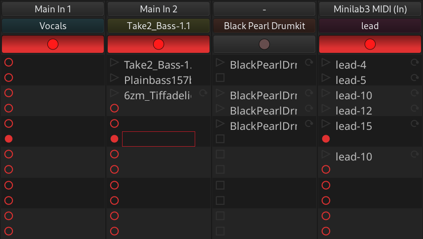

.. _recording_cues:

Recording cues
==============

You can record audio and MIDI from respective inputs into trigger slots
to play them back. Here is the workflow.

#. On the Cue page, Click on the record button at the top of the track
   you want to record to.
#. Select a trigger slot
#. Enable Follow Length in Follow Options at the bottom
#. Set the follow length in beats
#. Click to the left of the selected trigger slot to enable recording
#. Click the Play button in the transport toolbar or press Space

Ardour will count down (the number of beats depends on launch
quantization and position of the playhead) and start recording.

As soon as the playhead reaches the end of the defined follow length,
Ardour will stop recording and start playing back the clip you've just
recorded.
