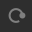
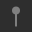
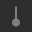
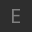

.. _clip_follow_actions:

Setting up follow actions
=========================

Follow actions
--------------

When the contents of one trigger slot has been played a user-defined
number of times, Ardour can do one of the two things: stop playing or
switch to a different trigger slot. This is defined by follow actions. 
A commonly used follow action is playing a clip in the next trigger
slot down the grid.

Here are the currently available follow actions. Please note that to
help distinguishing between them, Ardour will display an icon next to
the name of a clip in a slot:

+---------+----------------------+----------------------------+
| None    | No icon              | Play the contents of the   |
|         |                      | slot once and stop         |
+---------+----------------------+----------------------------+
| Stop    | |image1|             | Stop after playing back    |
|         |                      | the amount of times set    |
|         |                      | with **Follow Count** or   |
|         |                      | via **Follow Length**      |
|         |                      | (see below)                |
+---------+----------------------+----------------------------+
| Again   | |image2|             | Repeat the contents of the |
|         |                      | trigger slot over and over |
|         |                      | again                      |
+---------+----------------------+----------------------------+
| Reverse | |image3|             | Play back and go to the    |
|         |                      | previous trigger slot      |
+---------+----------------------+----------------------------+
| Forward | |image4|             | Play back and go to the    |
|         |                      | next trigger slot          |
+---------+----------------------+----------------------------+
| Jump    | |image5|  |image6|   | Play back and jump to a    |
|         |                      | particular scene.          |
|         |                      | Selecting **multi-jump**   |
|         |                      | and multiple trigger slots |
|         |                      | will result in randomly    |
|         |                      | playing one of the         |
|         |                      | selected slots.            |
+---------+----------------------+----------------------------+

Note that the follow action can be set right in the grid. It is achieved
by clicking the icon that corresponds to the currently selected follow
action for a slot and choosing a different one in the newly opened menu.

Follow actions probability
--------------------------

Ardour can help explore ideas by bringing an element of randomness. Two
possible follow actions can be set to randomly alternate between, then
the percentage of probability of the left or the right follow action to
be triggered can be adjusted:

-  ``0%`` means the left follow action is always chosen
-  ``100%`` means the right follow action is always chosen
-  Anything between ``0%`` and ``50%`` will skew the probability towards
   the left follow action
-  Anything between ``50%`` and ``100%`` will do the same for the right
   follow action

Playback duration
-----------------

There are two options here that affect the playback duration one way or
another.

**Follow Count** defines how many times a clip will be played back
before triggering the follow action.

**Follow Length** overrides clip length and defines the new one in
beats. By default it's as long as the clip is long. Making this value
lower will cut the clip short, making it longer will add some silence at
the end of the clip.

