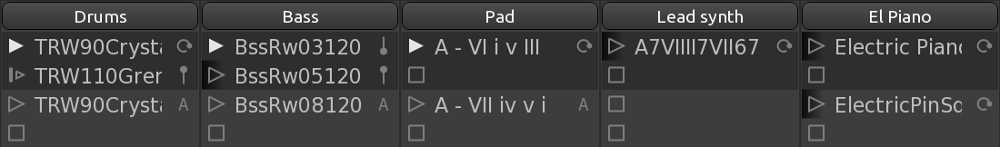
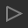
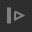
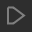
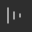

.. _clip_launch_options:

Setting up launch options
=========================

Velocity Sense
--------------

This control defines how much the velocity coming off a MIDI device
affects clip's volume. At 0%, which is the default, it doesn't matter
how hard a key or a pad is pressed, the volume will be what it is set
to. At 100%, hitting a key as hard as possible produces maximum volume,
and pressing the key or a pad really softly produces a barely audible
sound.

Launch Style
------------

The Launch Style defines how the user interacts with the clip's
playback. Ardour makes a distinction between pressing a button or a key
(the 'down' event for a mouse or the note-on MIDI event) and releasing a
button or a key (the 'up' event for a mouse or the note-off MIDI event).

A trigger slot can be set up so that pressing a silicon pad on an
external grid controller, would make Ardour play the clip in that slot
indefinitely on repeat. Or it could be set up so that Ardour would only
repeat that clip as long as the pad is kept pressed and stop playing it
as soon as the pad is released.

+-----------+----------+--------------------------------------------+
| Trigger   | |image1| | Clicking will trigger the playback of a    |
|           |          | clip. Further clicks, as well as mouse up  |
|           |          | and note-off events will be ignored.       |
+-----------+----------+--------------------------------------------+
| Retrigger | |image2| | Clicking will trigger the playback of a    |
|           |          | clip. Another click will restart           |
|           |          | (retrigger) the playback from the          |
|           |          | beginning, quantization will be taken into |
|           |          | consideration. Mouse up and note-off       |
|           |          | events will be ignored.                    |
+-----------+----------+--------------------------------------------+
| Gate      | |image3| | The clip will be played back as long as    |
|           |          | the mouse button or the MIDI key/pad is    |
|           |          | kept pressed. Quantization defines how     |
|           |          | soon playback starts after pressing the    |
|           |          | button/key down and ends after releasing   |
|           |          | the button/key.                            |
+-----------+----------+--------------------------------------------+
| Toggle    | |image4| | The clip will keep playing until the       |
|           |          | button is clicked again or another note-on |
|           |          | event is sent from a MIDI device           |
+-----------+----------+--------------------------------------------+
| Repeat    | |image5| | The contents of the clip will be played to |
|           |          | the extent of the quantization setting.    |
+-----------+----------+--------------------------------------------+

Launch Quantize
---------------

This setting defines how long Ardour will wait till beginning the
playback of a clip in a trigger slot. If the transport is already
rolling, and quantization is set to 1 bar, which is the default, Ardour
will wait for the next bar, then start playing the clip. Quantizing to a
whole bar or several bars typically guarantees that downbeats of a drums
track and a bassline track align.

The quantization value can be as large as 4 bars and as small as 1/64
bar. When 'None' is selected, playback with a rolling transport will
start immediately.

Legato
------

The Legato mode helps keeping two clips of the same track in sync when
switching from one to another. With Legato on, Ardour will pick up the
playback of the second clip at the position where the first one left
off. Please note that quantization applies here.

Cue Isolate
-----------

When an entire cue is played, all slots that belong to it get triggered.
Solo Isolate is a way to disable that for selected slots. An isolated
slot will only be triggered when either mouse-down or note-on event is
sent directly to it.

Isolated slots are visually separated from others: they have a linear
black-to-transparent gradient fill in the background of the trigger
button.

   Isolated trigger slots

On the screenshot above, the Bass, Lead Synth and El Piano tracks all
have at least one isolated trigger slot.

