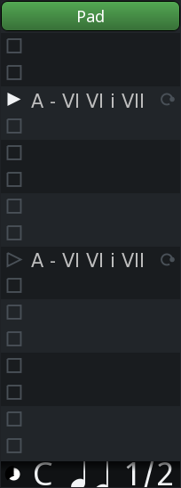
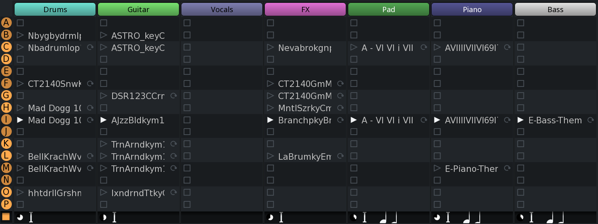

.. _playing_back_the_cues:

Playing back the cues
=====================

It is possible to play both individual clips and entire cues.

Playing and stopping individual clips
-------------------------------------

There are generally two ways to trigger a slot with a clip inside.

#. Pressing a mouse button over the button to the left of the clip's
   name (Ardour defaults to Trigger launch style which has a classical
   triangle playback icon)
#. Sending a note-on event from an external or a virtual MIDI controller

How Ardour responds to releasing the mouse button or sending a note-off
event depends on the trigger launch style. :ref:`This chapter
<clip_launch_options>` covers that topic.

Once the clip starts playing, the playback indication panel for that
track lights up with some information:

   Playback indication

Left to right:

-  Clip progress, in the form of a sliding pie chart
-  Which cue is playing (it's C on the screenshot)
-  MIDI clip indication, an icon representing two beamed 1/16 notes
-  Follow count, e.g. '1/2' on the screenshot means the clip is
   currently being played the first time out of two times total

One way to stop a playing clip is to click the square-shaped icon in any
of the empty slots in the track of interest.

Ardour allows assigning arbitrary keys on MIDI controllers to trigger
cue slots by:

#. Right-clicking on the trigger slot of interest
#. Choosing MIDI Learn in the newly opened window
#. Pressing a key on the MIDI controller

An existing assignment can be removed using the MIDI un-Learn command in
the same right-click menu.

This use of MIDI devices and its learning function is separate from,
functions differently to, and is not to be confused with the use of MIDI
devices as control surfaces.

For a MIDI device to be used to trigger clips it must be defined as
**Default** trigger input in the **Triggering** page of the
**Preferences** dialog and/or be connected to the ``ardour:Cue Control
in`` MIDI port.

Playing and stopping entire cues
--------------------------------

Clicking a round-shaped button with a Latin letter inside launches the
playback of the entire cue, that is, all clips in all trigger slots of a
cue.

   Entire Cue playback

The time when playback of each slot starts depends on the launch
quantization setting. If there is no quantization selected, playback
will start immediately regardless of the playhead's position. However,
if the launch quantization is set to 1 bar, playback will only start
once the playhead passes the start of the closest bar. This ensures that
however long each clip is when measured in beats, all clips in one cue
will play in sync.

Clicking the square-shaped button under the last letter-coded cue
(**P**) will stop playback of all cues and all clips in all trigger
slots. Just like with playback, the time playback stops depends on
quantization settings of each trigger slot.
