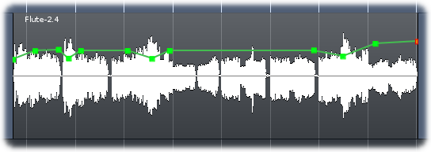

.. _gain_envelopes:

Gain envelopes
==============

.. figure:: images/gain-envelope1.png
   :alt: Default gain envelope
   :class: right-float

In Ardour, every **region** has a **gain envelope**, which is normally
hidden. Clicking on the **Draw** tool will cause all the gain envelopes
on all regions to show themselves; these will appear as green lines with
square dots (**control points**) at the beginning and end of each
region. The vertical axis represents gain, with the top of the region
representing ``+6dB`` and the bottom representing approximately
``-170dB``. By default, the line starts and ends at ``0dB``; the control
points can be moved up and down to change the amount of gain at that
point.

Gain follows the line between control points continuously during
playback, and adjusts the gain for that region accordingly. It is
completely automatic, unlike channel :ref:`automation <automation>`.

The default gain curve, by itself, is not very useful; in order to have
more control over the shape of the gain envelope it is necessary to add
extra control points. Clicking anywhere in the region where there are no
existing control points adds a control point to the envelope; it will
appear *on the line* at the X-axis of the mouse's current position in
the region.

   A more complex gain envelope.

Once added, a control point can be left-clicked and dragged to the
desired location. Hovering over a control point will show its current
level in dB. Left clicking a control point and pressing **Delete**, or
:kbd:`Shift`-right-clicking a control point deletes it.
