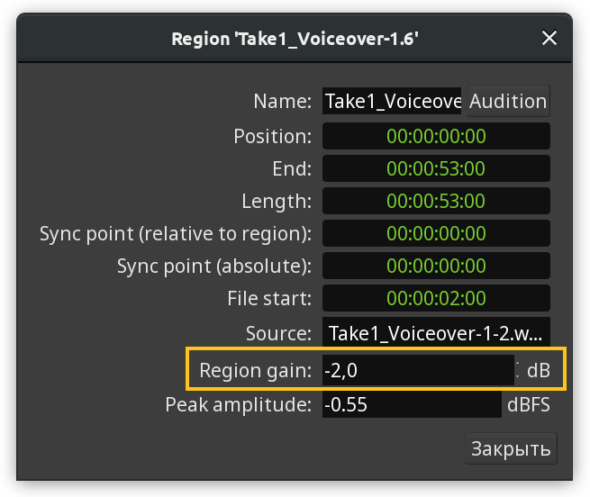
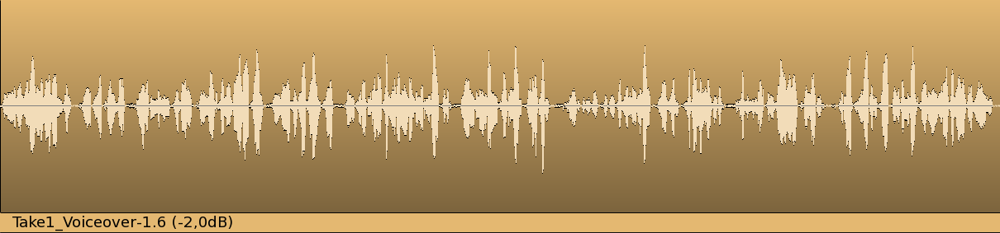
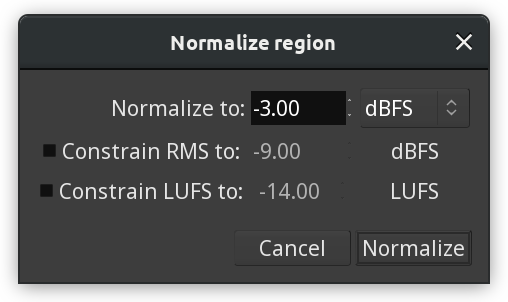
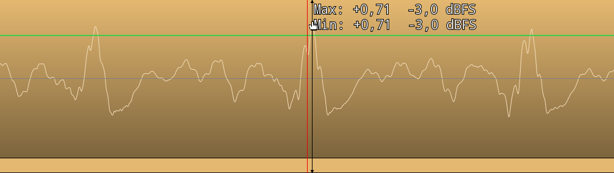
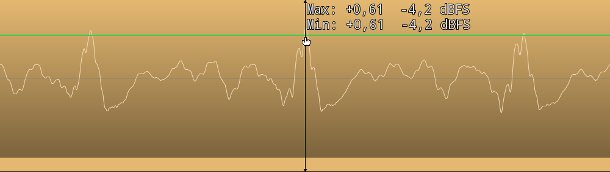

.. _region_gain:

Region gain
===========

Ardour allows adjusting region gain by a constant amount as opposed to
adjusting gain envelope where it's possible to change it gradually over
time. Like everything in Ardour, this is a non-destructive change. The
result can be adjusted at any a later time or discarded altogether.
Internally, region gain is an inherent property of regions, it can be
edited directly in the region properties dialog.

There are two additional ways to adjust region gain: by boosting or
cutting gain with a ``1dB`` step, or by normalizing audio.

Boosting and cutting gain
-------------------------

The quickest way to increase or decrease gain of selected regions
without involving the gain envelope is to use **Boost Gain** and **Cut
Gain** commands respectively.

These commands can be accessed via the main **Region > Gain** menu or
region's context menu. A much easier way is to use shortcuts: :kbd:`Alt+6`
boosts gain by 1dB, :kbd:`Alt+7` cuts gain by ``1dB``.

When gain is boosted or cut, the region caption in the bottom of the
affected region specifies the amount in parentheses. In an example
below, gain was cut by ``2dB``.

   Gain cut

Normalizing audio regions
-------------------------

Audio normalization is a way to bring the amplitude of a signal to a
target level by applying the same amount of gain to an entire piece of
audio data. Unlike other ways to treat perceived loudness, such as
compression, normalization retains the original dynamic range.

Normalization is a common step in exporting an entire project to an
audio file. However, with Ardour, it's also possible to normalize some
of the regions. This effectively changes the region gain setting, the
same one that the boost/cut gain commands change.

Region-level normalization in Ardour can be accessed via the **Region >
Gain > Normalize…** menu command.

The normalization tool locates the part of the audio region that has the
largest amplitude and adjusts the whole region so that that part matches
the normalization target. In an example below, an audio region was
normalized to ``-3dBFS``, which led to ``-2.5dB`` gain reduction, and
this is the part with the largest amplitude hitting the exact ``-3dBFS``
target:

   Normalized region, zoomed in

It's also possible to apply additional constraints by analyzing
perceieved loudness of the material. The first option is to constraint
root mean square (RMS) to a certain amplitude value. The second option
is to constrain loudness units (LUFS) to a certain value.

The normalization tool will use the peak amplitude value, but will also
correct the calculated gain adjustment when the constraint demands that.
In the example below the same region as in example above was normalized
to the same peak amplitude of ``-3dB`` but with an additional constraint
of ``-21LUFS``. The normalization tool took the peak amplitude into
account and made sure it wouldn't exceed the target value of ``-3dBFS``,
then adjusted the region gain further from ``-2.5dB`` to ``-3.3dB`` to
meet the LUFS constraint demands. This resulted in the peak amplitude
hitting ``-4.2dBFS`` rather than the target ``-3dBFS``.

   Normalization with LUFS constraint, zoomed in

Resetting gain
--------------

To reset gain correction for a region entirely you can either set it to
``0`` in the region properties dialog or use the **Region > Gain > Reset
Gain** menu command.
