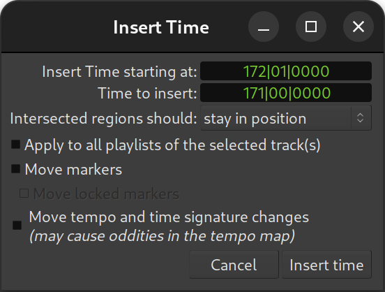

.. _insert_remove_time:

Inserting/Removing time
=======================

Inserting time
--------------

The **Insert Time** window allows to insert blank space in the timeline,
on the selected track(s). It is accessed through the **Track > Insert
Time** menu.

The window also provides some fine-tuning options:

Insert Time starting at:  
   Sets the point in the session where the time will be added.  
   By default, it is the playhead's position.

Time to insert:  
   Duration of the blank space inserted.

Intersected regions should:  
   A choice as to what happens to regions that exist at the Insert Time set above.  
   See below.

Apply to all the track's playlists  
   As a track can have multiple :ref:`playlists <understanding_playlists>`,  
   the insertion can happen either only on the active playlist or  
   on all the playlists of this track.

Move markers  
   As a :ref:`marker <working_with_markers>` can be locked,  
   this option and the two subjacent ones allow  
   shifting the time position of those markers.

Move tempo and meter changes  
   The :ref:`tempo and meter <tempo_and_meter>` markers,  
   that can be used to change the tempo along the session,  
   can also be shifted in the process.  
   Though, moving the tempo markers while e.g. keeping the MIDI regions unaffected  
   can create oddities.

Both the two time fields have a useful context menu, that allows to
copy/paste the time and change the display among one of the :ref:`clock
modes <editing_clocks>`. The Insert Time field also has two options to
**Set from Playhead** (to get the insertion time from the playhead,
which is what happens by default) and **Locate to This Time** which
moves the playhead to the time field value, useful if the field has been
manually edited to better visualize the insertion point.

The **Intersected regions should** dropdown allows to select what happens
to regions that cross the insertion position:

stay in position *(default)*
   The crossed regions are not affected by the time insertion. Only regions after the insertion point are moved.

move
   The crossed regions are shifted in time.

be split
   The crossed regions are split, and the section after the time insertion point is shifted in time.

This last mode allows a *brute force* insertion, creating a blank space
in all the selected tracks, and replacing multiple operations.

.. note::
   One interesting option is, if a range selection (created with in
   :ref:`Range Mode <toolbox>`) exists, it is used as the default parameters
   in the window, instead of the playhead, for both the start time and
   duration.

Removing time
-------------

The **Remove Time** window, accessed through the **Track > Remove Time** menu,
is very similar to the previous, and its options are very similar. Only
the **Intersected regions should:** option is not present.

The range selection note above can be especially useful in this context.
