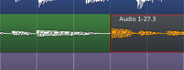
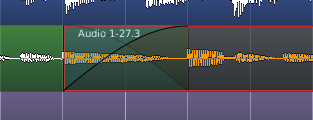
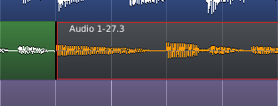

.. _push_pull_trimming:

Push/Pull trimming
==================

Normally, when trimming regions by dragging with the mouse, it affects
only the selected regions. Their lengths are directly affected by the
trim operation, but nothing else is.

Sometimes though, when trimming a region that directly adjoins another,
the desired result is to move the boundary between the regions and not
to make these regions overlap. This requires trimming both regions on
either side of the junction, in opposite directions. **Push/Pull trim**,
activated by pressing the :kbd:`Shift` key before starting the drag,
will do just that.

The following pictures show the difference in the results of a normal
trim and a push/pull trim:

   Before trimming

   After a simple trim

   After a push/pull trim

In the initial situation, before trimming, two adjacent regions are
present, the rightmost-one being selected.

The simple trim, obtained by dragging the selected region's starting
position earlier, overlaps the earlier region. A crossfade has been
manually created between them, so their sound will fade from the
leftmost region to the rightmost one.

If the same trim is done, but by :kbd:`Shift`-left-dragging to turn it
into a push-pull trim instead, there is no overlap, and the end of the
earlier region has been moved along with the start of the later region,
so that they still directly adjoin each other. In effect, it is like
doing a simple trim to reduce the leftmost region, then doing a simple
trim to extend the rightmost one to fill the gap.

