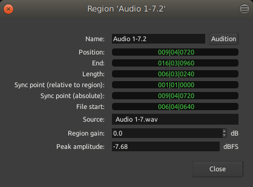

.. _region_properties:

Region properties
=================

The **Region Properties** window brings information about the selected
regions, and allows to fine tune its sequencing. It is accessed through
the **Region > Properties…** menu, or by right-clicking the region and
selecting **<Name_of_the_Region> > Properties…**.

This window also allows to manually set the different values.

+----------------------------+----------------------------+----------+
| Field                      | Meaning                    | Editable |
+============================+============================+==========+
| Name:                      | The :ref:`name of the      | X        |
|                            | region <region_naming>`    |          |
|                            | in the editor              |          |
+----------------------------+----------------------------+----------+
| **Audition**               | This button allows to      |          |
|                            | listen to the region and   |          |
|                            | only the region, dry (with |          |
|                            | no effects, regardless of  |          |
|                            | the processors applied to  |          |
|                            | the track). For MIDI, the  |          |
|                            | default MIDI synth, set in |          |
|                            | the :ref:`Preferences      |          |
|                            | <preferences_midi>`,       |          |
|                            | is used to audition the    |          |
|                            | region.                    |          |
+----------------------------+----------------------------+----------+
| **Position:**              | Position in time of the    | X        |
|                            | left-hand side of the      |          |
|                            | region                     |          |
+----------------------------+----------------------------+----------+
| **End:**                   | Position in time of the    | X        |
|                            | right-hand side of the     |          |
|                            | region                     |          |
+----------------------------+----------------------------+----------+
| **Length:**                | Duration of the region     | X        |
|                            | (=End−Position)            |          |
+----------------------------+----------------------------+----------+
| **Sync point (relative to  | Position in time of the    | X        |
| region):**                 | :ref:`Sync                 |          |
|                            | Point <grid_controls>`,    |          |
|                            | relative to the beginning  |          |
|                            | of the region. No manual   |          |
|                            | sync point means the sync  |          |
|                            | point is the beginning of  |          |
|                            | the region (=Position), so |          |
|                            | will show as "0" in time   |          |
|                            | and ``001|01|0000`` in     |          |
|                            | Bars:Beats notation.       |          |
+----------------------------+----------------------------+----------+
| **Sync point (absolute):** | Position in time of the    | X        |
|                            | :ref:`Sync                 |          |
|                            | Point <grid_controls>`,    |          |
|                            | relative to the beginning  |          |
|                            | of the session. No manual  |          |
|                            | sync point means the sync  |          |
|                            | point is the beginning of  |          |
|                            | the region, and will be    |          |
|                            | equal to the Position.     |          |
+----------------------------+----------------------------+----------+
| **File start:**            | Position in time of the    |          |
|                            | beginning of the region    |          |
|                            | relative to the source     |          |
|                            | file start. If the region  |          |
|                            | has not been trimmed on    |          |
|                            | the left, then the regions |          |
|                            | start is the file start    |          |
|                            | and this value is 0.       |          |
+----------------------------+----------------------------+----------+
| **Source:**                | Name of the source         | X        |
|                            | audio/MIDI file the region |          |
|                            | is extracted from. A       |          |
|                            | region can be a part of or |          |
|                            | a whole audio/MIDI file,   |          |
|                            | and multiple regions can   |          |
|                            | be based on the same       |          |
|                            | source file.               |          |
+----------------------------+----------------------------+----------+
| **Region gain:**           | *(Audio files only)*       | X        |
|                            | Manual gain, in dB,        |          |
|                            | applied constantly to the  |          |
|                            | whole region, regardless   |          |
|                            | of the global track's      |          |
|                            | gain, automation, etc…     |          |
+----------------------------+----------------------------+----------+
| **Peak amplitude:**        | *(Audio files only)*       |          |
|                            | Maximum level the signal   |          |
|                            | reaches inside the region. |          |
|                            | Expressed in dBFS (Full    |          |
|                            | Scale), where 0 is the     |          |
|                            | numeric maximum a signal   |          |
|                            | can reach.                 |          |
+----------------------------+----------------------------+----------+

All the fields marked as "editable" in the table above allow the user to
manually enter a value in the field, to manually set this value.

Right-clicking on a field allow to switch between the different
:ref:`clock modes <editing_clocks>`.

The context menu that pops up also allows the relevant fields
(**Position**, **End**, and both **Sync points**) to be set from the
playhead location, which can be used to e.g. trim a region to the
playhead or place a sync point exactly on a beat.
