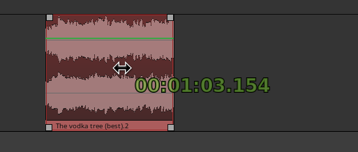

.. _moving_region_contents:

Moving region contents
======================

It's possible to move the contents of regions in time, without moving
the regions' start or end points. This is sometimes known as "slip
editing".

To do this, hold the :kbd:`Ctrl` and :kbd:`Shift` keys while dragging
the region or regions. As you click, the cursor will change to a
double-headed arrow, and when you start dragging, the time from the
start of the underlying content to the start of the clicked region is
displayed.

   Moving region contents / Slip-dragging

As you drag, the region start and end points will remain fixed, but the
audio or MIDI content of the region will move, as long as the underlying
source extends beyond the region bounds.