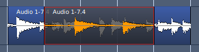
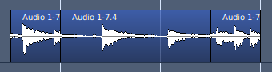
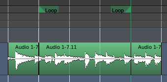

.. _separate_under:

Separating under
================

Separating under
----------------

When one region is over another, and the lower region has to be cut so
that it directly adjoins both ends of the overlapping one, with no
overlaps, the Separate Under tool can be a very efficient time-saver.
With the upper region selected, the **Edit > Separate > Separate Under**
menu command will split the lower region so that it no longer overlaps
the upper region at all.

   Region arrangement before separate under

   Region arrangement after separate under

If the upper region covers only one end of the lower region, then this
operation is equivalent to :ref:`Trim to Next or Trim to Previous
<trimming_regions>`, depending on which end is covered.

Separating using range
----------------------

A loop or punch range can also be used to slice a region. By using the
**Edit > Separate > Separate Using Loop/Punch Range**, any selected
regions that are covered by the range at both ends of the range, or just
one if the range only covers part of the region. This makes it easy to
generate regions that correspond precisely to a range.

.. figure:: images/before-separate-loop.png
   :alt: region arrangement before separate using loop range

   Region arrangement before separate using loop range

   Region arrangement after separate using loop range
