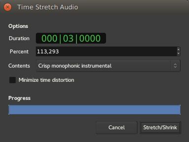

.. _stretching_regions:

Stretching regions
==================

The Stretch Mode tool can be switched to by selecting it in the
:ref:`Toolbox <toolbox>`, or simply by hitting the :kbd:`T` key.

It allows to extend or reduce the duration of a region, optionally
maintaining its pitch. This is one of the few operations in Ardour that
affect the underlying audio data from a region, even if the original
audio is kept safely—no data is lost in the process.

This operation is usually used to fit an audio sequence with a different
rhythm into a session, but can be used in a wide area of cases, due to
its ability to maintain or alter the pitch.

   Before stretching

   While stretching

   After a stretch

The **Stretch** tool is very similar in use to doing a trim in grab
mode: the boundary (start or end) is left-clicked and dragged to its
wanted position. Notice a timer appearing, showing the new duration of
the region using the same :ref:`clock mode <editing_clocks>` as in the
:ref:`primary transport clock <transport_clocks>`.

Stretching is a complex operation (phase vocoding), involving
resampling, frequency analysis and synthesis. The parameters used to
transform the audio data are user tweakable, and exposed to the user as
the left mouse button is released:

   The Time Stretch Audio window

The Time Stretch Audio window is made of:

Duration
   The target duration of the region, expressed using the primary transport clock's mode

Percent
   The target duration of the region, expressed as a percentage of the region's original length. Can be either higher than 100% (to expand the region) or lower (to shrink it)

Contents
   The type of audio the region is made of. Ardour will fine-tune its algorithm based on this content, see below

Minimize time distortion
   Tries to reduce the smearing of the audio created by the phase vocoding process

a Progress bar
   showing the operation in progress.

The **Contents** should be selected to best fit the actual content of the
region, amongst:

+--------------+---------------+--------------+----------------+--------------+--------------+
| Content      | Disable       | Band-limit   | Disable        | Use longer   | Use shorter  |
|              | phase resync  | phase resync | phase locking  | processing   | processing   |
|              | at transients | to extreme   | to peak        | window       | window       |
|              |               | frequencies  | frequencies    | (actual size |              |
|              |               |              |                | may vary)    |              |
|              |               |              |                |              |              |
|              |               |              |                |              |              |
|              |               |              |                |              |              |
+--------------+---------------+--------------+----------------+--------------+--------------+
| Mushy        | X             |              | X              | X            |              |
+--------------+---------------+--------------+----------------+--------------+--------------+
| Smooth       | X             |              | X              |              |              |
+--------------+---------------+--------------+----------------+--------------+--------------+
| Balanced     | X             |              |                |              |              |
| multitimbral |               |              |                |              |              |
| mixture      |               |              |                |              |              |
+--------------+---------------+--------------+----------------+--------------+--------------+
| Unpitched    |               | X            |                |              |              |
| percussion   |               |              |                |              |              |
| with         |               |              |                |              |              |
| stable       |               |              |                |              |              |
| notes        |               |              |                |              |              |
+--------------+---------------+--------------+----------------+--------------+--------------+
| Crisp        |               |              |                |              |              |
| monophonic   |               |              |                |              |              |
| instrumental |               |              |                |              |              |
| (*default*)  |               |              |                |              |              |
+--------------+---------------+--------------+----------------+--------------+--------------+
| Unpitched    |               |              | X              |              | X            |
| solo         |               |              |                |              |              |
| percussion   |               |              |                |              |              |
+--------------+---------------+--------------+----------------+--------------+--------------+
| Resample     | *see          |              |                |              |              |
| without      | below*        |              |                |              |              |
| preserving   |               |              |                |              |              |
| pitch        |               |              |                |              |              |
+--------------+---------------+--------------+----------------+--------------+--------------+

While the table above details *how* the different kinds of audio
material alter the fine-tuning of the DSP, from an user point of view,
the operation often consists in trying different settings and listening
to the result.

The best way to start experimenting is to consider the material itself:

-  If the material doesn't need its pitch to be preserved, the best
   choice is **Resample without preserving pitch**
-  For drum-type material, the best choice is (depending on the
   transients crispness, stretching factor...) one of the two
   *percussion* types
-  For melodic mono-tonal material (bass, winds,…), the best (and
   default) choice is **Crisp monophonic instrumental**
-  For multi-tonal material (chords,…), either one of the three first
   choice, or the default **Crisp**.

