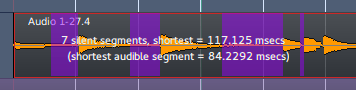
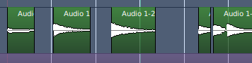

.. _strip_silence:

Strip silence from audio regions
================================

.. figure:: images/strip-silence-window.png
   :alt: The Strip Silence window
   :class: right-float

The Strip Silence tool allows to remove the parts of one or multiple
regions that are below a user-defined silence threshold. It does *not*
destroy the underlying audio, but trims the regions according to the
silence threshold parameter. The edit applies to all selected regions,
allowing batch processing.

The window is accessible through the **Region > Edit > Strip Silence**
menu and by right-click on a region and selecting **<Name_Of_The_Region>
> Edit > Strip Silence**. The parameters are:

Threshold
   The audio level under which the audio is considered silent (in dBFS)

Minimum length
   A minimum number of samples for Ardour to create a split. Under this number, the region won't be sliced

Fade length
   Ardour adds fades, both in and out, to the trimmed regions, to the created region (so the sliced regions are longer by both the in and out fades duration, expressed in samples)

A progress bar
   showing the time Ardour takes to compute the trimming based on the current parameters

Changing any parameter in the window is reflected in the main editor:
the silent segments are highlighted and the number and durations of the
shortest segments is displayed, helping fine-tune the parameters.

.. container:: float

   |strip silence: view of the audio| |strip silence: view of the audio
   after|

The minimum length for silence can be useful when editing very
percussive material and just needing to automatically trim the ends of a
region.

