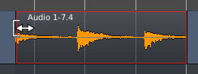

.. _trimming_regions:

Trimming regions
================

Changing the length of a region is a very common editing operation,
often known as trimming. There are several ways to accomplish this with
Ardour, and some very useful specialized trimming operations.

Drag-Trimming With the Mouse
----------------------------

In the Grab mode, moving the pointer near the beginning or end of the region
changes the cursor to indicate that trimming is possible, and the edge
of the region can then be Left-dragged in both directions.

Trimming will obey :ref:`Snap settings <grid_controls>`.

Other Trimming operations
-------------------------

There are several commands for region trimming. Some use the :ref:`edit
point <edit_point_control>` to determine where to trim to. Some are
not bound to any keys by default (but could be via the :ref:`Keybindings
Editor <keyboardshortcuts>`).

These command are both in the Region > Trim main menu (with a region
selected) or in the context menu of a region, right click on a **region >
*Name_Of_The_Region* > Trim**.

Trim Start at Edit Point (:kbd:`j`)
   Trim selected region(s) start to edit point.

Trim End at Edit Point (:kbd:`k`)
   Trim selected region(s) end to edit point.

Trim to Loop/Punch
   Trim selected region(s) beginning and end to the loop/punch boundaries (if it exists).

Trim to Previous (:kbd:`Ctrl-j`)
   Trim the start of selected region(s) to the end of the previous region. If the region is too short, it is extended to its maximum to the left.

Trim to Next (:kbd:`Ctrl-k`)
   Trim the end of selected region(s) to the start of the following region. If the region is too short, it is extended to its maximum to the right.
