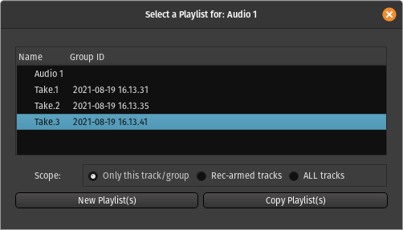

.. _playlist_operations:

Playlist operations
===================

In the `track header <audio_track_controls>` (editor window, left pane)
is a button labelled **p** (for "Playlist"). A click on this button
displays the following menu:

*(Local Playlists)*  
   Shows all of the playlists associated with this track, and indicates the currently selected playlist.

Select…  
   Allows switching playlists, either for this track or multiple ones (more about that later).

Rename…  
   Displays a dialog to rename the current playlist.

New Playlist…  
   Creates a new empty playlist, and the track switches to the new playlist.

Copy Playlist…  
   Creates a new playlist that is an independent copy of the current playlist;  
   the track switches to the new playlist.

Clear Current  
   Removes all regions from the current playlist.

**Advanced**

Copy from …  
   Creates a new playlist that is an independent copy of a playlist from
   this track or another one; the track switches to the new playlist.

Share with …  
   Uses a playlist from this track or another one; any edit to this
   playlist will be reflected on the other track(s) that use this
   playlist.

Steal from …  
   Uses a playlist from this track or another one and removes it from
   the local playlists in the "robbed" track. Otherwise, behaves like
   **Share with…**.

.. note::
   When *Stealing* a playlist, it does not remove the playlist from the
   robbed track. The playlist now belongs to the current track, and the
   robbed track uses the playlist as a shared playlist with the new owner.
   Hence, this playlist won't be in the **(Local Playlists)** list from the
   robbed track anymore, but will now appear in the current track's local
   playlists.

Sharing vs copying playlists
----------------------------

It is entirely possible to **share playlists** between tracks. The only
slightly unusual thing that should be noted when sharing is that edits
to the playlist made in one track will magically appear in the other. It
is an obvious consequence of sharing. One application of this attribute
is parallel processing, described in :ref:`Playlist Use Cases
<playlist_usecases>`.

To avoid this kind of behaviour, and nevertheless use the same (or
substantially the same) playlist on two tracks, the desired playlist
must be copied and not shared. This generates an **independent copy** of
it for that track, which can then be edited without affecting the
original.

Select menu
-----------

In its most basic use, the **Select…** menu allows:

-  to switch from one playlist to another (with the added benefit,
   compared to switching directly from the **Local Playlists** list, to
   see the creation date and time),
-  to create a new, empty playlist, with the **New Playlist(s)** button,
-  or to create an independent copy of the current one, with the **Copy
   Playlist(s)** button.

When used for **Only this track/group**, in the selector below, it is the
same as using the **New Playlist…** and **Copy Playlist…** from the
**Playlist** menu.

But the selector also allows to apply these operation (changing
playlist, creating an empty new one or creating an independent copy) for
**Rec-armed tracks** or **ALL tracks**. This can be useful in a recording
situation with many microphones and multiple takes to deal with.

These playlist operations, on multiple tracks, are also available
directly on the secondary toolbar in :ref:`Recorder <recorder>` mode.
