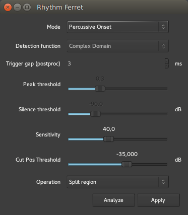

.. _rhythm_ferret:

Rhythm ferret
=============

The Rhythm Ferret is a dedicated tool to speed up the usually labor
intensive task of slicing and adjusting a sound region to match a
specific time grid. It is especially useful for drum tracks, either to
match a different tempo, or to adjust a slightly out of tempo
performance.

It is not limited to this use though, as it supports both percussive and
note type detection, and can be used on melodic material too.

Accessing the Rhythm Ferret
---------------------------

The **Rhythm Ferret** window can be accessed by right clicking any audio
region, then **<Name_Of_The_Region> > Edit > Rhythm Ferret**.

Once the window is open, selecting any region will make it the focus of
the Rhythm Ferret's detection, hence allowing to process multiple
regions sequentially without reopening the window each time.

The window itself is made of:

-  a "mode" selection
-  some parameters for this mode
-  an operation selection, that for now only allows to **Split regions**.

The mode selection
--------------------

As the Rhythm Ferret is able to detect both percussive hits and melodic
notes, it is important to choose the best suited mode for the considered
material, so that Ardour can perform the detection with the greatest
accuracy :

-  **Percussive Onset** will detect the start of each hit based on the
   sudden change in energy (= volume) of the waveform
-  **Note Onset** will detect the start of each note based on the
   changes in the frequency domain.

The percussive onset mode
-------------------------

In this mode, only two parameters are active:

Sensitivity (%)
   The proportion of the samples that must exceed the energy rise
   threshold in order for an onset to be detected (at frames in which
   the detection function peaks). This roughly corresponds to how
   "noisy" a percussive sound must be in order to be detected.

Cut Pos Threshold (dB)
   The rise in energy amongst a group of samples that is required for
   that to be counted toward the detection function's count. This
   roughly corresponds to how "loud" a percussive sound must be in order
   to be detected.

As those parameters are very material-related, there is no recipe for a
perfect match, and a good peak detection is a matter of adjusting those
two parameters by trial and error, and trying using the **Analyze** button
after each try.

Vertical grey markers will appear on the selected region, showing where
Ardour detects onsets as per the parameters. This markers can be
manually adjusted, see below.

The Note Onset Mode
-------------------

In the Note Onset mode, more parameters are active:

Detection function
   The method used to detect note changes. More on this below.

Trigger gap (postproc) (ms)
   Set the minimum inter-onset interval, in milliseconds, i.e. the
   shortest interval between two consecutive onsets.

Peak threshold
   Set the threshold value for the onset peak picking. Lower threshold
   values imply more onsets detected. Increasing this threshold should
   reduce the number of incorrect detections.

Silence threshold (dB)
   Set the silence threshold, in dB, under which the onset will not be
   detected. A value of -``20.0`` would eliminate most onsets but the
   loudest ones. A value of ``-90.0`` would select all onsets. 

The detection function, used in **Note Onset** mode to choose the
mathematical strategy used to detect the note changes, is
user-selectable:

Energy based  
   This function calculates the local energy of the input spectral frame.

Spectral Difference  
   Spectral difference onset detection function based on Jonathan Foote and  
   Shingo Uchihashi's "The beat spectrum: a new approach to rhythm analysis" (2001).

High-Frequency Content  
   This method computes the High Frequency Content (HFC) of the input spectral frame.  
   The resulting function is efficient at detecting percussive onsets.  
   Based on Paul Masri's "Computer modeling of Sound for Transformation and  
   Synthesis of Musical Signal" (1996).

Complex Domain  
   This function uses information both in frequency and in phase to determine  
   changes in the spectral content that might correspond to musical onsets.  
   It is best suited for complex signals such as polyphonic recordings.

Phase Deviation  
   This function uses information both energy and in phase to determine musical onsets.

Kullback-Liebler  
   Kulback-Liebler onset detection function based on Stephen Hainsworth and  
   Malcolm Macleod's "Onset detection in music audio signals" (2003).

Modified Kullback-Liebler  
   Modified Kulback-Liebler onset detection function based on Paul Brossier's  
   "Automatic annotation of musical audio for interactive systems" (2006).

Ardour defaults to **Complex Domain**, which usually gives good result for
harmonic material.

Manual adjustment
-----------------

Using the Rhythm Ferret consists usually in finding the right parameters
to split the audio, by adjusting them and clicking the **Analyze**
button. Each time an analysis is run, Ardour erases the previous
results, and creates grey markers on the region according to the
parameters. Those markers can be manually dragged with the left mouse
button to adjust their positions.

   The Rhythm Ferret: analysing

Once the markers are suitably placed, the second button in the down hand
side of the Rhythm Ferret window allows to **Apply** the operation. At
the moment of writing, only the **Split Region** is available, which
will split the region at the markers.

   The Rhythm Ferret: splitting

Those regions can then be manually aligned, or have their sync points
set to the closest grid (as per the :ref:`Grid settings <grid_controls>`
in effect), by selecting all the regions, and using the right-click, then
**Selected Regions > Position > Snap position to grid**.

   The Rhythm Ferret: snapping to grid
