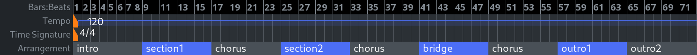

.. _sections:

Sections
========

Sections represent significant self-contained parts of the timeline.
Common examples of a section are a verse, a chorus, or a bridge in a
song.

   Arrangement example

Sections are represented in two ways in the editor window:

#. The :ref:`Arrangement timeline ruler <arrangement_ruler>`
#. The :ref:`Arrangement sidebar tab <arrangement_list>`

There are also several commands in the main **Edit** menu:

-  Cut/Paste Range Section to Edit Point
-  Copy/Paste Range Section to Edit Point
-  Delete Range Section

When Ardour treats a range as a section, it cuts or copies audio and
MIDI data and their automation (hidden or visible) across all tracks, as
well as markers and unused playlists. When pasting the cut or copied
data, it ripples all tracks at the edit point. It's also possible to
repeatedly copy and paste an existing section.
