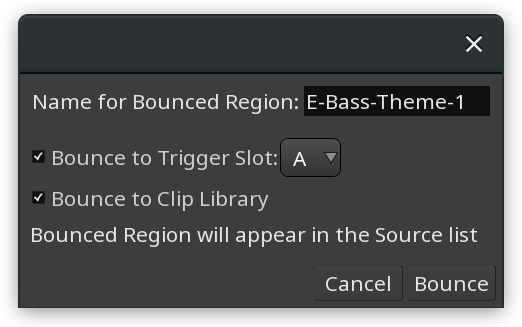
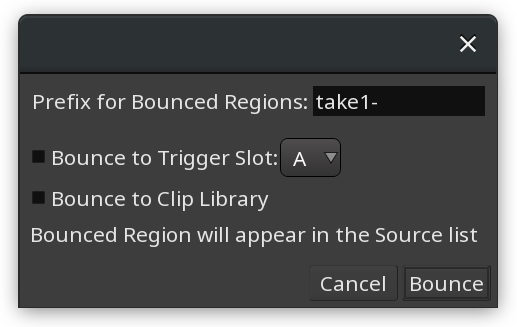
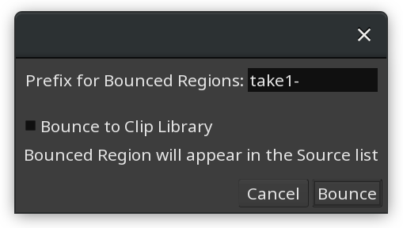
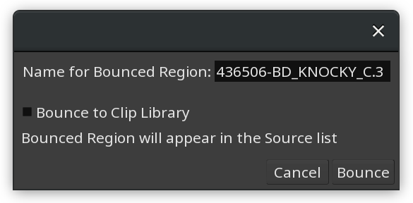

.. _bouncing_regions:

Bouncing regions
================

Selected region or multiple selected regions from any tracks can be exported to dedicated files. This creates audio files on the disk inside project's 'interchange' folder and automatically adds them to the Sources list.

There are two commands to do so: **Bouncing without processing** and **Bouncing with processing**, both available in the top-level **Region** menu, as well as in the context (right-click) menu of regions.

Bouncing without processing
---------------------------

This method disables all processing in the mixer channel, including fader/panner and pre- and post-fader processors. It will however apply non-destructive gain adjustment and fade in/out envelopes to audio clips.

Dropping all processing in the mixer channel effectively means that in the case of MIDI regions, MIDI files will be exported to the disk.

The dialog with bouncing settings will provide different options based on several possible scenarios.

One track, one region
~~~~~~~~~~~~~~~~~~~~~

If just one region is selected, Ardour will automatically suggest using the region name as is. It will also provide two options:

-  Automatically loading the exported file into a respective slot of a cue of user's choice.
-  Bouncing the region to a user-defined Clips folder so that it could be reused across sessions.

Multiple tracks, one region per each track
~~~~~~~~~~~~~~~~~~~~~~~~~~~~~~~~~~~~~~~~~~

When the selection contains multiple regions, and each region is on a separate track, this makes it possible to automatically add exported files to respective slots in a cue. However since multiple regions are selected, Ardour will use original region names and prepend them with user-given text, if the user chooses to submit any. E.g. adding ``take1-`` prefix to ``piano`` and ``bass`` regions of respective mono tracks will create ``take1-piano.wav`` and ``take1-bass.wav`` files.

One or more tracks, two and more regions per track
~~~~~~~~~~~~~~~~~~~~~~~~~~~~~~~~~~~~~~~~~~~~~~~~~~

When the selection contains at least two regions in the same track, the option to add bounced files to cue slots is not available, as two and more clips cannot be loaded into the same slot. Ardour will also ask for an optional prefix and provide an option to bounce to the ``Clips`` folder.

Bouncing with processing
------------------------

This method applies all processing in the mixer channel. If the original data is MIDI and it passes a virtual instrument that translates it into audio, an audio file will be exported. Since this changes the nature of the data, bouncing to trigger slots is unavailable as MIDI tracks cannot contain audio data.

Just like in the case of bouncing without processing, availability of options depends on the use case.

.. _one-track-one-region-1:

One track, one region
~~~~~~~~~~~~~~~~~~~~~

In this scenario, Ardour will automatically suggest using region's name and provide an option to bounce to the ``Clips`` folder.

Any amount of tracks and regions per track
~~~~~~~~~~~~~~~~~~~~~~~~~~~~~~~~~~~~~~~~~~

In this scenario, Ardour will use an optional user-defined prefix to prepend original region names with it when creating audio files. There also is an option to bounce to the ``Clips`` folder.