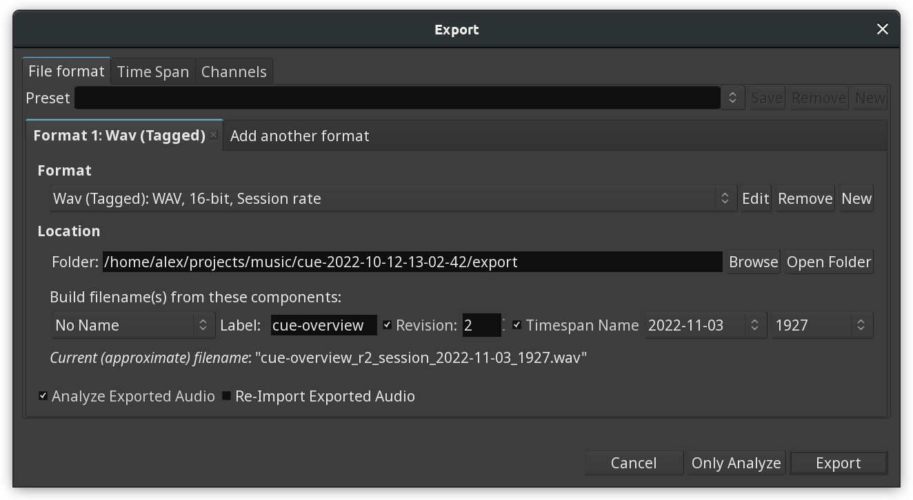
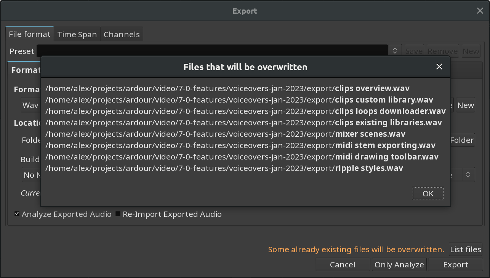
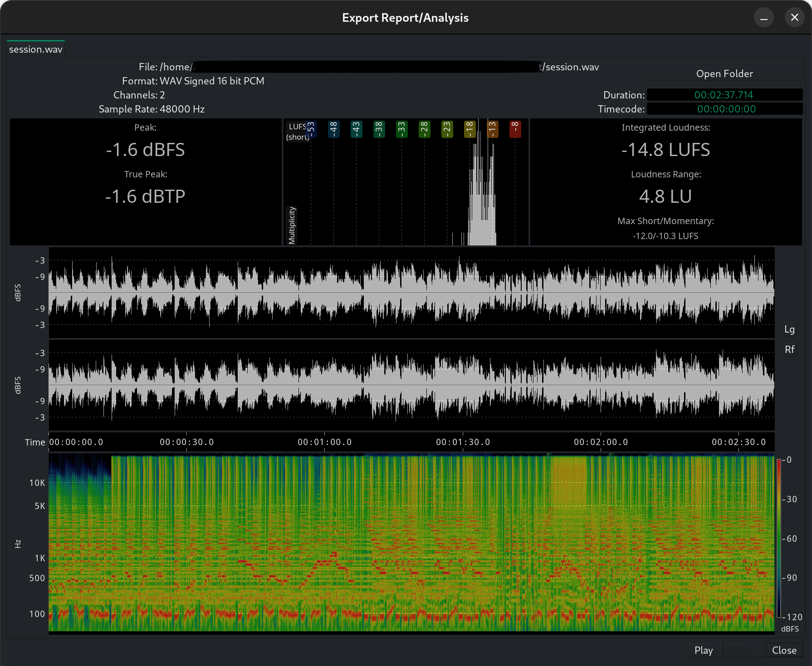
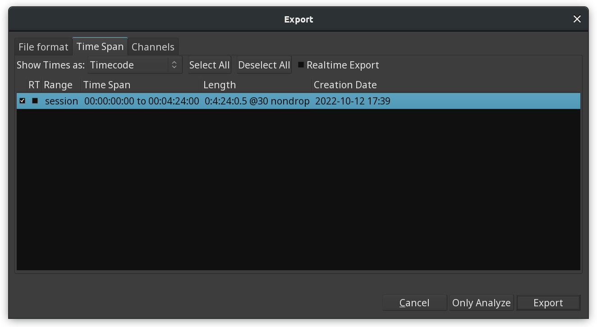
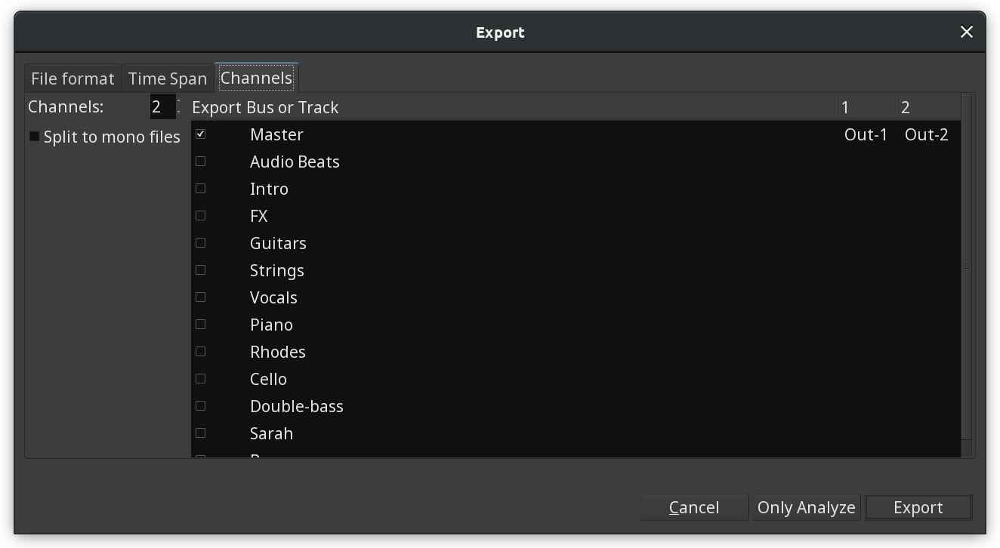

.. _export_dialog:

Export dialog
=============

When the work in Ardour is finished, one or multiple sound file(s) need to be created, be it to be printed to a medium such as a CD or DVD, uploaded to a streaming site or sent to another person or software for further work. This can be done either using **Session > Export > Export to Audio file(s)…**.

   The Export window

.. _export-file_format:

File Format
-----------

This tab contains controls for the format of the exported audio file(s). More than one format can be enabled here, in which case each will be exported in turn. Ardour is supplied with a list of export formats, including:

-  Amazon Music
-  Apple Music
-  BWAV 24bit
-  BWAV 32float
-  CD (Red Book)
-  FLAC 24 bit
-  MP3 (extreme)
-  MP3 (medium)
-  MP3 (standard)
-  Ogg/Vorbis
-  Ring Tone
-  Soundcloud and Spotify
-  Wav (Tagged)
-  YouTube and Deezer

These formats can be edited, or new ones created, with the :ref:`Edit Export Format Profile <export_format_profiles>` dialog, which appears when clicking the **Edit** or **New** buttons to the right of the drop-down list of formats.

Presets can also be created, consisting of one or more formats. Ardour provides some ready-made presets, too:

-  CD + Ogg/Vorbis + FLAC
-  CD only
-  DVD-A only
-  FLAC
-  Ogg/Vorbis
-  Ogg/Vorbis + FLAC
-  Streaming

.. _export-location:

The location
------------

Aside from providing a way to tell Ardour *where* to put the created file(s), the location part of the window allows to name the exported files with a lot of choice regarding the naming convention, hence blending into the user's workflow, and providing a clean way to keep the export folders from being cluttered with poorly named files.

The name of the file(s) can optionally be made of:

-  The session or snapshot's name
-  A custom label (i.e., any text)
-  A revision number
-  The name of the timespan (see below)
-  A date (in multiple formats)
-  A time (also in multiple format).

.. note::
   As in the screenshot above, when writing a file could erase a present file with the same name, Ardour shows a yellow warning line in the bottom of the window, and a button to list all the files that would be erased and replaced.

.. _export-overwrite:

Overwriting files
-----------------

Ardour checks whether exporting will overwriting existing files. If such files are discovered, it will display a warning in the lower right corner of the window. Clicking the **List files** button next to the message will display the list of file that will be overwritten.

   List of files to be overwritten

.. _export-analyze:

Analyze exported audio
----------------------

Checking **Analyze Exported Audio** shows the **Export Report/Analysis** window.

   The Export Report/Analysis window

This provides a lot of useful information about the exported file:

-  the file name and location
-  its format
-  its channel count
-  its sample rate
-  its duration and timecode.

It also allows to **Play** the file, and the **Open Folder** button gives a quick access to the place where it has been created.

The most prominent feature though, are the two generated views of the audio file in time (waveform) and frequency (sonograph) domain, and the loudness analysis, giving:

-  the peak value
-  the true peak value (to take inter sample peaks into account)
-  the normalization gain (if it has been applied)
-  the integrated loudness
-  the loudness range
-  a graph of the multiplicity of the peaks at the different loudness
   levels.

.. _export-timespan:

Time Span
---------

This tab allows to select the range (or ranges) of the timeline to export.

   The Time Span tab

By default, "session" is enabled—this will export the whole session from the start marker to the end marker. Any loop or range present in the session can be chosen, or a combination thereof.

The realtime checkboxes allow to export audio as it is played, and not freewheeling to render the file as fast as Ardour can. This can prevent odd behaviours from some plugins (reverbs, etc...). This can be chosen globally (with the **Realtime Export** checkbox at the top) or individually on a per time span basis, with the **RT** checkbox next to each time span.

.. _export-channels:

Channels
--------

   The Channels tab

This tab decides which outputs (tracks or busses) should be sent to the exported file. By default, only the Master bus is sent.
