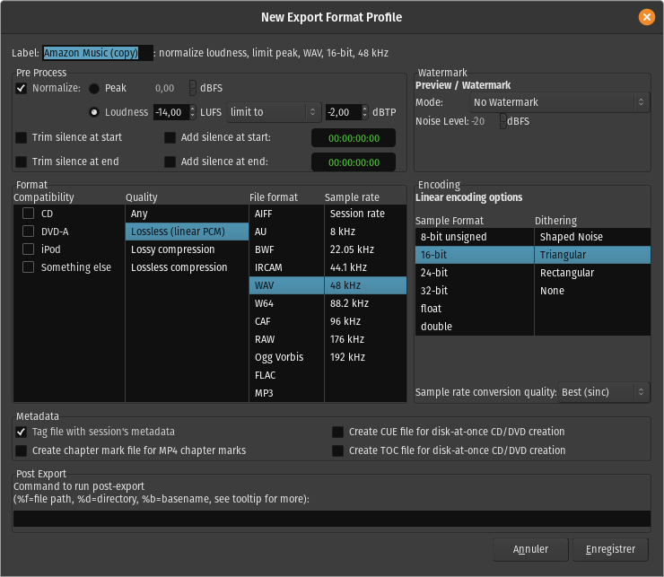

.. _export_format_profiles:

Export format profiles
======================

An export format profile specifies the file format in which Ardour will export audio files, and also other audio file export options.

Export format profiles are edited via the **Edit Export Format Profile** dialog.

   The Edit Export Format Profile dialog

Label
-----

The Label field allows to choose the name which will be shown for this format in the drop-down list of export formats in the 'File Formats' tab of the :ref:`Export dialog <export_dialog>`.

Pre-Process
-----------

If enabled, levels of exported files will be normalized to the level chosen here. The normalization can be either:

-  Peak, which adjusts the gain to bring the highest signal peak to the chosen level (in dBFS),
-  Loudness, which adjusts the gain to bring the average amplitude to the chosen level (in LUFS), without exceeding the chosen true-peak value (in dBTP). EBU R128 is only available for mono or stereo sounds while true-peak works for any channel layout.

.. _trim-silence-at-start-end:

Trim silence at start/end
~~~~~~~~~~~~~~~~~~~~~~~~~

These checkboxes allow to remove any part Ardour considers silent (< −90dB), at the beginning or/and end of each exported track.

.. _add-silence-at-start-end:

Add silence at start/end
~~~~~~~~~~~~~~~~~~~~~~~~

These checkboxes allow to add silence at the beginning or/and end of each exported track. The duration of the added silence can be manually fixed in the adjacent 'timer' input fields.

Watermark
---------

This section adds watermarks to the exported audio (e.g. for limited/demo distribution), by overwriting part of the audio with white noise in the exported file.

Both the **Mode** (how often and how long) and **Noise Level** (how loud) can be set.

Format
------

Compatibility
~~~~~~~~~~~~~

Selecting an item in the **Compatibility** emphasizes the settings in the other columns that are compatible with the selected standard, by turning incompatible options red. When an incompatible quality/format/sample rate is selected, the compatibility column checkbox disappears.

Quality
~~~~~~~

The appropriate item in the **Quality** column will be highlighted when a file format is chosen. At the moment, selecting a Quality setting does not show the compatible **File formats**.

File format
~~~~~~~~~~~

This column contains a list of Ardour's supported export file types. Selecting one updates the options underneath it.

Note: For MP3 exporting, Ardour relies on libsndfile v1.1.0 and newer to encode the file. For Opus support, Ardour requires a build of libsndfile 1.2.0 and newer. This comes bundled with official Ardour binaries.

Sample rate
~~~~~~~~~~~

A specific sample rate can be chosen for the exported files, or the current session's sample rate (by choosing **Session rate**), without sample rate conversion.

Encoding
--------

Options relevant to the chosen file format will appear just to the right of the Compatibility/Quality/File format/Sample rate table.

Sample rate conversion quality
~~~~~~~~~~~~~~~~~~~~~~~~~~~~~~

In case the chosen sample rate does not match the current session's sample rate, the sample rate conversion quality can be chosen here. Better quality options are slower.

Metadata
--------

These options are presented whatever the chosen format is:

Tag file with session's metadata
~~~~~~~~~~~~~~~~~~~~~~~~~~~~~~~~

If the exported file format supports metadata (e.g. FLAC, Ogg Vorbis), use data entered in the :ref:`Session Metadata <metadata>` window to tag the exported files.

.. _create-toc-cue-chapter-mark-file:

Create CUE/TOC/chapter mark file
~~~~~~~~~~~~~~~~~~~~~~~~~~~~~~~~

As well as exporting an audio file, Ardour can create a file (in CUE, TOC or MP4ch format respectively) containing CD track information, as defined in the :ref:`Ranges & Marks List <the_ranges_and_marks_lists>`. Those files can then be used to either burn a CD or DVD, or to create "chapters" inside a compatible mp4 video container.

Post Export
-----------

If this is not blank, it is considered as a command to be run after the export of each file. Either the command must exist in ``$PATH``, or an absolute path to an executable file can be specified here.

Certain sequences are allowed here to stand for the exported file name and various parameters. Currently these are:

-  %a: Artist name
-  %b: File's base-name
-  %c: Copyright
-  %d: File's directory
-  %f: File's full absolute path
-  %l: Lyricist
-  %n: Session name
-  %o: Conductor
-  %t: Title
-  %z: Organization
-  %A: Album
-  %C: Comment
-  %E: Engineer
-  %G: Genre
-  %L: Total track count
-  %M: Mixer
-  %N: Timespan name
-  %O: Composer
-  %P: Producer
-  %S: Disc subtitle
-  %T: Track number
-  %Y: Year
-  %Z: Country

Any part of the command-line enclosed in double-quotes (``"``) will be used as-is.

For example, exporting an mp3 file can be done by inserting ``lame -b320 %f`` which will convert the exported audio file (``%f``) to a 320 kbs mp3 using the lame encoder (provided lame is installed first on the system).
