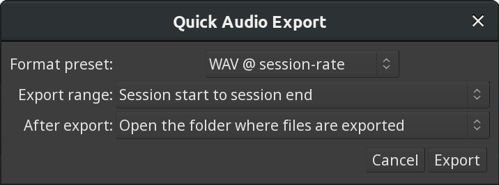

.. _quick_audio_export:

Quick audio export
==================

The **Quick Audio Export** dialog is a trimmed-down version of its original counterpart. It's best for cases when all the user needs is exporting an entire session (or part of it) to something like a WAV file at the session rate.

   Quick Audio Export Dialog

The three available options are:

Format preset
   Lists popular options such as FLAC, WAV @ session rate, MP3, and others.

Export range
   Allows choosing between exporting a selection (range), the entire session (from session start marker to session end marker), or ranges defined by range markers. If neither selection nor range markers are available, only the entire session can be exported.

After export
   Allows choosing whether to open the folder where the audio file has been exported to, or do nothing.

Ongoing export can be canceled by pressing the **Abort** button.
