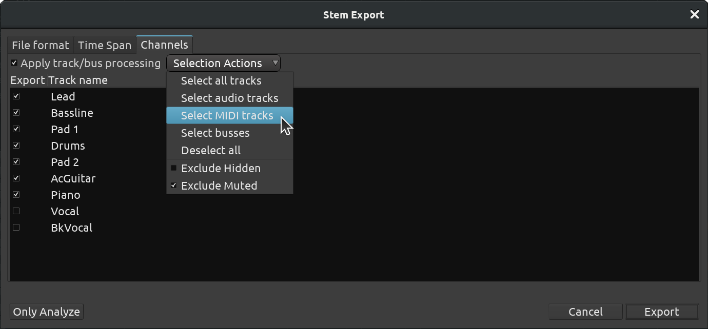

.. _stem_exports:

Stem exports
============

Stem exporting allows to transfer files between different systems and programs by exporting each track individually, including silence, to keep them in sync. All data will be lost except the actual audio/MIDI. This is one of the most common methods of interchange because it works between all DAWs.

   The Stem Export dialog

The **Stem Export** window, accessed via the Session > Export > Stem Export… menu, is very similar to the :ref:`Export dialog <export_dialog>`, except the **Channels** tab appears slightly differently: in this case each chosen channel (track or bus) is exported to its own file, instead of all channels being mixed together into a single file.

The exported tracks or busses can, by checking **Apply track/bus processing**, be exported with the effects/processors applied, so that the destination system does not need those effects plugins.

The toolbar in the **Stem Export** window also provides a quick way to
select either audio or MIDI tracks or busses.
